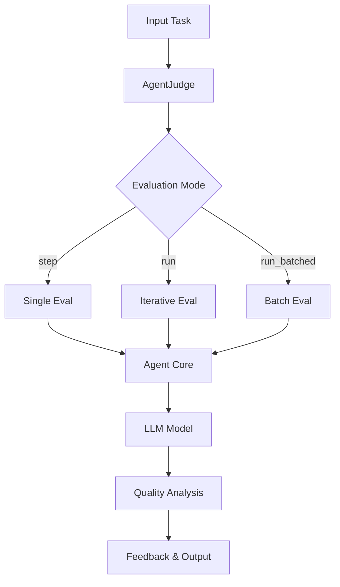

The `AgentJudge` evaluates and critiques outputs from other AI agents, providing structured feedback on quality, accuracy, and areas for improvement. It supports single-shot evaluations and iterative refinement through multiple evaluation loops with context building.

Based on the research paper: [Agent-as-a-Judge: Evaluate Agents with Agents](https://arxiv.org/abs/2410.10934)

| Capability | Description |
|------------|-------------|
| **Quality Assessment** | Evaluates correctness, clarity, and completeness of agent outputs |
| **Structured Feedback** | Provides detailed critiques with strengths, weaknesses, and suggestions |
| **Multimodal Support** | Can evaluate text outputs alongside images |
| **Context Building** | Maintains evaluation context across multiple iterations |
| **Custom Evaluation Criteria** | Supports weighted evaluation criteria for domain-specific assessments |
| **Batch Processing** | Efficiently processes multiple evaluations |

## Architecture



## Parameters

| Parameter | Type | Default | Description |
|-----------|------|---------|-------------|
| `id` | `str` | `uuid4()` | Unique identifier for the judge instance |
| `agent_name` | `str` | `"Agent Judge"` | Name of the agent judge |
| `description` | `str` | `"You're an expert AI agent judge..."` | Description of the agent's role |
| `system_prompt` | `str` | `None` | Custom system instructions (uses default if None) |
| `model_name` | `str` | `"openai/o1"` | LLM model for evaluation |
| `max_loops` | `int` | `1` | Maximum evaluation iterations |
| `verbose` | `bool` | `False` | Enable verbose logging |
| `evaluation_criteria` | `Optional[Dict[str, float]]` | `None` | Dictionary of evaluation criteria and weights |
| `return_score` | `bool` | `False` | Whether to return a numerical score instead of full conversation |

## Methods

### step()

Processes a single task and returns the agent's evaluation.

```python
result = judge.step(task: str, img: Optional[str] = None) -> str
```

### run()

Executes evaluation in multiple iterations with context building.

```python
result = judge.run(task: str, img: Optional[str] = None) -> Union[str, int]
```

Returns `str` (full conversation) if `return_score=False`, or `int` (numerical score) if `return_score=True`.

### run_batched()

Executes batch evaluation of multiple tasks.

```python
results = judge.run_batched(tasks: List[str]) -> List[Union[str, int]]
```

## Examples

### Basic Evaluation

```python
from swarms import AgentJudge

judge = AgentJudge(
    agent_name="quality-judge",
    model_name="claude-sonnet-4-6",
    max_loops=2
)

agent_output = "The capital of France is Paris. The city is known for its famous Eiffel Tower."

evaluations = judge.run(task=agent_output)
```

### Custom Evaluation Criteria

```python
from swarms import AgentJudge

judge = AgentJudge(
    agent_name="technical-judge",
    model_name="claude-sonnet-4-6",
    max_loops=1,
    evaluation_criteria={
        "accuracy": 0.4,
        "completeness": 0.3,
        "clarity": 0.2,
        "logic": 0.1,
    },
)

technical_output = "To solve x^2 + 5x + 6 = 0, we use the quadratic formula..."
evaluations = judge.run(task=technical_output)
```

### Scoring Mode

```python
from swarms import AgentJudge

judge = AgentJudge(
    agent_name="scoring-judge",
    model_name="claude-sonnet-4-6",
    max_loops=2,
    return_score=True
)

score = judge.run(task="This is a correct and well-explained answer.")
```

### Batch Processing

```python
from swarms import AgentJudge

judge = AgentJudge()

tasks = [
    "The capital of France is Paris.",
    "2 + 2 = 4",
    "The Earth is flat."
]

evaluations = judge.run_batched(tasks=tasks)
```

## Reference

```bibtex
@misc{zhuge2024agentasajudgeevaluateagentsagents,
    title={Agent-as-a-Judge: Evaluate Agents with Agents},
    author={Mingchen Zhuge and Changsheng Zhao and Dylan Ashley and Wenyi Wang and Dmitrii Khizbullin and Yunyang Xiong and Zechun Liu and Ernie Chang and Raghuraman Krishnamoorthi and Yuandong Tian and Yangyang Shi and Vikas Chandra and Jürgen Schmidhuber},
    year={2024},
    eprint={2410.10934},
    archivePrefix={arXiv},
    primaryClass={cs.AI},
}
```
