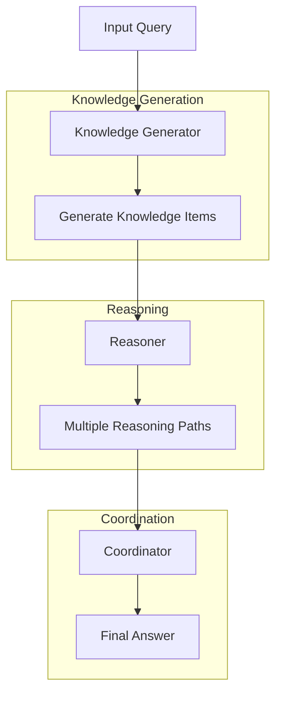

The GKP Agent enhances its reasoning by generating relevant knowledge before answering queries. This approach, inspired by [Liu et al. 2022](https://arxiv.org/abs/2110.08387), is particularly effective for tasks requiring commonsense reasoning and factual information.

The agent consists of three main components:

1. **Knowledge Generator** — Creates relevant factual information
2. **Reasoner** — Uses generated knowledge to form answers
3. **Coordinator** — Synthesizes multiple reasoning paths into a final answer

## Architecture



## API Reference

### GKPAgent

| Parameter | Type | Default | Description |
|-----------|------|---------|-------------|
| `agent_name` | `str` | `"gkp-agent"` | Name identifier for the agent |
| `model_name` | `str` | `"openai/o1"` | LLM model to use for all components |
| `num_knowledge_items` | `int` | `6` | Number of knowledge snippets to generate per query |

| Method | Parameters | Returns |
|--------|------------|---------|
| `process(query)` | `query: str` | `Dict[str, Any]` — full processing results |
| `run(queries, detailed_output?)` | `queries: List[str]`, `detailed_output: bool` | `Union[List[str], List[Dict[str, Any]]]` |

### KnowledgeGenerator

| Parameter | Type | Default | Description |
|-----------|------|---------|-------------|
| `agent_name` | `str` | `"knowledge-generator"` | Name identifier |
| `model_name` | `str` | `"openai/o1"` | Model for knowledge generation |
| `num_knowledge_items` | `int` | `2` | Number of knowledge items to generate per query |

| Method | Parameters | Returns |
|--------|------------|---------|
| `generate_knowledge(query)` | `query: str` | `List[str]` — generated knowledge statements |

### Reasoner

| Parameter | Type | Default | Description |
|-----------|------|---------|-------------|
| `agent_name` | `str` | `"knowledge-reasoner"` | Name identifier |
| `model_name` | `str` | `"openai/o1"` | Model for reasoning |

| Method | Parameters | Returns |
|--------|------------|---------|
| `reason_and_answer(query, knowledge)` | `query: str`, `knowledge: str` | `Dict[str, str]` — explanation, confidence, answer |

## Example

```python
from swarms.agents.gkp_agent import GKPAgent

agent = GKPAgent(
    agent_name="gkp-agent",
    model_name="gpt-4o",
    num_knowledge_items=6,
)

queries = [
    "What are the implications of quantum entanglement on information theory?",
]

results = agent.run(queries)

for i, result in enumerate(results):
    print(f"\nQuery {i+1}: {queries[i]}")
    print(f"Answer: {result}")
```

## Best Practices

1. **Knowledge Generation**: Set appropriate number of knowledge items based on query complexity
2. **Reasoning Process**: Ensure diverse reasoning paths for complex queries. Validate confidence levels.
3. **Coordination**: Review coordination logic for complex scenarios. Validate final answers against source knowledge.

## Performance Considerations

- Processing time increases with number of knowledge items
- Complex queries may require more knowledge items
- Consider caching frequently used knowledge
- Monitor token usage for cost optimization
