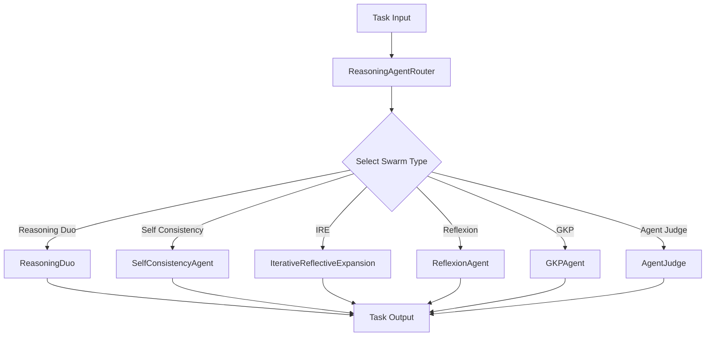

The `ReasoningAgentRouter` enables dynamic selection and execution of different reasoning strategies based on task requirements. It provides a flexible interface to work with multiple reasoning approaches.

## Architecture



## Parameters

| Parameter | Type | Default | Description |
|-----------|------|---------|-------------|
| `agent_name` | `str` | `"reasoning_agent"` | Name identifier for the agent |
| `description` | `str` | `"A reasoning agent..."` | Description of the agent's capabilities |
| `model_name` | `str` | `"gpt-5.4"` | The underlying language model to use |
| `system_prompt` | `str` | `"You are a helpful..."` | System prompt for the agent |
| `max_loops` | `int` | `1` | Maximum number of reasoning loops |
| `swarm_type` | `agent_types` | `"reasoning-duo"` | Type of reasoning swarm to use |
| `num_samples` | `int` | `1` | Number of samples for self-consistency |
| `output_type` | `OutputType` | `"dict-all-except-first"` | Format of the output |
| `num_knowledge_items` | `int` | `6` | Number of knowledge items for GKP agent |
| `memory_capacity` | `int` | `6` | Memory capacity for agents that support it |
| `eval` | `bool` | `False` | Enable evaluation mode for self-consistency |
| `random_models_on` | `bool` | `False` | Enable random model selection for diversity |
| `majority_voting_prompt` | `Optional[str]` | `None` | Custom prompt for majority voting |
| `reasoning_model_name` | `Optional[str]` | `"gpt-4o"` | Model for reasoning in ReasoningDuo |

## Available Agent Types

The following values are supported for the `swarm_type` parameter:

- `"reasoning-duo"` or `"reasoning-agent"`
- `"self-consistency"` or `"consistency-agent"`
- `"ire"` or `"ire-agent"`
- `"ReflexionAgent"`
- `"GKPAgent"`
- `"AgentJudge"`

## Methods

| Method | Description |
|--------|-------------|
| `select_swarm()` | Selects and initializes the appropriate reasoning swarm |
| `run(task, *args, **kwargs)` | Executes the selected swarm's reasoning process |
| `batched_run(tasks, *args, **kwargs)` | Executes the reasoning process on a batch of tasks (each task processed via `run`) |

## Examples

### Basic Usage

```python
from swarms import ReasoningAgentRouter

router = ReasoningAgentRouter(
    agent_name="reasoning-agent",
    model_name="claude-sonnet-4-6",
    swarm_type="self-consistency",
    num_samples=3,
)

result = router.run("What is the best approach to solve this problem?")
```

### Self-Consistency with Evaluation

```python
router = ReasoningAgentRouter(
    swarm_type="self-consistency",
    num_samples=5,
    model_name="claude-sonnet-4-6",
    eval=True,
    random_models_on=True
)

result = router.run("What is 2 + 2?")
```

### ReasoningDuo with Image Support

```python
router = ReasoningAgentRouter(
    swarm_type="reasoning-duo",
    model_name="claude-sonnet-4-6",
    reasoning_model_name="claude-3-5-sonnet-20240620",
    max_loops=2
)

result = router.run(
    "Analyze this image and explain the patterns you see",
    img="data_visualization.png"
)
```

### GKP Agent

```python
router = ReasoningAgentRouter(
    swarm_type="GKPAgent",
    model_name="claude-sonnet-4-6",
    num_knowledge_items=6
)

result = router.run("What are the implications of quantum entanglement?")
```

### Reflexion Agent

```python
router = ReasoningAgentRouter(
    swarm_type="ReflexionAgent",
    max_loops=3,
    model_name="claude-sonnet-4-6"
)

result = router.run("Explain quantum computing to a beginner.")
```

## Choosing the Right Type

| Scenario | Recommended Type | Why |
|----------|-----------------|-----|
| Tasks requiring high reliability | `self-consistency` | Multiple validation paths, consensus building |
| Complex tasks needing analysis + action | `reasoning-duo` | Separates reasoning from execution |
| Problems requiring iterative refinement | `ire` | Designed for progressive improvement |
| Tasks requiring introspection | `ReflexionAgent` | Self-reflection and learning from experience |
| Knowledge-intensive tasks | `GKPAgent` | Generates knowledge before reasoning |
| Quality control | `AgentJudge` | Specialized evaluation capabilities |

## Best Practices

1. **Swarm Type Selection**: Match the reasoning strategy to your task requirements
2. **Performance**: Adjust `max_loops` and `num_samples` based on task complexity
3. **Self-Consistency**: Use 3-5 samples for most tasks, 7+ for critical decisions
4. **Multi-modal**: Use vision-capable models when processing images
5. **ReasoningDuo**: Set different models for reasoning vs execution via `reasoning_model_name`
