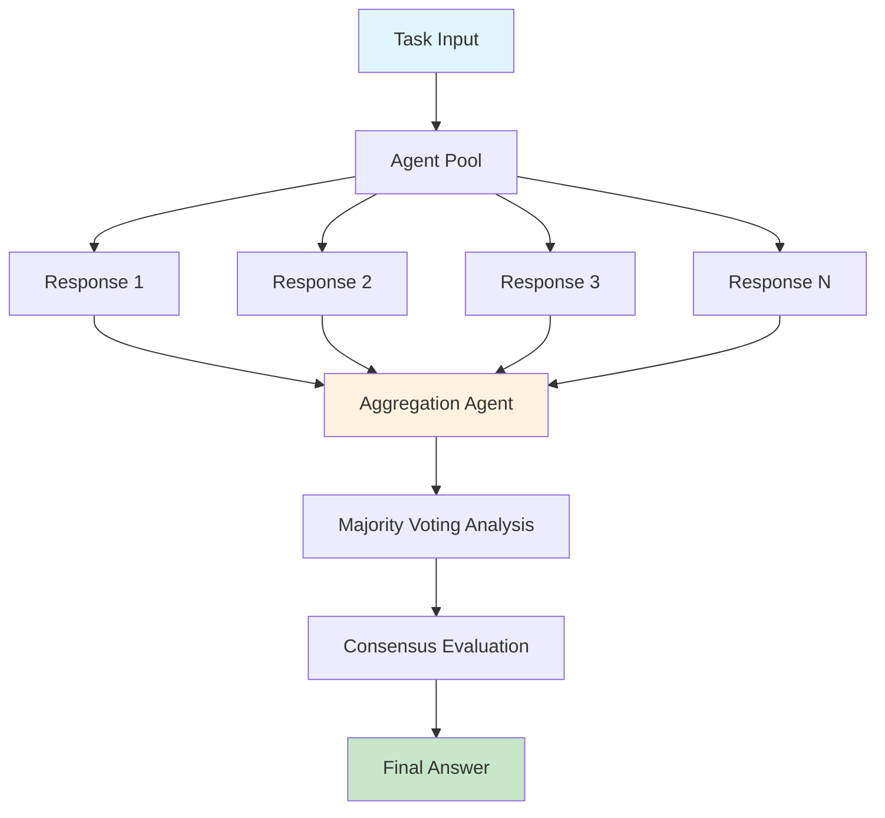
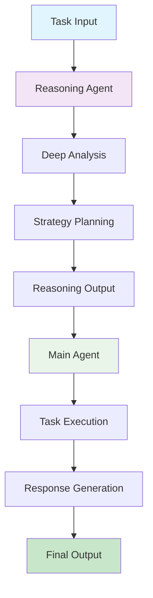
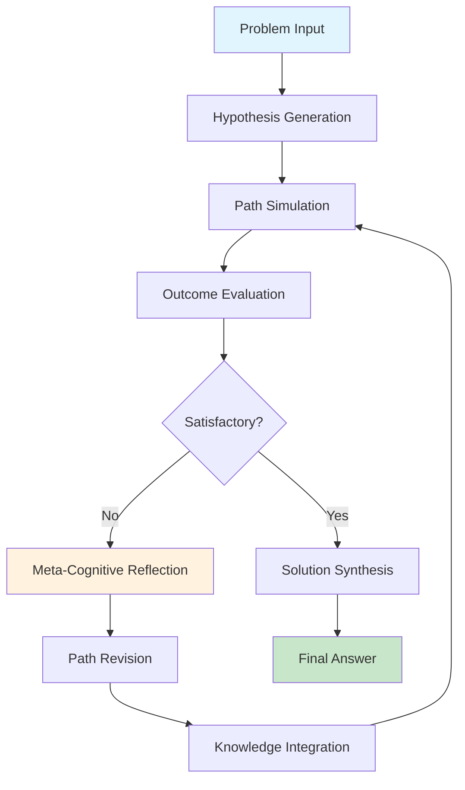
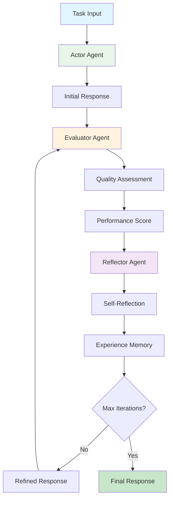
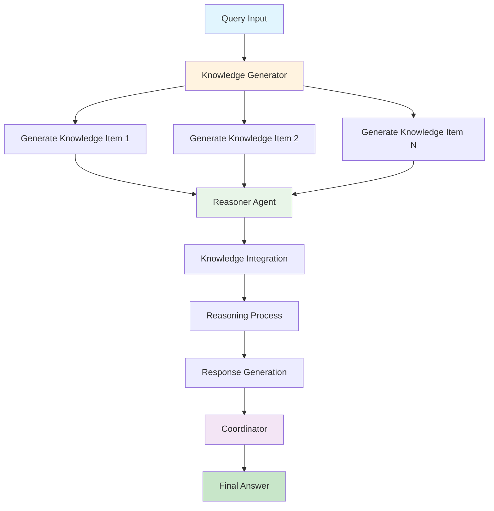
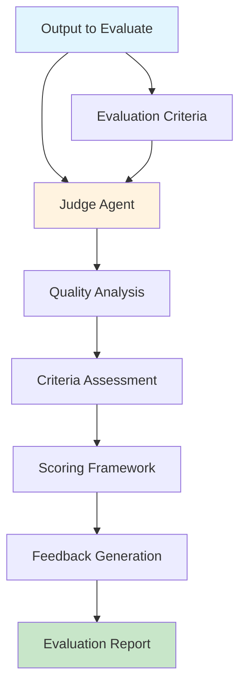

Reasoning agents are sophisticated agents that employ advanced cognitive strategies to improve problem-solving performance beyond standard language model capabilities. Unlike traditional prompt-based approaches, reasoning agents implement structured methodologies that enable them to think more systematically, self-reflect, collaborate, and iteratively refine their responses.

These agents are inspired by cognitive science and human reasoning processes, incorporating techniques such as:

- **Multi-step reasoning**: Breaking down complex problems into manageable components
- **Self-reflection**: Evaluating and critiquing their own outputs
- **Iterative refinement**: Progressively improving solutions through multiple iterations
- **Collaborative thinking**: Using multiple reasoning pathways or agent perspectives
- **Memory integration**: Learning from past experiences and building knowledge over time
- **Meta-cognitive awareness**: Understanding their own thinking processes and limitations

## Available Reasoning Agents

| Agent Name | Type | Research Paper | Key Features | Best Use Cases |
|------------|------|----------------|--------------|----------------|
| **Self-Consistency Agent** | Consensus-based | [Self-Consistency Improves Chain of Thought Reasoning](https://arxiv.org/abs/2203.07870) (Wang et al., 2022) | Multiple independent reasoning paths, majority voting aggregation, concurrent execution, validation mode | Mathematical problem solving, high-accuracy requirements, decision making |
| **Reasoning Duo** | Collaborative | Novel dual-agent architecture | Separate reasoning and execution agents, collaborative problem solving, task decomposition, cross-validation | Complex analysis tasks, multi-step problem solving, research and planning |
| **IRE Agent** | Iterative | Iterative Reflective Expansion framework | Hypothesis generation, path simulation, error reflection, dynamic revision | Complex reasoning tasks, research problems, strategy development |
| **Reflexion Agent** | Self-reflective | [Reflexion: Language Agents with Verbal Reinforcement Learning](https://arxiv.org/abs/2303.11366) (Shinn et al., 2023) | Self-evaluation, experience memory, adaptive improvement, learning from failures | Continuous improvement tasks, long-term projects, quality refinement |
| **GKP Agent** | Knowledge-based | [Generated Knowledge Prompting](https://arxiv.org/abs/2110.08387) (Liu et al., 2022) | Knowledge generation, multi-perspective reasoning, information synthesis | Knowledge-intensive tasks, research questions, fact-based reasoning |
| **Agent Judge** | Evaluation | [Agent-as-a-Judge](https://arxiv.org/abs/2410.10934) | Quality assessment, structured evaluation, performance metrics, feedback generation | Quality control, output evaluation, performance assessment |

## Agent Architectures

### Self-Consistency Agent

Implements multiple independent reasoning paths with consensus-building to improve response reliability and accuracy through majority voting mechanisms.



**Use Cases**: Mathematical problem solving, high-stakes decision making, answer validation, quality assurance

[Self-Consistency Agent Guide](/agents/self-consistency-agent)

---

### Reasoning Duo

Dual-agent collaborative system that separates reasoning and execution phases, enabling specialized analysis and task completion through coordinated agent interaction.



**Use Cases**: Complex analysis tasks, multi-step problem solving, research and planning, verification workflows

[Reasoning Duo Guide](/agents/reasoning-duo)

---

### IRE Agent (Iterative Reflective Expansion)

Sophisticated reasoning framework employing iterative hypothesis generation, simulation, and refinement through continuous cycles of testing and meta-cognitive reflection.



**Use Cases**: Complex reasoning tasks, research problems, strategy development, iterative learning

[IRE Agent Guide](/agents/iterative-agent)

---

### Reflexion Agent

Advanced self-reflective system implementing actor-evaluator-reflector architecture for continuous improvement through experience-based learning and memory integration.



**Use Cases**: Continuous improvement tasks, long-term projects, adaptive learning, quality refinement

[Reflexion Agent Guide](/agents/reflexion-agent)

---

### GKP Agent (Generated Knowledge Prompting)

Knowledge-driven reasoning system that generates relevant information before answering queries, implementing multi-perspective analysis through coordinated knowledge synthesis.



**Use Cases**: Knowledge-intensive tasks, research questions, fact-based reasoning, information synthesis

[GKP Agent Guide](/agents/gkp-agent)

---

### Agent Judge

Specialized evaluation system for assessing agent outputs and system performance, providing structured feedback and quality metrics through comprehensive assessment frameworks.



**Use Cases**: Quality control, output evaluation, performance assessment, model comparison

[Agent Judge Guide](/agents/agent-judge)

## Implementation Guide

### Unified Interface via Reasoning Agent Router

The `ReasoningAgentRouter` provides a centralized interface for accessing all reasoning agent implementations:

```python
from swarms.agents import ReasoningAgentRouter

# Initialize router with specific reasoning strategy
router = ReasoningAgentRouter(
    swarm_type="self-consistency",
    model_name="gpt-4o",
    num_samples=5,
    max_loops=3
)

# Execute reasoning process
result = router.run("Analyze the optimal solution for this complex business problem")
print(result)
```

[Reasoning Agent Router Reference](/agents/reasoning-agent-router)

### Direct Agent Implementation

```python
from swarms.agents import SelfConsistencyAgent, ReasoningDuo, ReflexionAgent

# Self-Consistency Agent for high-accuracy requirements
consistency_agent = SelfConsistencyAgent(
    model_name="gpt-4o",
    num_samples=5
)

# Reasoning Duo for collaborative analysis workflows
duo_agent = ReasoningDuo(
    model_names=["gpt-4o", "gpt-4o-mini"]
)

# Reflexion Agent for adaptive learning scenarios
reflexion_agent = ReflexionAgent(
    model_name="gpt-4o",
    max_loops=3,
    memory_capacity=100
)
```

## Choosing the Right Reasoning Agent

| Scenario | Recommended Agent | Why? |
|----------|------------------|------|
| **High-stakes decisions** | Self-Consistency | Multiple validation paths ensure reliability |
| **Complex research tasks** | Reasoning Duo + GKP | Collaboration + knowledge synthesis |
| **Learning & improvement** | Reflexion | Built-in self-improvement mechanisms |
| **Mathematical problems** | Self-Consistency | Proven effectiveness on logical reasoning |
| **Quality assessment** | Agent Judge | Specialized evaluation capabilities |
| **Iterative refinement** | IRE | Designed for progressive improvement |
