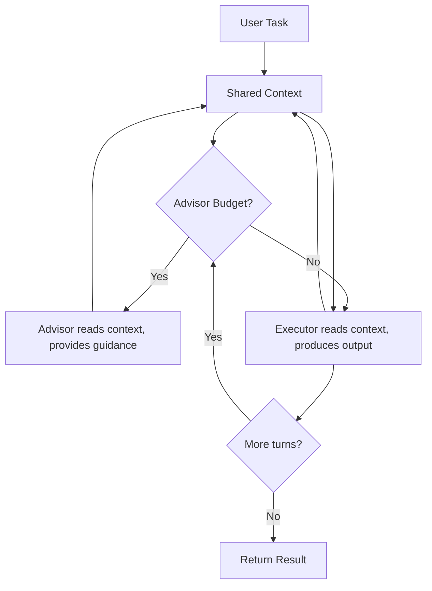

## Overview

The `AdvisorSwarm` implements the [advisor strategy](https://claude.com/blog/the-advisor-strategy) described in Anthropic's research (April 2026). It pairs a cheaper **executor** model that drives the task end-to-end with a powerful **advisor** model consulted on-demand between executor turns.

The executor runs every turn. The advisor is on-demand -- consulted between executor turns when budget allows. Both agents read from and write to the same shared conversation context. The advisor never calls tools or produces user-facing output.

This is provider-agnostic: any model supported by LiteLLM works for either role.



The swarm follows this workflow:

1. User task goes into the shared conversation
2. Before each executor turn, the advisor reads the full shared context and provides guidance (if budget allows)
3. The executor reads the full shared context (including any advisor guidance) and produces output
4. Both advisor guidance and executor output are added to the shared conversation
5. Repeat for `max_loops` executor turns

## Installation

```bash
pip install -U swarms
```

## Key Features

| Feature | Description |
|---------|-------------|
| **Executor-Driven Loop** | The executor runs every turn -- it's the main driver |
| **On-Demand Advisor** | Advisor is consulted between turns, not in a fixed sequence |
| **Shared Context** | Both agents read from and write to the same conversation |
| **Budget Control** | `max_advisor_uses` caps advisor consultations per run |
| **Provider-Agnostic** | Any LiteLLM-supported model works for either role |
| **Custom Agents** | Pass pre-configured agents with tools, MCP, or any Agent settings |

## Attributes

<ParamField path="id" type="str" default="None">
  Unique identifier for this swarm instance. Auto-generated via `swarm_id()` if not provided.
</ParamField>

<ParamField path="name" type="str" default="AdvisorSwarm">
  Human-readable name
</ParamField>

<ParamField path="description" type="str" default="An executor-advisor swarm...">
  Description of the swarm's purpose
</ParamField>

<ParamField path="executor_model_name" type="str" default="claude-sonnet-4-6">
  Model for the executor agent
</ParamField>

<ParamField path="advisor_model_name" type="str" default="claude-opus-4-6">
  Model for the advisor agent
</ParamField>

<ParamField path="executor_system_prompt" type="str" default="Built-in">
  System prompt for the executor
</ParamField>

<ParamField path="advisor_system_prompt" type="str" default="Built-in">
  System prompt for the advisor
</ParamField>

<ParamField path="max_advisor_uses" type="int" default="3">
  Max advisor consultations per `run()`. 0 = executor runs alone.
</ParamField>

<ParamField path="max_loops" type="int" default="1">
  Number of executor turns
</ParamField>

<ParamField path="output_type" type="OutputType" default="dict-all-except-first">
  Format for output (dict, str, list, final, json, yaml)
</ParamField>

<ParamField path="verbose" type="bool" default="False">
  Enable detailed logging
</ParamField>

<ParamField path="executor_agent" type="Agent" default="None">
  Pre-configured Agent for execution (e.g., with tools or MCP)
</ParamField>

<ParamField path="advisor_agent" type="Agent" default="None">
  Pre-configured Agent for advising
</ParamField>

<ParamField path="tools" type="List[Callable]" default="None">
  Tools available to the executor agent only
</ParamField>

**Raises:**

| Exception | Condition |
|-----------|-----------|
| `ValueError` | If `max_advisor_uses < 0`, `max_loops < 1`, or model names are empty |

## Methods

### run()

Execute the advisor-executor orchestration flow.

```python
def run(self, task: str, img: str = None, imgs: List[str] = None) -> Any
```

**Parameters:**
- `task` (str): The task to accomplish
- `img` (str, optional): Optional single image input
- `imgs` (List[str], optional): Optional list of image inputs

**Returns:** Formatted conversation history according to `output_type`

### batched_run()

Run the swarm on multiple tasks sequentially.

```python
def batched_run(self, tasks: List[str]) -> List[Any]
```

**Parameters:**
- `tasks` (List[str]): List of task strings

**Returns:** List of results, one per task

## Usage Examples

### Basic Usage

```python
from swarms import AdvisorSwarm

swarm = AdvisorSwarm(
    executor_model_name="claude-sonnet-4-6",
    advisor_model_name="claude-opus-4-6",
    max_advisor_uses=3,
    max_loops=1,
    verbose=True,
)

result = swarm.run(
    "Write a Python function that implements binary search on a sorted list. "
    "Include proper error handling, type hints, and edge cases."
)

print(result)
```

### Multi-Turn with Advisor Guidance

Run the executor for multiple turns, with the advisor providing guidance before each:

```python
from swarms import AdvisorSwarm

swarm = AdvisorSwarm(
    executor_model_name="claude-sonnet-4-6",
    advisor_model_name="claude-opus-4-6",
    max_advisor_uses=3,
    max_loops=3,
)

result = swarm.run("Design and implement a REST API rate limiter in Python")
```

### Custom Executor with Tools

Pass a pre-configured executor agent with tools while keeping the advisor tool-free:

```python
from swarms import Agent, AdvisorSwarm


def write_file(filename: str, content: str) -> str:
    """Write content to a file."""
    with open(filename, "w") as f:
        f.write(content)
    return f"Written: {filename}"


executor = Agent(
    agent_name="Executor",
    model_name="claude-sonnet-4-6",
    max_loops=1,
    tools=[write_file],
)

swarm = AdvisorSwarm(
    executor_agent=executor,
    advisor_model_name="claude-opus-4-6",
)

result = swarm.run("Create a Python module for string manipulation utilities")
```

### Executor Only (No Advisor)

Set `max_advisor_uses=0` to run the executor alone:

```python
from swarms import AdvisorSwarm

swarm = AdvisorSwarm(
    executor_model_name="claude-sonnet-4-6",
    advisor_model_name="claude-opus-4-6",
    max_advisor_uses=0,
    max_loops=1,
)

result = swarm.run("Simple task that doesn't need advisor guidance")
```

### Different Providers

The swarm is provider-agnostic. Use any models LiteLLM supports:

```python
from swarms import AdvisorSwarm

# OpenAI models
swarm = AdvisorSwarm(
    executor_model_name="gpt-4.1-mini",
    advisor_model_name="gpt-4.1",
)

# Mix providers
swarm = AdvisorSwarm(
    executor_model_name="gpt-4.1-mini",
    advisor_model_name="claude-opus-4-6",
)
```

## Architecture Details

### Shared Context

Both agents read from and write to the same `Conversation` object. This mirrors the Anthropic diagram where the advisor reads the same context as the executor. On each turn:

1. The advisor reads `conversation.get_str()` -- sees everything so far
2. The advisor's guidance is added to the conversation
3. The executor reads `conversation.get_str()` -- sees the task, any prior output, and the advisor's guidance
4. The executor's output is added to the conversation

### Advisor Budget

The `max_advisor_uses` parameter controls how many times the advisor is consulted:

| `max_advisor_uses` | `max_loops` | Behavior |
|---|---|---|
| `0` | `1` | Executor runs alone -- no advisor |
| `1` | `1` | Advisor guides once, executor runs once |
| `3` | `3` | Advisor guides before each of 3 executor turns |
| `1` | `3` | Advisor guides first turn only, executor runs 3 turns |

### Multi-Turn Execution

When `max_loops > 1`, the executor runs multiple turns. Each turn, it reads the full conversation -- including its own previous output and any advisor guidance -- so it can build on prior work. The advisor's budget is distributed across turns: it is consulted before each executor turn until the budget is exhausted.

## Source Code

View the [source code on GitHub](https://github.com/kyegomez/swarms/blob/master/swarms/structs/advisor_swarm.py)
