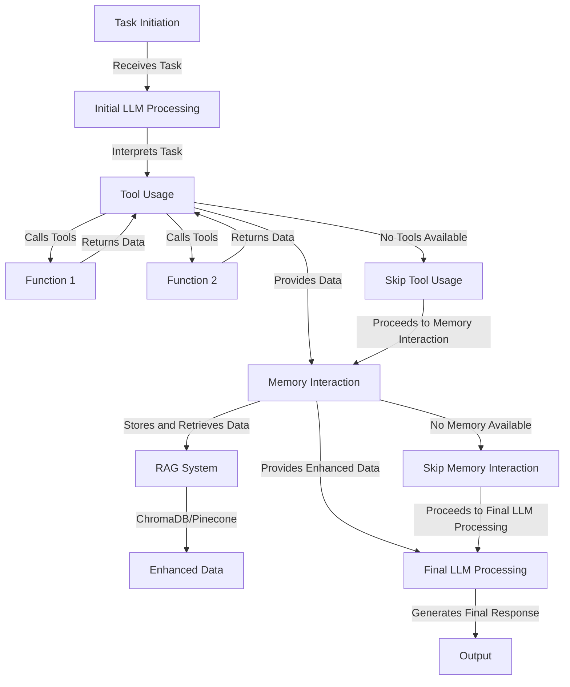

## Overview

The `Agent` class is the core component of the Swarms framework, connecting LLMs with tools, long-term memory, and advanced autonomous capabilities. It provides a production-ready interface for building intelligent agents that can reason, use tools, handle multimodal inputs, and execute complex tasks. The class is designed to handle a variety of document types—including PDFs, text files, Markdown, and JSON—enabling robust document ingestion and processing.



| Feature                                 | Description                                                                                      |
|------------------------------------------|--------------------------------------------------------------------------------------------------|
| **Conversational Loop**                  | Enables back-and-forth interaction with the model.                                               |
| **Feedback Collection**                  | Allows users to provide feedback on generated responses.                                         |
| **Stoppable Conversation**               | Supports custom stopping conditions for the conversation.                                        |
| **Retry Mechanism**                      | Implements a retry system for handling issues in response generation.                            |
| **Tool Integration**                     | Supports the integration of various tools for enhanced capabilities.                             |
| **Long-term Memory Management**          | Incorporates vector databases for efficient information retrieval.                               |
| **Document Ingestion**                   | Processes various document types for information extraction.                                     |
| **Interactive Mode**                     | Allows real-time communication with the agent.                                                   |
| **Sentiment Analysis**                   | Evaluates the sentiment of generated responses.                                                  |
| **Output Filtering and Cleaning**        | Ensures generated responses meet specific criteria.                                              |
| **Asynchronous and Concurrent Execution**| Supports efficient parallelization of tasks.                                                     |
| **Planning and Reasoning**               | Implements planning functionality for enhanced decision-making.                                  |
| **Autonomous Planning and Execution**    | When `max_loops="auto"`, automatically creates plans, executes subtasks, and generates summaries. Includes built-in tools for file operations, user communication, and workspace management. |
| **Agent Handoffs and Task Delegation**   | Intelligently routes tasks to specialized agents based on capabilities and task requirements.      |

## Import

```python
from swarms import Agent
```

## Key Features

- **Tool Integration**: Native support for function calling and tool execution
- **Long-term Memory**: RAG-based memory system for context retention
- **Autonomous Loops**: Dynamic execution with configurable stopping conditions
- **Multi-modal Support**: Process text, images, and other media
- **MCP Support**: Integration with Model Context Protocol servers
- **Agent Handoffs**: Delegate tasks to specialized agents
- **Streaming**: Real-time token streaming with callbacks
- **Fallback Models**: Automatic failover to backup models
- **State Management**: Autosave and state persistence

## Initialization

<ParamField path="id" type="str" default="agent-{uuid}">
  Unique identifier for the agent instance
</ParamField>

<ParamField path="agent_name" type="str" default="swarm-worker-01">
  The name of the agent, used for identification and logging
</ParamField>

<ParamField path="agent_description" type="str" default="An autonomous agent that can perform tasks and learn from experience powered by Swarms">
  A description of the agent's purpose and capabilities. Shown to orchestrators when routing tasks.
</ParamField>

<ParamField path="system_prompt" type="str">
  The system prompt that defines the agent's behavior and personality
</ParamField>

<ParamField path="llm" type="Any">
  The language model instance to use. If None, a LiteLLM instance will be created
</ParamField>

<ParamField path="model_name" type="str" default="gpt-5.4">
  The LiteLLM-compatible model identifier (e.g. `"gpt-5.4"`, `"claude-sonnet-4-6"`, `"groq/llama-3.3-70b-versatile"`).
</ParamField>

<ParamField path="llm_args" type="dict" default="None">
  Extra keyword arguments forwarded to the underlying LiteLLM client.
</ParamField>

<ParamField path="prompt_caching" type="bool" default="False">
  Enable provider-side prompt caching. When `True`, ephemeral `cache_control` breakpoints are added to the stable prefix of each request (system prompt, tools, and the last message) so it is cached and re-billed at a large discount. Applies to the Anthropic model family (Claude on Anthropic / Bedrock / Vertex); providers that cache automatically (e.g. OpenAI) are left untouched. See the [Prompt Caching guide](/agents/prompt-caching).
</ParamField>

<ParamField path="cache_config" type="dict" default="None">
  Fine-grained prompt-caching options; only consulted when `prompt_caching=True`. All keys optional:
  - `ttl` (`str`): `"5m"` (default) or `"1h"` for Anthropic's extended cache (2x write cost, survives longer gaps; the required beta header is attached automatically).
  - `cache_system_prompt` (`bool`, default `True`): cache the system prefix.
  - `cache_messages` (`bool`, default `True`): cache through the last message (incremental multi-turn caching).
  - `cache_tools` (`bool`, default `True`): cache the tool-definitions block.
  - `override` (`bool`, default `None`): force `cache_control` injection on/off regardless of the detected provider (e.g. opt Gemini/Vertex in, or a custom alias out). `None` auto-detects (Anthropic only).
  - `prompt_cache_key` (`str`): OpenAI-only routing hint for higher cache hit rates.
  - `prompt_cache_retention` (`str`): OpenAI-only cache TTL — `"in_memory"` or `"24h"`.
</ParamField>

<ParamField path="llm_base_url" type="str" default="None">
  Base URL for OpenAI-compatible providers (Ollama, LM Studio, vLLM, etc.).
</ParamField>

<ParamField path="llm_api_key" type="str" default="None">
  Override API key for the LLM provider. Falls back to environment variables when unset.
</ParamField>

<ParamField path="fallback_model_name" type="str" default="None">
  Single fallback model used when the primary model fails.
</ParamField>

<ParamField path="max_loops" type="Union[int, str]" default="1">
  Maximum number of reasoning loops. Use "auto" for autonomous mode with dynamic planning
</ParamField>

<ParamField path="tools" type="List[Callable]">
  List of callable functions that the agent can use as tools
</ParamField>

<ParamField path="temperature" type="float" default="0.5">
  Temperature for LLM sampling (0.0 to 1.0)
</ParamField>

<ParamField path="max_tokens" type="int" default="4096">
  Maximum number of tokens in the LLM response
</ParamField>

<ParamField path="context_length" type="int" default="16000">
  Effective context window in tokens. When `context_compression=True`, the agent compresses memory once usage crosses 90% of this limit.
</ParamField>

<ParamField path="top_p" type="float" default="None">
  Nucleus-sampling parameter. Stripped automatically for Anthropic models when extended thinking is enabled.
</ParamField>

<ParamField path="dynamic_context_window" type="bool" default="True">
  Allow the framework to grow/shrink the per-call context budget based on token usage signals.
</ParamField>

<ParamField path="context_compression" type="bool" default="True">
  When `True`, the agent runs a `ContextCompressor` that summarises long histories at 90% of `context_length` so long sessions never hit the context wall.
</ParamField>

<ParamField path="persistent_memory" type="bool" default="True">
  When `True`, read/write `MEMORY.md` under the workspace so agent state survives process restarts. Set `False` for stateless tasks.
</ParamField>

<ParamField path="transforms" type="Union[TransformConfig, dict]" default="None">
  Optional pre/post-processing transforms applied to the conversation history.
</ParamField>

<ParamField path="streaming_on" type="bool" default="false">
  Enable basic streaming with formatted panels
</ParamField>

<ParamField path="stream" type="bool" default="false">
  Enable detailed token-by-token streaming with metadata (citations, tokens used, etc.)
</ParamField>

<ParamField path="streaming_callback" type="Callable[[str], None]">
  Callback function to receive streaming tokens in real-time. Use with `agent.run_stream` / `agent.arun_stream` for generator-style consumption.
</ParamField>

<ParamField path="interactive" type="bool" default="false">
  Enable interactive mode (REPL-style) — prompt the user for input between loops.
</ParamField>

<ParamField path="verbose" type="bool" default="false">
  Enable verbose logging for debugging.
</ParamField>

<ParamField path="print_on" type="bool" default="True">
  When `False`, suppress the agent's printed output (Rich panels, thinking panel, etc.). Token streams via `arun_stream` / `streaming_callback` are unaffected.
</ParamField>

<ParamField path="output_type" type="OutputType" default="str-all-except-first">
  Output format: 'str', 'string', 'list', 'json', 'dict', 'yaml', 'xml'
</ParamField>

<ParamField path="autosave" type="bool" default="false">
  Automatically save agent state during execution
</ParamField>

<ParamField path="dashboard" type="bool" default="false">
  Display agent dashboard on initialization
</ParamField>

<ParamField path="long_term_memory" type="Union[Callable, Any]">
  Long-term memory backend (e.g. vector database) for RAG.
</ParamField>

<ParamField path="fallback_models" type="List[str]">
  List of fallback models to try in order if the primary model fails.
</ParamField>

<ParamField path="retry_attempts" type="int" default="3">
  Number of retry attempts for LLM calls
</ParamField>

<ParamField path="retry_interval" type="int" default="1">
  Interval in seconds between retry attempts
</ParamField>

<ParamField path="stopping_token" type="str">
  Token that signals the agent to stop execution
</ParamField>

<ParamField path="stopping_condition" type="Callable[[str], bool]">
  Function that returns True when the agent should stop
</ParamField>

<ParamField path="stopping_func" type="Callable">
  Alternative stopping function
</ParamField>

<ParamField path="dynamic_temperature_enabled" type="bool" default="false">
  Enable dynamic temperature adjustment during execution
</ParamField>

<ParamField path="dynamic_loops" type="bool" default="false">
  Enable dynamic loop count adjustment (sets max_loops="auto")
</ParamField>

<ParamField path="loop_interval" type="int" default="0">
  Seconds to wait between consecutive loop iterations.
</ParamField>

<ParamField path="custom_exit_command" type="str" default="exit">
  Token the user can type in interactive mode to exit the loop.
</ParamField>

<ParamField path="preset_stopping_token" type="bool" default="false">
  When `True`, append the framework's preset stopping marker to the system prompt.
</ParamField>

<ParamField path="auto_generate_prompt" type="bool" default="false">
  Auto-generate a system prompt from the task description when one is not provided.
</ParamField>

<ParamField path="user_name" type="str" default="Human">
  Name of the user in conversation history
</ParamField>

<ParamField path="saved_state_path" type="str">
  Path to save agent state
</ParamField>

<ParamField path="sop" type="str">
  Standard operating procedure for the agent
</ParamField>

<ParamField path="sop_list" type="List[str]">
  List of standard operating procedures
</ParamField>

<ParamField path="rules" type="str">
  Rules that govern agent behavior
</ParamField>

<ParamField path="planning_prompt" type="str">
  Prompt for planning phase
</ParamField>

<ParamField path="plan_enabled" type="bool" default="false">
  Enable planning phase before execution
</ParamField>

<ParamField path="multi_modal" type="bool">
  Enable multi-modal processing (images, etc.).
</ParamField>

<ParamField path="summarize_multiple_images" type="bool" default="false">
  When multiple images are provided, summarise them into a single context entry before invoking the LLM.
</ParamField>

<ParamField path="tool_call_summary" type="bool" default="True">
  After every tool call, run a brief LLM summary of the tool result and add it to the conversation.
</ParamField>

<ParamField path="tool_retry_attempts" type="int" default="3">
  Number of times to retry a failing tool call before giving up.
</ParamField>

<ParamField path="show_tool_execution_output" type="bool" default="True">
  Display tool inputs/outputs in the agent's printed output.
</ParamField>

<ParamField path="tools_list_dictionary" type="List[Dict[str, Any]]" default="None">
  Pre-built OpenAI function-calling tool schemas. Use when you want to bypass the auto-generated schema.
</ParamField>

<ParamField path="tool_schema" type="ToolUsageType" default="None">
  Override tool schema used at runtime.
</ParamField>

<ParamField path="output_cleaner" type="Callable" default="None">
  Optional post-processor applied to the agent's output before returning.
</ParamField>

<ParamField path="list_base_models" type="List[BaseModel]" default="None">
  Pydantic models registered for structured-output prompting.
</ParamField>

<ParamField path="mcp_url" type="Union[str, MCPConnection]">
  URL or connection object for a single MCP server.
</ParamField>

<ParamField path="mcp_urls" type="List[str]">
  List of MCP server URLs for connecting to multiple servers.
</ParamField>

<ParamField path="mcp_config" type="MCPConnection">
  Single MCP connection configuration object.
</ParamField>

<ParamField path="handoffs" type="Union[Sequence[Callable], Any]">
  List of agents to enable task handoffs/delegation
</ParamField>

<ParamField path="capabilities" type="List[str]">
  Free-form list of agent capabilities used for routing and documentation.
</ParamField>

<ParamField path="role" type="agent_roles" default="worker">
  The agent's role within a swarm (e.g. `"worker"`, `"director"`).
</ParamField>

<ParamField path="tags" type="List[str]" default="None">
  Tags used to filter or categorise the agent.
</ParamField>

<ParamField path="use_cases" type="List[Dict[str, Any]]" default="None">
  Structured list of intended use cases for documentation/marketplace listings.
</ParamField>

<ParamField path="mode" type="Literal['interactive', 'fast', 'standard']" default="standard">
  Execution mode: `interactive` (REPL), `fast` (minimal logging/decoration), or `standard`.
</ParamField>

<ParamField path="marketplace_prompt_id" type="str">
  UUID of a prompt from the Swarms marketplace to use as the system prompt.
</ParamField>

<ParamField path="publish_to_marketplace" type="bool" default="false">
  When `True`, publish this agent to the Swarms marketplace on initialization.
</ParamField>

<ParamField path="skills_dir" type="str">
  Path to a directory of Agent Skills (Anthropic `SKILL.md` format).
</ParamField>

<ParamField path="selected_tools" type="Union[str, List[str]]" default="all">
  Tools to enable for the autonomous looper when `max_loops="auto"`. Use `"all"` or a list of tool names.
</ParamField>

<ParamField path="react_on" type="bool" default="false">
  Enable ReAct-style reasoning prompting.
</ParamField>

<ParamField path="reasoning_prompt_on" type="bool" default="True">
  Whether to prepend the framework's reasoning preamble to the system prompt.
</ParamField>

<ParamField path="reasoning_enabled" type="bool" default="false">
  Enable reasoning mode for supported models (e.g. o1, o3, Claude with extended thinking).
</ParamField>

<ParamField path="reasoning_effort" type="str">
  Effort level for reasoning models: `"low"`, `"medium"`, or `"high"`.
</ParamField>

<ParamField path="thinking_tokens" type="int">
  Maximum extended-thinking budget for Claude reasoning models.
</ParamField>

<ParamField path="safety_prompt_on" type="bool" default="false">
  Prepend the framework's safety preamble to the system prompt.
</ParamField>

<ParamField path="random_models_on" type="bool" default="false">
  Randomly select from a pool of models on each call (load-balancing/experimentation).
</ParamField>

<ParamField path="tokenizer" type="Any" default="None">
  Optional tokenizer instance used for local token counting.
</ParamField>

<ParamField path="workspace_dir" type="str">
  The workspace directory for the agent. Controlled by the `WORKSPACE_DIR` environment variable (defaults to `agent_workspace`). Each agent gets its own subdirectory at `workspace_dir/agents/{agent-name}-{uuid}/`.
</ParamField>

<ParamField path="load_state_path" type="str" default="None">
  Path from which to load saved agent state on init.
</ParamField>

## Methods

### run

Execute the agent's main loop for a given task.

```python
def run(
    task: Optional[Union[str, Any]] = None,
    img: Optional[str] = None,
    imgs: Optional[List[str]] = None,
    correct_answer: Optional[str] = None,
    streaming_callback: Optional[Callable[[str], None]] = None,
    *args,
    **kwargs
) -> Any
```

<ParamField path="task" type="Union[str, Any]">
  The task or prompt for the agent to process
</ParamField>

<ParamField path="img" type="str">
  Optional image path or data for vision-enabled models
</ParamField>

<ParamField path="imgs" type="List[str]">
  Optional list of image paths for batch processing
</ParamField>

<ParamField path="correct_answer" type="str">
  Expected correct answer for validation with automatic retries
</ParamField>

<ParamField path="streaming_callback" type="Callable[[str], None]">
  Callback function to receive streaming tokens in real-time
</ParamField>

<ResponseField name="return" type="Any">
  Agent output formatted according to output_type configuration
</ResponseField>

**Return types based on input:**

| Scenario              | Return Type     | Description                                             |
|-----------------------|-----------------|---------------------------------------------------------|
| Single task           | `str`           | Returns the agent's response                            |
| Multiple images       | `List[Any]`     | Returns a list of results, one for each image           |
| Answer validation     | `str`           | Returns the correct answer as a string                  |
| Streaming             | `str`           | Returns the complete response after streaming completes |

**Examples:**

```python
# Basic usage
response = agent.run("Generate a report on financial performance.")

# Single image processing
response = agent.run(
    task="Analyze this image and describe what you see",
    img="path/to/image.jpg"
)

# Multiple image processing
response = agent.run(
    task="Analyze these images and identify common patterns",
    imgs=["image1.jpg", "image2.png", "image3.jpeg"]
)

# Answer validation with retries
response = agent.run(
    task="What is the capital of France?",
    correct_answer="Paris"
)

# Real-time streaming
def streaming_callback(token: str):
    print(token, end="", flush=True)

response = agent.run(
    task="Tell me a long story about space exploration",
    streaming_callback=streaming_callback
)
```

### __call__

Alternative syntax for running the agent (calls `run` internally).

```python
def __call__(
    task: str,
    *args,
    **kwargs
) -> str
```

### arun

Async version of `run`.

```python
async def arun(
    task: Optional[Union[str, Any]] = None,
    img: Optional[str] = None,
    *args,
    **kwargs,
) -> Any
```

### run_batched

Run multiple tasks concurrently in batch mode.

```python
def run_batched(
    tasks: List[str],
    imgs: List[str] = None,
    *args,
    **kwargs,
) -> List[Any]
```

<ParamField path="tasks" type="List[str]">
  List of tasks to run concurrently
</ParamField>

<ParamField path="imgs" type="List[str]">
  List of images to process with each task
</ParamField>

<ResponseField name="return" type="List[Any]">
  List of results from each task execution, in the same order as the input tasks
</ResponseField>

```python
tasks = [
    "Analyze the financial data for Q1",
    "Generate a summary report for stakeholders",
    "Create recommendations for Q2 planning"
]

batch_results = agent.run_batched(tasks)

for i, (task, result) in enumerate(zip(tasks, batch_results)):
    print(f"Task {i+1}: {task}")
    print(f"Result: {result}\n")
```

### run_multiple_images

Run the agent with multiple images using concurrent processing.

```python
def run_multiple_images(
    task: str,
    imgs: List[str],
    *args,
    **kwargs,
) -> List[Any]
```

```python
outputs = agent.run_multiple_images(
    "Describe image",
    ["img1.jpg", "img2.png"]
)
```

### continuous_run_with_answer

Run the agent until the correct answer is provided.

```python
def continuous_run_with_answer(
    task: str,
    img: Optional[str] = None,
    correct_answer: Optional[str] = None,
    max_attempts: int = 10,
) -> str
```

```python
response = agent.continuous_run_with_answer(
    "Math problem",
    correct_answer="42"
)
```

### run_stream

Run the agent and yield response tokens one-by-one as a sync generator. The full agent loop (multi-step reasoning, tool calls, MCP, autonomous plan/execute/summary) runs in a background daemon thread; tokens are forwarded to the caller the moment the LLM emits them.

```python
def run_stream(
    task: str,
    img: Optional[str] = None,
    **kwargs,
) -> Iterator[str]
```

Tool-call results are fed back into the loop automatically — tokens from each subsequent LLM turn (synthesis turn, autonomous summary phase, etc.) are streamed through as well.

```python
for token in agent.run_stream("Analyse NVDA"):
    print(token, end="", flush=True)
```

### arun_stream

Async generator version of `run_stream`. The agent loop runs in a thread executor while tokens are forwarded through an `asyncio.Queue`, so the caller's event loop is never blocked.

```python
async def arun_stream(
    task: str,
    img: Optional[str] = None,
    **kwargs,
) -> AsyncIterator[str]
```

```python
import asyncio

async def main():
    async for token in agent.arun_stream("Analyse NVDA"):
        print(token, end="", flush=True)

asyncio.run(main())
```

<Note>
  Both `run_stream` and `arun_stream` work for any `max_loops` value (1, integer &gt; 1 with tools, or `"auto"`). They stream tokens through every internal loop, including tool-call turns, synthesis turns after a tool returns, and the autonomous plan/execute/summary cycle.
</Note>

### run_concurrent

Run a single task concurrently using the agent's internal executor. Returns the awaited result.

```python
async def run_concurrent(
    task: str,
    *args,
    **kwargs,
) -> Any
```

### run_concurrent_tasks

Run a batch of tasks concurrently via a thread pool.

```python
def run_concurrent_tasks(
    tasks: List[str],
    *args,
    **kwargs,
) -> List[Any]
```

### bulk_run

Generate responses for multiple input sets. Each input is a dict of kwargs forwarded to `run`.

```python
def bulk_run(
    inputs: List[Dict[str, Any]],
) -> List[str]
```

### save

Save the agent's current state to disk.

```python
def save(
    file_path: str = None
) -> None
```

### load

Load agent state from a saved file.

```python
def load(
    file_path: str
) -> Agent
```

### save_state

Save the current state of the agent to a JSON file.

```python
def save_state(
    file_path: str,
    *args,
    **kwargs
) -> None
```

### save_to_yaml

Save the agent to a YAML file.

```python
def save_to_yaml(
    file_path: str
) -> None
```

### to_dict

Convert agent configuration to dictionary.

```python
def to_dict() -> Dict[str, Any]
```

### to_json

Convert agent configuration to JSON string.

```python
def to_json(
    indent: int = 4
) -> str
```

### to_yaml

Convert agent configuration to YAML string.

```python
def to_yaml(
    indent: int = 4
) -> str
```

### to_toml

Convert agent configuration to TOML string.

```python
def to_toml() -> str
```

### model_dump_json / model_dump_yaml

Save the agent model to a JSON or YAML file in the workspace directory.

```python
def model_dump_json() -> None
def model_dump_yaml() -> None
```

### add_tool / add_tools

Dynamically add a tool (or list of tools) to the agent at runtime.

```python
def add_tool(tool: Callable) -> None
def add_tools(tools: List[Callable]) -> None
```

### remove_tool / remove_tools

Remove a previously-registered tool (or list of tools).

```python
def remove_tool(tool: Callable) -> None
def remove_tools(tools: List[Callable]) -> None
```

### add_memory

Append a message to the agent's short-term memory.

```python
def add_memory(message: str) -> None
```

### memory_query

Query the long-term memory for relevant information.

```python
def memory_query(
    task: str,
    *args,
    **kwargs
) -> Any
```

### ingest_docs / ingest_pdf

Ingest documents into the agent's memory.

```python
def ingest_docs(docs: List[str], *args, **kwargs) -> None
def ingest_pdf(pdf: str) -> None
```

### talk_to

Initiate a conversation with another agent.

```python
def talk_to(
    agent: Any,
    task: str,
    img: Optional[str] = None,
    *args,
    **kwargs
) -> Any
```

### talk_to_multiple_agents

Talk to multiple agents concurrently.

```python
def talk_to_multiple_agents(
    agents: List[Any],
    task: str,
    *args,
    **kwargs
) -> List[Any]
```

### receive_message / send_agent_message

Receive or send messages between agents.

```python
def receive_message(name: str, message: str) -> None
def send_agent_message(agent_name: str, message: str, *args, **kwargs) -> str
```

### handle_handoffs

Handle task delegation to specialized agents when handoffs are configured.

```python
def handle_handoffs(task: str) -> Any
```

### reset

Reset the agent's memory and state.

```python
def reset() -> None
```

### undo_last

Undo the last response and return the previous state.

```python
def undo_last() -> Tuple[Any, str]
```

```python
response = agent.run("Another task")
previous_state, message = agent.undo_last()
print(message)
```

### plan

Run only the planning phase for a task without executing.

```python
def plan(task: str, *args, **kwargs) -> None
```

### print_dashboard

Display the agent's configuration dashboard.

```python
def print_dashboard() -> None
```

### showcase_config

Display the agent's configuration in a formatted table.

```python
def showcase_config() -> None
```

### analyze_feedback

Analyze the feedback for issues.

```python
def analyze_feedback() -> None
```

### update_system_prompt / update_max_loops / update_loop_interval / update_retry_attempts / update_retry_interval

In-place setters for runtime reconfiguration.

```python
def update_system_prompt(system_prompt: str) -> None
def update_max_loops(max_loops: Union[int, str]) -> None
def update_loop_interval(loop_interval: int) -> None
def update_retry_attempts(retry_attempts: int) -> None
def update_retry_interval(retry_interval: int) -> None
```

### enable_autosave / disable_autosave / cleanup

Control the agent's background autosave loop.

```python
def enable_autosave(interval: int = 300) -> None
def disable_autosave() -> None
def cleanup() -> None
```

### get_llm_parameters

Returns the parameters of the language model.

```python
def get_llm_parameters() -> dict
```

### get_agent_role

Returns the role of the agent.

```python
def get_agent_role() -> str
```

### Complete Methods Reference

| Method | Description | Usage Example |
|--------|-------------|---------------|
| `run(task, img, imgs, correct_answer, streaming_callback)` | Run the autonomous agent loop | `agent.run("Generate a report")` |
| `run_batched(tasks, imgs)` | Run multiple tasks in batch | `agent.run_batched(["Task 1", "Task 2"])` |
| `run_multiple_images(task, imgs)` | Run with multiple images concurrently | `agent.run_multiple_images("Describe", ["img1.jpg"])` |
| `continuous_run_with_answer(task, correct_answer)` | Run until correct answer | `agent.continuous_run_with_answer("Q", correct_answer="A")` |
| `__call__(task)` | Alternative way to call `run` | `agent("Generate a report")` |
| `arun(task, img)` | Async version of `run` | `await agent.arun("Task")` |
| `run_stream(task, img)` | Sync streaming generator | `for t in agent.run_stream("Task"): ...` |
| `arun_stream(task, img)` | Async streaming generator | `async for t in agent.arun_stream("Task"): ...` |
| `run_concurrent(task)` | Run a task concurrently | `await agent.run_concurrent("Task")` |
| `run_concurrent_tasks(tasks)` | Run multiple tasks concurrently | `agent.run_concurrent_tasks(["T1", "T2"])` |
| `bulk_run(inputs)` | Generate responses for multiple inputs | `agent.bulk_run([{"task": "T1"}])` |
| `parse_and_execute_tools(response)` | Parse response and execute tools | `agent.parse_and_execute_tools(response)` |
| `tool_execution_retry(response, loop_count)` | Execute tools with retry logic | `agent.tool_execution_retry(response, 1)` |
| `add_memory(message)` | Add message to memory | `agent.add_memory("Important info")` |
| `memory_query(task)` | Query long-term memory | `agent.memory_query("Find X")` |
| `plan(task)` | Plan task execution | `agent.plan("Analyze trends")` |
| `save()` | Save agent history | `agent.save()` |
| `load(file_path)` | Load agent history | `agent.load("history.json")` |
| `save_state(file_path)` | Save state to JSON | `agent.save_state("state.json")` |
| `save_to_yaml(file_path)` | Save to YAML | `agent.save_to_yaml("config.yaml")` |
| `to_dict()` | Convert to dictionary | `agent.to_dict()` |
| `to_json(indent)` | Convert to JSON string | `agent.to_json()` |
| `to_yaml(indent)` | Convert to YAML string | `agent.to_yaml()` |
| `to_toml()` | Convert to TOML string | `agent.to_toml()` |
| `model_dump_json()` | Save model to JSON file | `agent.model_dump_json()` |
| `model_dump_yaml()` | Save model to YAML file | `agent.model_dump_yaml()` |
| `add_tool(tool)` | Add a tool | `agent.add_tool(my_tool)` |
| `add_tools(tools)` | Add multiple tools | `agent.add_tools([t1, t2])` |
| `remove_tool(tool)` | Remove a tool | `agent.remove_tool(my_tool)` |
| `remove_tools(tools)` | Remove multiple tools | `agent.remove_tools([t1, t2])` |
| `talk_to(agent, task)` | Talk to another agent | `agent.talk_to(other, "Collaborate")` |
| `talk_to_multiple_agents(agents, task)` | Talk to multiple agents | `agent.talk_to_multiple_agents([a1], "Task")` |
| `receive_message(name, message)` | Receive a message | `agent.receive_message("User", "Hello")` |
| `send_agent_message(agent_name, message)` | Send a message | `agent.send_agent_message("AgentX", "Done")` |
| `handle_handoffs(task)` | Delegate to specialized agents | `agent.handle_handoffs("Analyze data")` |
| `update_system_prompt(prompt)` | Update system prompt | `agent.update_system_prompt("New prompt")` |
| `update_max_loops(max_loops)` | Update max loops | `agent.update_max_loops(5)` |
| `reset()` | Reset memory | `agent.reset()` |
| `undo_last()` | Undo last response | `agent.undo_last()` |
| `analyze_feedback()` | Analyze feedback | `agent.analyze_feedback()` |
| `print_dashboard()` | Display dashboard | `agent.print_dashboard()` |
| `showcase_config()` | Display config table | `agent.showcase_config()` |
| `get_llm_parameters()` | Get LLM parameters | `agent.get_llm_parameters()` |
| `get_agent_role()` | Get agent role | `agent.get_agent_role()` |
| `ingest_docs(docs)` | Ingest documents | `agent.ingest_docs(["doc.pdf"])` |
| `ingest_pdf(pdf)` | Ingest a PDF | `agent.ingest_pdf("doc.pdf")` |
| `check_available_tokens()` | Check available tokens | `agent.check_available_tokens()` |
| `enable_autosave(interval)` | Enable autosave | `agent.enable_autosave(300)` |
| `disable_autosave()` | Disable autosave | `agent.disable_autosave()` |
| `cleanup()` | Cleanup resources | `agent.cleanup()` |
| `log_agent_data()` | Log data to external API | `agent.log_agent_data()` |
| `pretty_print(response, loop_count)` | Print formatted response | `agent.pretty_print("Done", 1)` |
| `call_llm(task)` | Call the language model | `agent.call_llm("Generate text")` |
| `execute_tools(response, loop_count)` | Execute tools from response | `agent.execute_tools(response, 1)` |
| `list_output_types()` | List available output types | `agent.list_output_types()` |
| `update_loop_interval(interval)` | Update loop interval | `agent.update_loop_interval(2)` |
| `update_retry_attempts(attempts)` | Update retry attempts | `agent.update_retry_attempts(3)` |
| `update_retry_interval(interval)` | Update retry interval | `agent.update_retry_interval(5)` |
| `get_docs_from_doc_folders()` | Retrieve and process docs from folder | `agent.get_docs_from_doc_folders()` |
| `handle_artifacts(response, output_path, extension)` | Save artifacts from execution | `agent.handle_artifacts(response, "outputs/", ".txt")` |
| `handle_tool_schema_ops()` | Handle tool schema operations | `agent.handle_tool_schema_ops()` |
| `handle_sop_ops()` | Handle SOP operations | `agent.handle_sop_ops()` |
| `mcp_tool_handling(response, current_loop)` | Handle MCP tool execution | `agent.mcp_tool_handling(response, 1)` |
| `parse_function_call_and_execute(response)` | Parse and execute function call | `agent.parse_function_call_and_execute(response)` |
| `parse_llm_output(response)` | Parse and standardize LLM output | `agent.parse_llm_output(llm_output)` |
| `llm_output_parser(response)` | Parse output from language model | `agent.llm_output_parser(llm_output)` |
| `log_step_metadata(loop, task, response)` | Log metadata for each step | `agent.log_step_metadata(1, "Task", "Done")` |
| `agent_output_type(responses)` | Process output based on output type | `agent.agent_output_type(responses)` |
| `check_if_no_prompt_then_autogenerate(task)` | Auto-generate prompt if none set | `agent.check_if_no_prompt_then_autogenerate("Task")` |
| `sentiment_analysis_handler(response)` | Perform sentiment analysis | `agent.sentiment_analysis_handler("Great job!")` |
| `sentiment_and_evaluator(response)` | Sentiment analysis and evaluation | `agent.sentiment_and_evaluator("Response")` |
| `count_and_shorten_context_window(history)` | Count tokens and shorten context | `agent.count_and_shorten_context_window(history)` |
| `output_cleaner_and_output_type(response)` | Clean and format output | `agent.output_cleaner_and_output_type(response)` |
| `output_cleaner_op(response)` | Apply output cleaning operations | `agent.output_cleaner_op(response)` |
| `stream_response(response, delay)` | Stream response token by token | `agent.stream_response("Response", 0.001)` |
| `dynamic_context_window()` | Dynamically adjust context window | `agent.dynamic_context_window()` |
| `tokens_checks()` | Perform token checks | `agent.tokens_checks()` |
| `tokens_operations(input_string)` | Token-related operations on string | `agent.tokens_operations("Input")` |
| `truncate_string_by_tokens(input_string, limit)` | Truncate string to token limit | `agent.truncate_string_by_tokens("Long text", 100)` |
| `temp_llm_instance_for_tool_summary()` | Create temp LLM for tool summaries | `agent.temp_llm_instance_for_tool_summary()` |

## Advanced Capabilities

### Tool Integration

The `Agent` class allows seamless integration of external tools by accepting a list of Python functions via the `tools` parameter. Each tool function must include type annotations and a docstring. The agent automatically converts these functions into an OpenAI-compatible function calling schema.

| Requirement         | Description                                                      |
|---------------------|------------------------------------------------------------------|
| Function            | The tool must be a Python function.                              |
| With types          | The function must have type annotations for its parameters.      |
| With doc strings    | The function must include a docstring describing its behavior.   |
| Must return a string| The function must return a string value.                         |

```python
from swarms import Agent
import subprocess

def terminal(code: str):
    """
    Run code in the terminal.

    Args:
        code (str): The code to run in the terminal.

    Returns:
        str: The output of the code.
    """
    out = subprocess.run(code, shell=True, capture_output=True, text=True).stdout
    return str(out)

agent = Agent(
    agent_name="Terminal-Agent",
    model_name="claude-sonnet-4-6",
    tools=[terminal],
    system_prompt="You are an agent that can execute terminal commands.",
)

response = agent.run("List the contents of the current directory")
print(response)
```

You can also provide tool schemas in OpenAI function-calling dictionary format via `tools_list_dictionary`:

```python
from swarms import Agent
from swarms.prompts.finance_agent_sys_prompt import FINANCIAL_AGENT_SYS_PROMPT
from swarms.utils.str_to_dict import str_to_dict

tools = [
    {
        "type": "function",
        "function": {
            "name": "get_stock_price",
            "description": "Retrieve the current stock price for a specified company.",
            "parameters": {
                "type": "object",
                "properties": {
                    "ticker": {
                        "type": "string",
                        "description": "The stock ticker symbol, e.g. AAPL for Apple Inc.",
                    },
                    "include_history": {
                        "type": "boolean",
                        "description": "Whether to include historical price data.",
                    },
                    "time": {
                        "type": "string",
                        "format": "date-time",
                        "description": "Time for which stock data is requested, in ISO 8601 format.",
                    },
                },
                "required": ["ticker", "include_history", "time"],
            },
        },
    }
]

agent = Agent(
    agent_name="Financial-Analysis-Agent",
    agent_description="Personal finance advisor agent",
    system_prompt=FINANCIAL_AGENT_SYS_PROMPT,
    max_loops=1,
    tools_list_dictionary=tools,
)

out = agent.run("What is the current stock price for Apple Inc. (AAPL)?")
print(out)
print(str_to_dict(out))
```

### Long-term Memory Management

The agent supports integration with vector databases for long-term memory management:

```python
from swarms import Agent
from swarms_memory import ChromaDB

chromadb = ChromaDB(
    metric="cosine",
    output_dir="finance_agent_rag",
)

agent = Agent(
    agent_name="Financial-Analysis-Agent",
    model_name="claude-sonnet-4-6",
    long_term_memory=chromadb,
    system_prompt="You are a financial analysis agent with access to long-term memory.",
)

response = agent.run("What are the components of a startup's stock incentive equity plan?")
print(response)
```

### Memory Persistence and Context Compression

The agent ships with two complementary memory controls that work together to manage what is remembered between runs and how the context window is managed during long sessions.

#### Persistent Memory

By default (`persistent_memory=True`) the agent reads and writes a `MEMORY.md` file under `$WORKSPACE_DIR/agents/{agent_name}/MEMORY.md`. Every message is appended to this file, and on the next run the file is loaded back so the agent remembers prior interactions.

Set `persistent_memory=False` to disable all on-disk state — the agent starts from a blank slate every run.

```python
from swarms import Agent

# Default: memory survives process restarts
agent = Agent(
    agent_name="Persistent-Agent",
    model_name="gpt-5.4",
    system_prompt="You are a helpful assistant.",
    # persistent_memory=True is the default
)

agent.run("My name is Alice and I work in finance.")
# On the next run the agent will still know the user's name and role.


# Stateless: no cross-session memory
stateless_agent = Agent(
    agent_name="Stateless-Agent",
    model_name="gpt-5.4",
    system_prompt="You are a helpful assistant.",
    persistent_memory=False,
)

stateless_agent.run("Summarise the latest news.")
```

#### Context Compression

For long-running agents the conversation history can grow until it fills the context window. `context_compression=True` (the default) attaches a `ContextCompressor` that automatically summarises and collapses `MEMORY.md` whenever token usage crosses 90% of `context_length`.

```python
from swarms import Agent

# Default: automatic summarisation when the window gets full
agent = Agent(
    agent_name="Long-Session-Agent",
    model_name="gpt-5.4",
    system_prompt="You are a research assistant.",
    max_loops=10,
    context_length=8192,
    # context_compression=True is the default
)

agent.run("Deep-dive analysis of transformer architecture papers.")
# If token usage passes ~7,372 tokens (90% of 8192) the compressor
# summarises MEMORY.md in place and continues without interruption.


# Disabled: keep every raw message intact
audit_agent = Agent(
    agent_name="Audit-Agent",
    model_name="gpt-5.4",
    system_prompt="You are a compliance auditor.",
    context_compression=False,
)
```

#### Combining Both Controls

```python
from swarms import Agent

# Persistent across runs + automatic context management (production default)
production_agent = Agent(
    agent_name="Production-Agent",
    model_name="gpt-5.4",
    system_prompt="You are a customer support assistant.",
    persistent_memory=True,
    context_compression=True,
    context_length=16000,
)

# Stateless + no compression (CI / unit-test friendly)
test_agent = Agent(
    agent_name="Test-Agent",
    model_name="gpt-5.4",
    system_prompt="You are a helpful assistant.",
    persistent_memory=False,
    context_compression=False,
    print_on=False,
)
```

### Agent Handoffs and Task Delegation

The `Agent` class supports intelligent task delegation through the `handoffs` parameter. When provided with a list of specialized agents, the main agent acts as a router that analyzes incoming tasks and delegates them to the most appropriate specialized agent.

**How Handoffs Work:**

1. **Task Analysis**: When a task is received, the main agent uses a built-in "boss agent" to analyze the task requirements
2. **Agent Selection**: The boss agent evaluates all available specialized agents and selects the most suitable one(s)
3. **Task Delegation**: The selected agent(s) receive the task and process it
4. **Response Aggregation**: Results from specialized agents are collected and returned

| Feature                   | Description                                                                                   |
|---------------------------|-----------------------------------------------------------------------------------------------|
| **Intelligent Routing**   | Uses AI to determine the best agent for each task                                             |
| **Multiple Agent Support**| Can delegate to multiple agents for complex tasks requiring different expertise               |
| **Task Modification**     | Can modify tasks to better suit the selected agent's capabilities                             |
| **Transparent Reasoning** | Provides clear explanations for agent selection decisions                                     |
| **Seamless Integration**  | Works transparently with the existing `run()` method                                          |

```python
from swarms.structs.agent import Agent

research_agent = Agent(
    agent_name="ResearchAgent",
    agent_description="Specializes in researching topics and providing detailed, factual information",
    model_name="gpt-5.4",
    max_loops=1,
    system_prompt="You are a research specialist.",
)

code_agent = Agent(
    agent_name="CodeExpertAgent",
    agent_description="Expert in writing, reviewing, and explaining code",
    model_name="gpt-5.4",
    max_loops=1,
    system_prompt="You are a coding expert.",
)

writing_agent = Agent(
    agent_name="WritingAgent",
    agent_description="Skilled in creative and technical writing",
    model_name="gpt-5.4",
    max_loops=1,
    system_prompt="You are a writing specialist.",
)

coordinator = Agent(
    agent_name="CoordinatorAgent",
    agent_description="Coordinates tasks and delegates to specialized agents",
    model_name="gpt-5.4",
    max_loops=1,
    handoffs=[research_agent, code_agent, writing_agent],
    system_prompt="You are a coordinator agent. Analyze tasks and delegate them to the most appropriate specialized agent.",
    output_type="all",
)

result = coordinator.run(task="Call all the agents and ask them how they are doing")
print(result)
```

### Autonomous Mode

When `max_loops="auto"` is set, the agent enables automatic planning and execution. The agent creates a structured plan with subtasks, executes them sequentially with dependency management, and generates a comprehensive summary.

#### Available Tools in Autonomous Mode

When `max_loops="auto"` and `interactive=False`, the agent has access to specialized tools:

| Tool | Description | Parameters |
|------|-------------|------------|
| `respond_to_user` | Send messages to the user | `message` (str), `message_type` (str) |
| `create_file` | Create a new file | `file_path` (str), `content` (str) |
| `update_file` | Update an existing file | `file_path` (str), `content` (str), `mode` (str) |
| `read_file` | Read file contents | `file_path` (str) |
| `list_directory` | List files and directories | `directory_path` (str) |
| `delete_file` | Delete a file (with safety checks) | `file_path` (str) |
| `run_bash` | Execute a bash command | `command` (str), `timeout_seconds` (int) |
| `create_sub_agent` | Create specialized sub-agents | `agents` (array of agent specs) |
| `assign_task` | Assign tasks to sub-agents | `assignments` (array), `wait_for_completion` (bool) |

All file operations use the agent's workspace directory (`$WORKSPACE_DIR/agents/{agent-name}-{uuid}/`).

```python
from swarms.structs.agent import Agent

agent = Agent(
    agent_name="Quantitative-Trading-Agent",
    agent_description="Advanced quantitative trading and algorithmic analysis agent",
    model_name="gpt-5.4",
    dynamic_temperature_enabled=True,
    max_loops="auto",
    dynamic_context_window=True,
    output_type="all",
)

out = agent.run(
    "Generate a comprehensive report on the top 5 publicly traded energy stocks. "
    "For each stock include company name, ticker, key financial metrics, and analysis. "
    "Only create 3 subtasks in your plan."
)
print(out)
```

#### Sub-Agent Delegation

The autonomous agent can create and manage sub-agents for parallel task execution:

```python
from swarms.structs.agent import Agent

coordinator = Agent(
    agent_name="Research-Coordinator",
    agent_description="Coordinates complex research by delegating to specialized sub-agents",
    model_name="gpt-5.4",
    max_loops="auto",
    selected_tools="all",
)

task = """
Conduct comprehensive research on three emerging technology trends:
1. Artificial Intelligence in Healthcare
2. Quantum Computing Advances
3. Renewable Energy Innovations

For each topic, create a specialized sub-agent and assign research tasks.
"""

result = coordinator.run(task)
print(result)
```

| Benefit | Description |
|---------|-------------|
| **Parallel Processing** | Multiple tasks execute simultaneously for faster completion |
| **Specialization** | Each sub-agent can focus on a specific domain or capability |
| **Scalability** | Complex tasks can be broken into manageable pieces |
| **Reusability** | Sub-agents are cached and can handle multiple assignments |
| **Fault Tolerance** | One sub-agent failure doesn't stop others from completing |

### Batch Processing

Process multiple tasks efficiently with `run_batched`:

```python
tasks = [
    "Analyze the financial data for Q1",
    "Generate a summary report for stakeholders",
    "Create recommendations for Q2 planning"
]

batch_results = agent.run_batched(tasks)

# Batch processing with images
tasks = ["Analyze this chart", "Identify patterns", "Summarize insights"]
images = ["chart1.png", "chart2.png", "chart3.png"]
batch_results = agent.run_batched(tasks, imgs=images)
```

## Examples

### Basic Usage

```python
from swarms import Agent

agent = Agent(
    agent_name="Financial-Analyst",
    model_name="claude-sonnet-4-6",
    max_loops=1,
    system_prompt="You are a financial analyst. Provide detailed, data-driven insights."
)

response = agent.run("Analyze the Q4 2024 revenue trends")
print(response)
```

### Minimal Configuration

```python
from swarms import Agent

agent = Agent(
    model_name="gpt-5.4",
    max_loops=1,
)

response = agent.run("What is the capital of France?")
print(response)
```

### Agent with Tools

```python
from swarms import Agent

def search_web(query: str) -> str:
    """Search the web for information."""
    return f"Search results for: {query}"

def calculate(expression: str) -> float:
    """Evaluate a mathematical expression."""
    return eval(expression)

agent = Agent(
    agent_name="Research-Agent",
    model_name="claude-sonnet-4-6",
    max_loops=5,
    tools=[search_web, calculate],
    system_prompt="You are a research assistant with web search and calculation abilities."
)

result = agent.run("Search for the population of Tokyo and calculate its growth rate")
```

### Multi-modal Agent

```python
agent = Agent(
    agent_name="Vision-Agent",
    model_name="claude-sonnet-4-6",
    multi_modal=True,
    max_loops=1
)

response = agent.run(
    task="Describe what you see in this image and identify any objects",
    img="path/to/image.jpg"
)
```

### Multi-Image Processing

```python
image_agent = Agent(
    agent_name="Image-Analysis-Agent",
    system_prompt="You are an expert at analyzing images.",
    multi_modal=True,
    summarize_multiple_images=True,
)

images = ["product1.jpg", "product2.jpg", "product3.jpg"]
analysis = image_agent.run(
    task="Analyze these product images and identify design patterns",
    imgs=images
)
```

### Autonomous Agent with Auto Loops

```python
agent = Agent(
    agent_name="Autonomous-Developer",
    model_name="claude-sonnet-4-6",
    max_loops="auto",
    system_prompt="You are an autonomous software developer."
)

result = agent.run("Build a REST API for a todo application with authentication")
# Agent will:
# 1. Create a plan with subtasks
# 2. Execute each subtask using available tools
# 3. Generate a comprehensive summary
```

### Multiple Loops

```python
from swarms import Agent

agent = Agent(
    agent_name="Iterative-Reasoning-Agent",
    model_name="gpt-5.4",
    max_loops=3,
    reasoning_prompt_on=True,
    system_prompt="You are an agent that reasons through problems step by step.",
)

response = agent.run("Solve this complex problem step by step: [problem description]")
```

### Dynamic Loops

```python
from swarms import Agent

agent = Agent(
    agent_name="Dynamic-Agent",
    model_name="gpt-5.4",
    dynamic_loops=True,
    system_prompt="You are an adaptive agent that adjusts reasoning depth based on task complexity.",
)

response = agent.run("Analyze this complex scenario and provide insights")
```

### Agent with Streaming

```python
def on_token(token: str):
    print(token, end="", flush=True)

agent = Agent(
    agent_name="Streaming-Agent",
    model_name="claude-sonnet-4-6",
    stream=True,
    streaming_callback=on_token,
    max_loops=1
)

response = agent.run("Write a creative story about space exploration")
```

### Token-by-Token Streaming

```python
from swarms import Agent

agent = Agent(
    model_name="gpt-5.4",
    max_loops=1,
    stream=True,
)

# Each token shows metadata including token count, model info, citations, and usage
agent.run("Tell me a short story about a robot learning to paint.")
```

### Agent with Fallback Models

```python
agent = Agent(
    agent_name="Reliable-Agent",
    fallback_models=["claude-sonnet-4-6", "gpt-5.4", "gpt-3.5-turbo"],
    max_loops=1
)

response = agent.run("Generate a market analysis report")
```

### Agent with MCP Integration

```python
agent = Agent(
    agent_name="MCP-Agent",
    model_name="claude-sonnet-4-6",
    mcp_url="npx -y @modelcontextprotocol/server-filesystem /path/to/directory",
    max_loops=3
)

result = agent.run("Read the contents of config.json and summarize the settings")
```

### Multiple MCP Connections

```python
from swarms import Agent

agent = Agent(
    model_name="gpt-5.4",
    mcp_urls=[
        "http://localhost:8000",
        "http://localhost:8001",
    ],
    max_loops=1,
)

response = agent.run("Use tools from both MCP servers")
```

### MCP with Connection Config

```python
from swarms import Agent
from swarms.schemas.mcp_schemas import MCPConnection

mcp_config = MCPConnection(
    server_path="http://localhost:8000",
    server_name="my_mcp_server",
    capabilities=["tools", "filesystem"]
)

mcp_agent = Agent(
    agent_name="MCP-Enabled-Agent",
    system_prompt="You are an agent with access to external tools via MCP.",
    mcp_config=mcp_config,
    mcp_urls=["http://localhost:8000", "http://localhost:8001"],
    tool_call_summary=True
)

response = mcp_agent.run("Use the available tools to analyze system status")
```

### Agent Handoffs

```python
researcher = Agent(
    agent_name="Researcher",
    model_name="claude-sonnet-4-6",
    system_prompt="You are a research specialist."
)

writer = Agent(
    agent_name="Writer",
    model_name="claude-sonnet-4-6",
    system_prompt="You are a technical writer."
)

coordinator = Agent(
    agent_name="Coordinator",
    model_name="claude-sonnet-4-6",
    max_loops=5,
    handoffs=[researcher, writer],
    system_prompt="You coordinate tasks between research and writing teams."
)

result = coordinator.run("Create a comprehensive report on quantum computing")
```

### Interactive Mode

```python
from swarms import Agent

agent = Agent(
    agent_name="Interactive-Agent",
    model_name="claude-sonnet-4-6",
    interactive=True,
    system_prompt="You are an interactive agent. Engage in a conversation with the user.",
)

agent.run("Let's start a conversation")
```

### Auto Generate Prompt

```python
from swarms import Agent

agent = Agent(
    agent_name="Financial-Analysis-Agent",
    system_prompt=None,
    model_name="gpt-5.4",
    max_loops=1,
    auto_generate_prompt=True,
)

agent.run("How can I establish a ROTH IRA to buy stocks and get a tax break?")
print(agent.system_prompt)
```

### Reasoning-Enabled Models

```python
from swarms import Agent

agent = Agent(
    model_name="o1-preview",
    reasoning_enabled=True,
    reasoning_effort="high",
    thinking_tokens=10000,
    max_loops=1
)

response = agent.run("Solve this complex mathematical problem step by step")
```

### Execution Modes

```python
from swarms import Agent

# Fast mode - optimized for performance
fast_agent = Agent(
    model_name="gpt-5.4",
    mode="fast",
    max_loops=1
)

# Interactive mode - for real-time conversations
interactive_agent = Agent(
    model_name="gpt-5.4",
    mode="interactive",
    max_loops=5
)

# Standard mode - default behavior
standard_agent = Agent(
    model_name="gpt-5.4",
    mode="standard",
    max_loops=1
)
```

### Marketplace Prompt Loading

```python
from swarms import Agent

agent = Agent(
    model_name="claude-sonnet-4-6",
    marketplace_prompt_id="550e8400-e29b-41d4-a716-446655440000",
    max_loops=1
)

response = agent.run("Execute the marketplace prompt task")
```

### Publishing to Marketplace

```python
from swarms import Agent

agent = Agent(
    model_name="gpt-5.4",
    agent_name="Financial-Advisor",
    agent_description="Expert financial advisor agent",
    system_prompt="You are an expert financial advisor...",
    tags=["finance", "advisor"],
    capabilities=["financial_planning", "investment_advice"],
    use_cases=[
        {"title": "Retirement Planning", "description": "Help users plan for retirement"},
        {"title": "Investment Analysis", "description": "Analyze investment opportunities"}
    ],
    publish_to_marketplace=True,
    max_loops=1
)
```

### Message Transforms for Context Management

```python
from swarms import Agent
from swarms.structs.transforms import TransformConfig

transforms = TransformConfig(
    max_tokens=8000,
    strategy="truncate_oldest"
)

agent = Agent(
    model_name="gpt-5.4",
    transforms=transforms,
    context_length=100000,
    max_loops=1
)

response = agent.run("Process this very long conversation history")
```

### Agent with Capabilities

```python
from swarms import Agent

agent = Agent(
    model_name="gpt-5.4",
    agent_name="Data-Analysis-Agent",
    capabilities=["data_analysis", "statistics", "visualization"],
    max_loops=1
)

response = agent.run("Analyze this dataset")
```

### Saving and Loading State

```python
# Save the agent state
agent.save_state('saved_flow.json')

# Load the agent state
agent = Agent(model_name="gpt-5.4", max_loops=5)
agent.load('saved_flow.json')
agent.run("Continue with the task")
```

### Autosave

When `autosave=True`, the agent saves its configuration at each loop step to `workspace_dir/agents/{agent-name}-{uuid}/config.json`. Files are written atomically to prevent corruption.

```python
from swarms import Agent

agent = Agent(
    model_name="gpt-5.4",
    agent_name="autosave-demo",
    max_loops=5,
    autosave=True,
    verbose=True,
)

response = agent.run("Complete a complex multi-step task")

workspace = agent._get_agent_workspace_dir()
print(f"Files saved to: {workspace}")
```

The workspace directory is controlled by the `WORKSPACE_DIR` environment variable (defaults to `agent_workspace`).

### Async and Concurrent Execution

```python
# Run a task concurrently
response = await agent.run_concurrent("Concurrent task")

# Run multiple tasks concurrently
tasks = [
    {"task": "Task 1"},
    {"task": "Task 2", "img": "path/to/image.jpg"},
    {"task": "Task 3"}
]
responses = agent.bulk_run(tasks)

# Run multiple tasks in batch mode
task_list = ["Analyze data", "Generate report", "Create summary"]
batch_responses = agent.run_batched(task_list)
```

### Comprehensive Agent Configuration

```python
from swarms import Agent

agent = Agent(
    agent_name="Advanced-Analysis-Agent",
    agent_description="Multi-modal analysis agent with advanced capabilities",
    system_prompt="You are an advanced analysis agent.",

    max_loops=3,
    dynamic_loops=True,
    interactive=False,
    dashboard=True,

    context_length=100000,
    dynamic_context_window=True,

    auto_generate_prompt=True,
    plan_enabled=True,
    react_on=True,
    safety_prompt_on=True,
    reasoning_prompt_on=True,

    tool_retry_attempts=5,
    tool_call_summary=True,
    show_tool_execution_output=True,

    output_type="json",
    model_name="gpt-5.4",
    temperature=0.3,
    max_tokens=8000,
    top_p=0.95,

    retry_attempts=3,
    retry_interval=2,
    tags=["analysis", "multi-modal", "advanced"],
    use_cases=[{"name": "Data Analysis", "description": "Process and analyze complex datasets"}],
    verbose=True,
    print_on=True
)

def streaming_callback(token: str):
    print(token, end="", flush=True)

response = agent.run(
    task="Analyze these financial charts",
    imgs=["chart1.png", "chart2.png", "chart3.png"],
    streaming_callback=streaming_callback
)
```

### Various Settings

```python
print(agent.to_dict())
print(agent.to_toml())
print(agent.model_dump_json())
print(agent.model_dump_yaml())

agent.ingest_docs("your_pdf_path.pdf")
agent.receive_message(name="agent_name", message="message")
agent.send_agent_message(agent_name="agent_name", message="message")
agent.add_memory("Add a memory to the agent")
agent.check_available_tokens()
agent.print_dashboard()
agent.get_docs_from_doc_folders()
```

## Output Types

The agent supports multiple output formats via the `output_type` parameter:

- `"str"` or `"string"`: Returns the last response as a string
- `"str-all-except-first"`: Returns all responses except system prompt as string (default)
- `"list"`: Returns conversation as a list of messages
- `"json"`: Returns conversation as JSON string
- `"dict"`: Returns conversation as dictionary
- `"yaml"`: Returns conversation as YAML string
- `"xml"`: Returns conversation as XML string

## Error Handling

The Agent class includes comprehensive error handling:

- **AgentInitializationError**: Raised when agent fails to initialize
- **AgentRunError**: Raised when execution fails
- **AgentLLMError**: Raised when LLM encounters issues
- **AgentToolError**: Raised when tool execution fails
- **AgentMemoryError**: Raised for memory-related issues

## New Features and Parameters

### Enhanced Run Method Parameters

- **`imgs`**: Process multiple images simultaneously instead of just one
- **`correct_answer`**: Validate responses against expected answers with automatic retries
- **`streaming_callback`**: Real-time token streaming for interactive applications

### MCP (Model Context Protocol) Integration

| Parameter      | Description                                         |
|----------------|-----------------------------------------------------|
| `mcp_url`      | Connect to a single MCP server                      |
| `mcp_urls`     | Connect to multiple MCP servers                     |
| `mcp_config`   | Advanced MCP configuration options for a single server |

### Advanced Reasoning and Safety

| Parameter            | Description                                                        |
|----------------------|--------------------------------------------------------------------|
| `react_on`           | Enable ReAct reasoning for complex problem-solving                 |
| `safety_prompt_on`   | Add safety constraints to agent responses                          |
| `reasoning_prompt_on`| Enable multi-loop reasoning for complex tasks                      |
| `reasoning_enabled`  | Enable reasoning capabilities for supported models (e.g., o1)     |
| `reasoning_effort`   | Set reasoning effort level: "low", "medium", or "high"            |
| `thinking_tokens`    | Maximum number of thinking tokens for reasoning models            |

### Performance and Resource Management

| Parameter                    | Description                                                              |
|------------------------------|--------------------------------------------------------------------------|
| `dynamic_context_window`     | Automatically adjust context window based on available tokens             |
| `tool_retry_attempts`        | Configure retry behavior for tool execution                              |
| `summarize_multiple_images`  | Automatically summarize results from multiple image processing           |

### Advanced Memory and Context

| Parameter                | Description                                                              |
|--------------------------|--------------------------------------------------------------------------|
| `auto_generate_prompt`   | Automatically generate system prompts based on tasks                    |
| `plan_enabled`           | Enable planning functionality for complex tasks                          |
| `context_compression`    | Auto-summarize MEMORY.md once token usage crosses 90% of context_length |
| `persistent_memory`      | Read/write MEMORY.md across sessions; set `False` to start fresh each run |

### Enhanced Tool Management

| Parameter                    | Description                                                              |
|------------------------------|--------------------------------------------------------------------------|
| `tools_list_dictionary`      | Provide tool schemas in dictionary format                               |
| `tool_call_summary`          | Enable automatic summarization of tool calls                            |
| `show_tool_execution_output` | Control visibility of tool execution details                            |

### Advanced LLM Configuration

| Parameter                | Description                                                              |
|--------------------------|--------------------------------------------------------------------------|
| `llm_args`               | Pass additional arguments to the LLM                                     |
| `llm_base_url`           | Specify custom LLM API endpoint                                          |
| `llm_api_key`            | Provide LLM API key directly                                             |
| `top_p`                  | Control top-p sampling parameter                                         |

### Execution Modes and Marketplace

| Parameter                | Description                                                              |
|--------------------------|--------------------------------------------------------------------------|
| `mode`                   | Execution mode: "interactive", "fast", or "standard"                    |
| `capabilities`           | List of agent capabilities for documentation and routing                 |
| `publish_to_marketplace` | Publish agent prompt to Swarms marketplace                              |
| `marketplace_prompt_id`  | Load prompt from Swarms marketplace by UUID                              |

## Best Practices

| Best Practice                                           | Description                                                                                      |
|---------------------------------------------------------|--------------------------------------------------------------------------------------------------|
| `system_prompt`                                         | Always provide a clear and concise system prompt to guide the agent's behavior.                  |
| `tools`                                                 | Use tools to extend the agent's capabilities for specific tasks.                                 |
| `retry_attempts` & error handling                       | Implement error handling and utilize the retry_attempts feature for robust execution.            |
| `long_term_memory`                                      | Leverage long_term_memory for tasks that require persistent information.                         |
| `interactive` & `dashboard`                             | Use interactive mode for real-time conversations and dashboard for monitoring.                   |
| `autosave`, `save`/`load`                               | Utilize autosave and save/load methods for continuity across sessions.                           |
| `dynamic_context_window` & `tokens_checks`              | Optimize token usage with dynamic_context_window and tokens_checks methods.                      |
| `concurrent` & `async` methods                          | Use concurrent and async methods for performance-critical applications.                          |
| `run_batched`                                           | Leverage run_batched for efficient processing of multiple related tasks.                         |
| `mcp_url` or `mcp_urls`                                 | Use mcp_url or mcp_urls to extend agent capabilities with external tools.                        |
| `react_on`                                              | Enable react_on for complex reasoning tasks requiring step-by-step analysis.                     |
| `tool_retry_attempts`                                   | Configure tool_retry_attempts for robust tool execution in production environments.              |
| `handoffs`                                              | Use handoffs to create specialized agent teams that can intelligently route tasks.               |
| Set appropriate `max_loops`                              | Use 1 for simple tasks, higher numbers for complex reasoning, or "auto" for autonomous planning. |
| Enable `verbose` during development                      | Helps debug issues during development and testing.                                               |
| Set `context_length` appropriately                       | Prevents token limit errors in production.                                                       |

## Related

- [BaseSwarm](/api/base-swarm) - Base class for multi-agent systems
- [BaseStructure](/api/base-structure) - Foundation for swarm structures
- [Tools](/concepts/tools) - Creating and using agent tools
- [Memory](/agents/agent-memory) - Long-term memory systems
