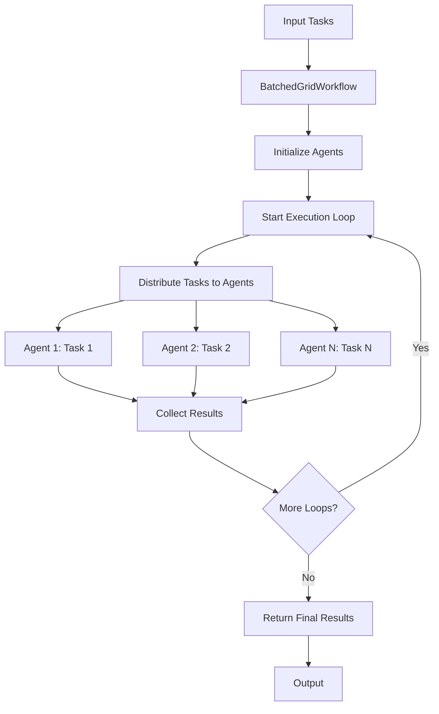

## Overview

The `BatchedGridWorkflow` is a multi-agent orchestration pattern that executes tasks in a batched grid format, where each agent processes a different task simultaneously. This workflow is particularly useful for parallel processing scenarios where you have multiple agents and multiple tasks that can be distributed across them.

The BatchedGridWorkflow provides a structured approach to:

- Execute multiple tasks across multiple agents in parallel
- Manage conversation state across execution loops
- Handle error scenarios gracefully
- Control the number of execution iterations

## Architecture



## Installation

```bash
pip install -U swarms
```

## Key Features

| Feature | Description |
|---------|-------------|
| **Parallel Execution** | Multiple agents work on different tasks simultaneously |
| **Error Handling** | Comprehensive error logging and exception handling |
| **Configurable Loops** | Control the number of execution iterations |
| **Agent Flexibility** | Supports any agent type that implements the `AgentType` interface |

## Attributes

<ParamField path="id" type="str" default="swarm_id()">
  Unique identifier for the workflow.
</ParamField>

<ParamField path="name" type="str" default="BatchedGridWorkflow">
  Name of the workflow.
</ParamField>

<ParamField path="description" type="str" default="For every agent, run the task on a different task">
  Description of what the workflow does.
</ParamField>

<ParamField path="agents" type="List[AgentType]" default="None">
  List of agents to execute tasks.
</ParamField>

<ParamField path="max_loops" type="int" default="1">
  Maximum number of execution loops to run (must be >= 1).
</ParamField>

<Note>
  `BatchedGridWorkflow` does not currently accept an `output_type` parameter — there is no earlier documented parameter in the constructor beyond the ones listed above, and it does not maintain a `Conversation` object internally.
</Note>

## Methods

### step()

Execute one step of the batched grid workflow. Pairs each agent with the task at the same index and runs all agent/task pairs concurrently via `batched_grid_agent_execution`. The number of `tasks` must match the number of `agents`.

```python
def step(self, tasks: List[str])
```

**Parameters:**
- `tasks` (List[str]): List of tasks to execute, one per agent (must be the same length as `agents`)

**Returns:** `List[Any]` - Results from each agent, in the same order as `agents`. If an agent fails, the exception is included in the results.

### run()

Run the batched grid workflow with the given tasks for `max_loops` iterations. This is the main entry point that includes error handling (logs and re-raises any exception).

```python
def run(self, tasks: List[str]) -> List[List[Any]]
```

**Parameters:**
- `tasks` (List[str]): List of tasks to execute, one per agent

**Returns:** `List[List[Any]]` - A list with one entry per loop iteration; each entry is the list of per-agent results returned by `step()` for that loop.

### run_()

Internal method that runs the workflow without the top-level try/except error handling.

```python
def run_(self, tasks: List[str]) -> List[List[Any]]
```

**Parameters:**
- `tasks` (List[str]): List of tasks to execute, one per agent

**Returns:** `List[List[Any]]` - A list with one entry per loop iteration; each entry is the list of per-agent results returned by `step()` for that loop.

## Usage Examples

### Basic Usage

```python
from swarms import Agent, BatchedGridWorkflow

# Initialize the ETF-focused agent
agent = Agent(
    agent_name="ETF-Research-Agent",
    agent_description="Specialized agent for researching, analyzing, and recommending Exchange-Traded Funds (ETFs) across various sectors and markets.",
    model_name="claude-sonnet-4-20250514",
    dynamic_temperature_enabled=True,
    max_loops=1,
    dynamic_context_window=True,
)


# Create workflow with default settings
workflow = BatchedGridWorkflow(agents=[agent, agent])

# Define simple tasks
tasks = [
    "What are the best GOLD ETFs?",
    "What are the best american energy ETFs?",
]

# Run the workflow
result = workflow.run(tasks)

print(result)
```

### Multi-Loop Execution

```python
from swarms import Agent, BatchedGridWorkflow

# Create workflow with multiple loops
workflow = BatchedGridWorkflow(
    agents=[agent1, agent2, agent3],
    max_loops=3,
    output_type="dict",
)

# Execute tasks with multiple iterations
tasks = ["Task 1", "Task 2", "Task 3"]
result = workflow.run(tasks)
```

## Error Handling

The workflow includes comprehensive error handling:

- **Validation**: Ensures `max_loops` is a positive integer
- **Execution Errors**: Catches and logs exceptions during execution
- **Detailed Logging**: Provides detailed error information including traceback

## Best Practices

| Best Practice | Description |
|--------------|-------------|
| **Agent Selection** | Choose agents with complementary capabilities for diverse task processing |
| **Task Distribution** | Ensure tasks are well-distributed and can be processed independently |
| **Loop Configuration** | Use multiple loops when iterative refinement is needed |
| **Error Monitoring** | Monitor logs for execution errors and adjust agent configurations accordingly |
| **Resource Management** | Consider computational resources when setting up multiple agents |

## Use Cases

| Use Case | Description |
|----------|-------------|
| **Content Generation** | Multiple writers working on different topics |
| **Data Analysis** | Different analysts processing various datasets |
| **Research Tasks** | Multiple researchers investigating different aspects of a problem |
| **Parallel Processing** | Any scenario requiring simultaneous task execution across multiple agents |

## Source Code

View the [source code on GitHub](https://github.com/kyegomez/swarms/blob/master/swarms/structs/batched_grid_workflow.py)
