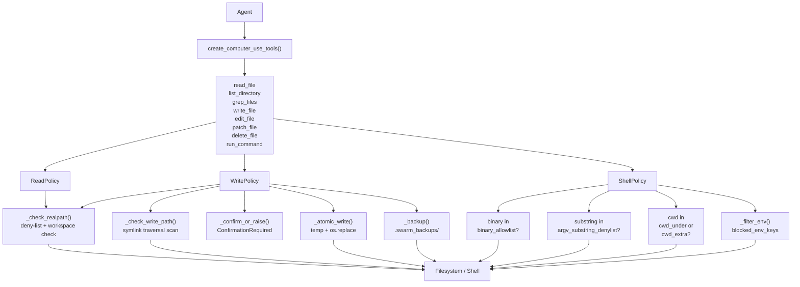

## Overview

The Computer Use Toolkit (`swarms.tools.computer_use`) provides eight security-hardened tools that give agents safe, controlled access to a workstation filesystem and shell. It wraps low-level Python operations and `subprocess` calls behind multiple enforcement layers: path sandboxing, binary allowlisting, argument substring denylisting, atomic writes with backup, environment-variable stripping, and confirmation gates for destructive operations.

The toolkit is purpose-built for autonomous agents that must read, search, write, edit, and delete files -- or run shell commands -- without corrupting the host system, leaking secrets, or escaping the designated workspace directory.

<Note>
This toolkit is appropriate when an agent needs controlled filesystem and shell access. For general-purpose subprocess or file I/O with no restrictions, use Python directly.
</Note>

## When to Use

| Scenario | Recommended approach |
|---|---|
| Agent reads and searches files in a sandboxed workspace | `read_file`, `list_directory`, `grep_files` |
| Agent produces output files (reports, code, configs) | `write_file` with atomic writes and backup |
| Agent applies targeted edits to existing files | `edit_file` or `patch_file` |
| Agent runs shell commands with a restricted binary set | `run_command` with the built-in allowlist |
| General-purpose subprocess or file I/O with no restrictions | Python directly -- this toolkit is not appropriate |

## Features

| Feature | Description |
|---|---|
| **Path sandboxing** | All file operations resolve real paths and reject any path outside the configured workspace or on the system-deny list. |
| **Binary allowlisting** | `run_command` only executes binaries on an explicit allowlist; `shell=False` throughout -- no shell injection possible. |
| **Argument substring denylisting** | Command arguments containing dangerous patterns (`rm -rf`, `chmod -R 777`, `>/etc/`, etc.) are rejected before execution. |
| **Atomic writes** | All file writes use a temp-file + `os.fsync` + `os.replace` sequence; a crash mid-write leaves the original intact. |
| **Backup on overwrite** | `write_file`, `edit_file`, and `delete_file` snapshot the original to `.swarm_backups/` before modifying it. |
| **Symlink traversal rejection** | Write operations walk the full resolved path and reject any operation that traverses a symlink when `follow_symlinks="reject"`. |
| **Environment sanitization** | `run_command` strips over 25 secret-bearing environment variables (`AWS_SECRET_ACCESS_KEY`, `OPENAI_API_KEY`, `ANTHROPIC_API_KEY`, etc.) from the subprocess environment. |
| **Confirmation gates** | Destructive write/edit/delete operations raise `ConfirmationRequired` unless `confirm=True` is passed or the policy has `require_confirm=False`. |
| **ripgrep fallback** | `grep_files` prefers the system `rg` binary when available; falls back to a pure-Python implementation when it is not. |
| **Output truncation** | All tools cap returned data at a configurable maximum to prevent accidental large-output amplification. |
| **Timeout enforcement** | `run_command` enforces per-invocation timeouts (default 30 s, max 600 s) and kills the entire process group on timeout. |

## Architecture



---

## Policy Reference

### ReadPolicy

Controls the behaviour of `read_file`, `list_directory`, and `grep_files`.

| Parameter | Type | Default | Description |
|---|---|---|---|
| `require_cwd_under` | `Optional[str]` | `None` | If set, all read paths must resolve under this directory. |
| `deny_paths` | `frozenset[str]` | See source -- includes `/etc`, `/root`, `/proc`, `/sys`, `/var/lib`, `/boot`, `/usr/lib`, `/usr/lib64` | Absolute paths that are always forbidden, including their subdirectories. |
| `follow_symlinks` | `bool` | `False` | Whether to follow symlinks during directory traversal. |
| `max_file_size_bytes` | `int` | `10 * 1024 * 1024` | Maximum file size (10 MiB) accepted for read operations. |
| `max_output_bytes` | `int` | `1 * 1024 * 1024` | Maximum bytes returned from a single call (output truncation threshold). |
| `max_glob_tokens` | `int` | `64` | Maximum number of glob pattern tokens permitted. |
| `rg_timeout_seconds` | `float` | `10.0` | Timeout in seconds for ripgrep subprocess calls. |

### WritePolicy

Controls the behaviour of `write_file`, `edit_file`, `patch_file`, and `delete_file`.

| Parameter | Type | Default | Description |
|---|---|---|---|
| `require_cwd_under` | `Optional[str]` | `None` | If set, all write targets must resolve under this directory. |
| `require_confirm` | `bool` | `True` | Whether to raise `ConfirmationRequired` before any write operation. |
| `mode_default` | `"fail" \| "overwrite" \| "append"` | `"fail"` | Default write mode when `mode` is not explicitly specified. |
| `atomic` | `bool` | `True` | Whether to use atomic (temp + rename) writes. |
| `max_file_size_bytes` | `int` | `10 * 1024 * 1024` | Maximum file size permitted for write operations. |
| `backup_on_overwrite` | `bool` | `True` | Whether to snapshot the original file to `backup_dir` before overwriting. |
| `backup_dir` | `str` | `".swarm_backups"` | Directory name, relative to the file's parent, used for backups. |
| `follow_symlinks` | `"reject" \| "allow"` | `"reject"` | Whether to reject write targets that traverse a symlink. |
| `max_content_bytes` | `int` | `1 * 1024 * 1024` | Maximum size of `old` / `new` content strings in `edit_file`. |

### ShellPolicy

Controls the behaviour of `run_command`.

| Parameter | Type | Default | Description |
|---|---|---|---|
| `binary_allowlist` | `frozenset[str]` | See source -- 50+ binaries including `ls`, `cat`, `grep`, `git`, `python`, etc. | Exact set of binaries that may be executed. No other binary -- including shell built-ins -- can be run. |
| `argv_substring_denylist` | `frozenset[str]` | See source -- includes `rm -rf`, `mkfs`, `chmod -R 777`, `curl`, `wget`, `/etc/passwd`, etc. | Command argument substrings that, if present anywhere in the flattened argv, cause immediate rejection. |
| `cwd_under` | `str` | `"/workspace"` | The working directory must be equal to this path or a subdirectory of it. |
| `cwd_extra` | `frozenset[str]` | See source code | Additional directories permitted as the working directory. |
| `timeout_default` | `int` | `30` | Default timeout in seconds if not specified at call time. |
| `timeout_max` | `int` | `600` | Maximum permitted timeout value. |
| `max_stdout_bytes` | `int` | `1 * 1024 * 1024` | Maximum stdout bytes returned before truncation. |
| `max_stderr_bytes` | `int` | `1 * 1024 * 1024` | Maximum stderr bytes returned before truncation. |
| `max_stdin_bytes` | `int` | `64 * 1024` | Maximum stdin bytes permitted. |
| `max_argv_tokens` | `int` | `256` | Maximum number of argv tokens permitted. |
| `max_arg_token_bytes` | `int` | `4096` | Maximum size in bytes per individual argv token. |
| `kill_process_group_on_timeout` | `bool` | `True` | Whether to send `SIGKILL` to the entire process group on timeout. |
| `redact_stdin_in_logs` | `bool` | `True` | Whether to redact stdin content from logs on timeout. |
| `blocked_env_keys` | `frozenset[str]` | See source -- includes `AWS_SECRET_ACCESS_KEY`, `OPENAI_API_KEY`, `ANTHROPIC_API_KEY`, `GITHUB_TOKEN`, etc. (25+ keys) | Environment variables stripped from the subprocess environment. |

---

## Exception Classes

| Exception | Base Class | Description |
|---|---|---|
| `SecurityError` | `Exception` | Base exception for all security-related failures in this module. |
| `PathPolicyError` | `SecurityError` | Raised when a path is denied or resolves outside the configured workspace. |
| `SymlinkPolicyError` | `SecurityError` | Raised when a write target traverses a symlink and `follow_symlinks="reject"`. |
| `InvalidInputError` | `SecurityError` | Raised when an argument fails validation (NUL bytes, flag injection, size caps, etc.). |
| `BinaryNotAllowedError` | `SecurityError` | Raised when the first argv token is not on `binary_allowlist`. |
| `ArgvPatternDeniedError` | `SecurityError` | Raised when any command argument matches the `argv_substring_denylist`. |
| `ConfirmationRequired` | `SecurityError` | Raised for write/delete operations when `confirm=True` is required but not provided. |

---

## Tool Reference

### read_file

Read a file's contents with optional offset and byte-limit slicing.

```python
def read_file(
    path: str,
    encoding: str = "utf-8",
    offset: int = 0,
    limit: Optional[int] = None,
    *,
    policy: Optional[ReadPolicy] = None,
    workspace_root: Optional[str] = None,
) -> str
```

<ParamField path="path" type="str" required>
  Path to the file to read.
</ParamField>

<ParamField path="encoding" type="str" default='"utf-8"'>
  Text encoding to use.
</ParamField>

<ParamField path="offset" type="int" default="0">
  Number of bytes to skip from the start of the file. Must be >= 0.
</ParamField>

<ParamField path="limit" type="Optional[int]" default="None">
  Maximum number of bytes to return. Cap is 10 MiB.
</ParamField>

<ParamField path="policy" type="Optional[ReadPolicy]" default="None">
  Custom read policy to override defaults.
</ParamField>

<ParamField path="workspace_root" type="Optional[str]" default="None">
  Restrict reads to this directory.
</ParamField>

<ResponseField name="return" type="str">
  The file contents, possibly truncated at `max_output_bytes`. Returns an error string if the path is a directory.
</ResponseField>

**Raises:** `PathPolicyError`, `InvalidInputError`

```python
content = read_file(
    "src/main.py",
    offset=0,
    limit=4096,
    workspace_root="/workspace",
)
```

---

### list_directory

List the entries in a directory without reading file contents.

```python
def list_directory(
    path: str = ".",
    glob: str = "*",
    include_hidden: bool = False,
    *,
    policy: Optional[ReadPolicy] = None,
    workspace_root: Optional[str] = None,
) -> List[Dict[str, Any]]
```

<ParamField path="path" type="str" default='"."'>
  Directory to list.
</ParamField>

<ParamField path="glob" type="str" default='"*"'>
  Glob pattern to filter entries by name.
</ParamField>

<ParamField path="include_hidden" type="bool" default="False">
  Whether to include dotfiles.
</ParamField>

<ParamField path="policy" type="Optional[ReadPolicy]" default="None">
  Custom read policy.
</ParamField>

<ParamField path="workspace_root" type="Optional[str]" default="None">
  Restrict operations to this directory.
</ParamField>

<ResponseField name="return" type="List[Dict[str, Any]]">
  List of entries, each containing `name`, `path`, `type` (`"file"`, `"dir"`, `"symlink"`), and `size_bytes`.
</ResponseField>

**Raises:** `PathPolicyError`, `InvalidInputError`

```python
entries = list_directory("/workspace/src", glob="*.py", include_hidden=False)
for entry in entries:
    print(entry["name"], entry["type"], entry["size_bytes"])
```

---

### grep_files

Search for a pattern across files in a directory tree using ripgrep (with a pure-Python fallback).

```python
def grep_files(
    pattern: str,
    path: str = ".",
    glob: str = "*",
    context_lines: int = 2,
    max_matches: int = 200,
    *,
    policy: Optional[ReadPolicy] = None,
    workspace_root: Optional[str] = None,
) -> List[Dict[str, Any]]
```

<ParamField path="pattern" type="str" required>
  Regex pattern to search for.
</ParamField>

<ParamField path="path" type="str" default='"."'>
  Root directory to search.
</ParamField>

<ParamField path="glob" type="str" default='"*"'>
  Glob pattern to filter files.
</ParamField>

<ParamField path="context_lines" type="int" default="2">
  Lines of context before and after each match.
</ParamField>

<ParamField path="max_matches" type="int" default="200">
  Maximum number of matches to return. Must be > 0.
</ParamField>

<ParamField path="policy" type="Optional[ReadPolicy]" default="None">
  Custom read policy.
</ParamField>

<ParamField path="workspace_root" type="Optional[str]" default="None">
  Restrict operations to this directory.
</ParamField>

<ResponseField name="return" type="List[Dict[str, Any]]">
  Each dict contains `raw` (ripgrep mode) or `path`, `line`, `match`, `context_before`, `context_after` (Python fallback mode).
</ResponseField>

**Raises:** `PathPolicyError`, `InvalidInputError`

```python
results = grep_files(
    pattern=r"class\s+\w+",
    path="/workspace/src",
    glob="*.py",
    context_lines=3,
)
for r in results:
    print(r.get("path", r.get("raw")))
```

---

### write_file

Write content to a file atomically, with optional backup.

```python
def write_file(
    path: str,
    content: str,
    mode: Literal["fail", "overwrite", "append"] = "fail",
    *,
    confirm: bool = False,
    policy: Optional[WritePolicy] = None,
    workspace_root: Optional[str] = None,
) -> Dict[str, Any]
```

<ParamField path="path" type="str" required>
  Target file path.
</ParamField>

<ParamField path="content" type="str" required>
  Content to write.
</ParamField>

<ParamField path="mode" type='"fail" | "overwrite" | "append"' default='"fail"'>
  Write mode. `"fail"` refuses to overwrite existing files.
</ParamField>

<ParamField path="confirm" type="bool" default="False">
  Set to `True` to bypass the confirmation gate when required.
</ParamField>

<ParamField path="policy" type="Optional[WritePolicy]" default="None">
  Custom write policy.
</ParamField>

<ParamField path="workspace_root" type="Optional[str]" default="None">
  Restrict operations to this directory.
</ParamField>

<ResponseField name="return" type="Dict[str, Any]">
  Dict containing `path`, `written` (bool), and either `bytes` or `appended` (bool), or `reason: "exists"` when mode is `"fail"` and the file exists.
</ResponseField>

**Raises:** `ConfirmationRequired`, `PathPolicyError`, `SymlinkPolicyError`, `InvalidInputError`

```python
result = write_file(
    "output/report.md",
    content="# Report\n\nGenerated on 2024-01-01.",
    mode="overwrite",
    confirm=True,
    workspace_root="/workspace",
)
```

---

### edit_file

Replace occurrences of `old` with `new` in a file, with an optional assertion on the number of replacements.

```python
def edit_file(
    path: str,
    old: str,
    new: str,
    expected_replacements: Optional[int] = 1,
    *,
    confirm: bool = False,
    policy: Optional[WritePolicy] = None,
    workspace_root: Optional[str] = None,
) -> Dict[str, Any]
```

<ParamField path="path" type="str" required>
  Target file path.
</ParamField>

<ParamField path="old" type="str" required>
  Exact substring to replace.
</ParamField>

<ParamField path="new" type="str" required>
  Replacement string.
</ParamField>

<ParamField path="expected_replacements" type="Optional[int]" default="1">
  Assert that exactly this many matches exist; `None` disables the check.
</ParamField>

<ParamField path="confirm" type="bool" default="False">
  Set to `True` to bypass the confirmation gate.
</ParamField>

<ParamField path="policy" type="Optional[WritePolicy]" default="None">
  Custom write policy.
</ParamField>

<ParamField path="workspace_root" type="Optional[str]" default="None">
  Restrict operations to this directory.
</ParamField>

<ResponseField name="return" type="Dict[str, Any]">
  Dict containing `path`, `replaced` (number of replacements made), `bytes` (new file size), and possibly `error: "match count mismatch"` when the assertion fails.
</ResponseField>

**Raises:** `ConfirmationRequired`, `PathPolicyError`, `SymlinkPolicyError`, `InvalidInputError`

```python
result = edit_file(
    "config.py",
    old="DEBUG = True",
    new="DEBUG = False",
    expected_replacements=1,
    confirm=True,
)
```

---

### patch_file

Alias for `edit_file` with `expected_replacements=1`. Identical behaviour when exactly one replacement is expected.

```python
def patch_file(
    path: str,
    old: str,
    new: str,
    *,
    confirm: bool = False,
    policy: Optional[WritePolicy] = None,
    workspace_root: Optional[str] = None,
) -> Dict[str, Any]
```

---

### delete_file

Delete a file or directory, with optional recursive deletion and backup.

```python
def delete_file(
    path: str,
    recursive: bool = False,
    *,
    confirm: bool = False,
    policy: Optional[WritePolicy] = None,
    workspace_root: Optional[str] = None,
) -> Dict[str, Any]
```

<ParamField path="path" type="str" required>
  Path to delete.
</ParamField>

<ParamField path="recursive" type="bool" default="False">
  Whether to delete directories recursively.
</ParamField>

<ParamField path="confirm" type="bool" default="False">
  Set to `True` to bypass the confirmation gate.
</ParamField>

<ParamField path="policy" type="Optional[WritePolicy]" default="None">
  Custom write policy.
</ParamField>

<ParamField path="workspace_root" type="Optional[str]" default="None">
  Restrict operations to this directory.
</ParamField>

<ResponseField name="return" type="Dict[str, Any]">
  Dict containing `path`, `deleted` (bool), `reason` if the file was missing, and `snapshot` (backup path) for directory deletions.
</ResponseField>

**Raises:** `ConfirmationRequired`, `PathPolicyError`, `SymlinkPolicyError`, `SecurityError`

```python
result = delete_file("/workspace/cache/tmp.dat", confirm=True)
```

---

### run_command

Execute a binary with arguments in a hardened subprocess environment.

```python
def run_command(
    argv: Sequence[str],
    cwd: str = "/workspace",
    env: Optional[Mapping[str, str]] = None,
    timeout: int = 30,
    stdin: Optional[str] = None,
    *,
    policy: Optional[ShellPolicy] = None,
) -> Dict[str, Any]
```

<ParamField path="argv" type="Sequence[str]" required>
  Command and arguments as a list. Never shell-quoted strings.
</ParamField>

<ParamField path="cwd" type="str" default='"/workspace"'>
  Working directory. Must be `cwd_under` or in `cwd_extra`.
</ParamField>

<ParamField path="env" type="Optional[Mapping[str, str]]" default="None">
  Additional environment variables to merge; defaults to `os.environ` with secrets stripped.
</ParamField>

<ParamField path="timeout" type="int" default="30">
  Seconds before the process is killed. Must be in `[1, timeout_max]`.
</ParamField>

<ParamField path="stdin" type="Optional[str]" default="None">
  String to pass to stdin.
</ParamField>

<ParamField path="policy" type="Optional[ShellPolicy]" default="None">
  Custom shell policy.
</ParamField>

<ResponseField name="return" type="Dict[str, Any]">
  Dict containing `argv`, `returncode`, `stdout`, `stderr`, `duration_ms`, `truncated` (stdout/stderr booleans), and possibly `error` on timeout.
</ResponseField>

**Raises:** `BinaryNotAllowedError`, `ArgvPatternDeniedError`, `PathPolicyError`, `InvalidInputError`

```python
result = run_command(
    ["grep", "-r", "TODO", "."],
    cwd="/workspace/src",
    timeout=60,
)
if result["returncode"] == 0:
    print(result["stdout"])
```

---

## Factory Function

### create_computer_use_tools

```python
def create_computer_use_tools(
    workspace_root: Optional[str] = None,
    write_policy: Optional[WritePolicy] = None,
    shell_policy: Optional[ShellPolicy] = None,
) -> Dict[str, Callable]
```

Returns a dictionary of eight pre-bound tool callables. When `workspace_root` is not provided it defaults to the current working directory or the `COMPUTER_USE_WORKSPACE` environment variable.

| Key | Underlying function |
|---|---|
| `"read_file"` | `read_file` |
| `"list_directory"` | `list_directory` |
| `"grep_files"` | `grep_files` |
| `"write_file"` | `write_file` (mode=`"overwrite"`, `confirm=True`) |
| `"edit_file"` | `edit_file` (`confirm=True`) |
| `"patch_file"` | `patch_file` (`confirm=True`) |
| `"delete_file"` | `delete_file` (`confirm=True`) |
| `"run_command"` | `_run_cmd` (accepts a single `str` command) |

<ParamField path="workspace_root" type="Optional[str]" default="None">
  Root directory for all tool operations.
</ParamField>

<ParamField path="write_policy" type="Optional[WritePolicy]" default="None">
  Override the default `WritePolicy`.
</ParamField>

<ParamField path="shell_policy" type="Optional[ShellPolicy]" default="None">
  Override the default `ShellPolicy`.
</ParamField>

#### Basic usage

```python
from swarms.tools.computer_use import create_computer_use_tools

tools = create_computer_use_tools(workspace_root="/workspace/my_agent")
content = tools["read_file"]("README.md")
```

#### Customizing policies

**Stricter shell policy -- remove dangerous binaries and add additional deny patterns:**

```python
from swarms.tools.computer_use import (
    create_computer_use_tools,
    ShellPolicy,
)

strict_shell = ShellPolicy(
    binary_allowlist=frozenset({"ls", "grep", "rg", "cat", "find", "head", "tail"}),
    argv_substring_denylist=frozenset({
        "rm -rf", "chmod -R 777", ">/etc/", "curl ", "wget ", "| sh",
    }),
    timeout_max=60,
)

tools = create_computer_use_tools(
    workspace_root="/workspace/restricted",
    shell_policy=strict_shell,
)
```

**Relaxed write policy -- disable confirmation gates for trusted agents:**

```python
from swarms.tools.computer_use import (
    create_computer_use_tools,
    WritePolicy,
)

trusted_write = WritePolicy(
    require_confirm=False,
    follow_symlinks="allow",
)

tools = create_computer_use_tools(
    workspace_root="/workspace/trusted",
    write_policy=trusted_write,
)
```

#### Full agent integration

```python
import os
from swarms import Agent
from swarms.tools.computer_use import create_computer_use_tools

os.environ["COMPUTER_USE_WORKSPACE"] = "/workspace/analysis_agent"

tools = create_computer_use_tools()

agent = Agent(
    agent_name="filesystem-agent",
    agent_description="Autonomous agent that reads, writes, and searches files in /workspace.",
    model_name="gpt-5.4",
    max_loops="auto",
    tools=list(tools.values()),
    workspace_dir="/workspace/analysis_agent",
)

result = agent.run(
    "Read all Python files in /workspace, count the total lines of code, "
    "and write a summary to /workspace/analysis_agent/loc_report.txt."
)
```

**Read-only agent -- selectively expose only safe tools:**

```python
read_only_tools = {
    k: v for k, v in tools.items()
    if k in ("read_file", "list_directory", "grep_files")
}

agent_read_only = Agent(
    agent_name="reader-agent",
    model_name="gpt-5.4-mini",
    max_loops=1,
    tools=list(read_only_tools.values()),
)
```

---


## Security Considerations

### Confirmation gates

`write_file`, `edit_file`, `patch_file`, and `delete_file` all raise `ConfirmationRequired` by default when called without `confirm=True`. This prevents accidental destructive operations in production. Always pass `confirm=True` intentionally -- consider this a deliberate human-in-the-loop signal rather than a nuisance.

### Atomic writes and backups

When `atomic=True` (the default), writes use a temp file + `os.fsync` + `os.replace` sequence. A crash mid-write leaves the original file intact; there is no partial-write state. The `os.replace` call is atomic on POSIX systems, so readers never see a half-written file. Backups in `.swarm_backups/` capture the pre-write state before any modification; these should be cleaned up periodically.

### Symlink rejection

When `follow_symlinks="reject"` (the `WritePolicy` default), write operations walk the full resolved path of the target and reject the operation if any component is a symlink. This prevents an attacker from creating a symlink inside the workspace that points to a file outside the workspace.

### Environment variable stripping

`run_command` strips the full `blocked_env_keys` list from the subprocess environment. If additional secrets are stored in environment variables, add them to `ShellPolicy.blocked_env_keys`:

```python
custom_policy = ShellPolicy(
    blocked_env_keys=ShellPolicy().blocked_env_keys | frozenset({"MY_SECRET_TOKEN"}),
)
```

### Working directory restrictions

`run_command` requires `cwd` to be either `cwd_under` (`"/workspace"` by default) or in `cwd_extra` (`{"/tmp", "/home"}`). Operations from other directories are rejected before any binary is invoked.

### Timeout enforcement

When `kill_process_group_on_timeout=True` (the default), `run_command` calls `os.killpg` on timeout, killing the entire process group including any child processes spawned by the binary.

---

## Troubleshooting

| Error | Cause | Fix |
|---|---|---|
| `PathPolicyError: path /etc/passwd is on the deny-list` | Attempted to access a system directory. | Ensure `workspace_root` is set to a non-system directory and paths are relative to it. |
| `ConfirmationRequired for 'write_file'; pass confirm=True.` | Write operation called without `confirm=True` when `require_confirm=True`. | Pass `confirm=True` to the call, or set `require_confirm=False` in the `WritePolicy`. |
| `BinaryNotAllowedError: binary 'vim' is not on the allow-list` | Attempted to run a binary not on `binary_allowlist`. | Add `"vim"` to `ShellPolicy.binary_allowlist` in a custom policy, or use a different tool. |
| `ArgvPatternDeniedError: argv contains forbidden substring 'rm -rf'` | Command argument matched the `argv_substring_denylist`. | Rewrite the command to avoid the forbidden pattern; if genuinely needed, override the denylist in a custom policy (not recommended for untrusted input). |
| `SymlinkPolicyError: path /workspace/link traverses symlink at /workspace` | Write target resolves through a symlink with `follow_symlinks="reject"`. | Remove the symlink, or set `follow_symlinks="allow"` in the `WritePolicy` (with caution). |
| `PathPolicyError: cwd /opt is outside /workspace and not in /tmp, /home` | `run_command` called with `cwd` outside the permitted set. | Set `cwd` to `/workspace` or a subdirectory of `/tmp` or `/home`. |

---

## Comparison

| Feature | Computer Use Toolkit | Raw `subprocess.run` | Plain `os.walk` / `open` |
|---|---|---|---|
| Path sandboxing | Yes -- deny-list + workspace check | No | No |
| Binary allowlisting | Yes -- explicit allowlist, `shell=False` | No | N/A |
| Argument substring denylist | Yes | No | N/A |
| Atomic writes | Yes -- temp + rename | No | No |
| Backup before overwrite | Yes -- `.swarm_backups/` | No | No |
| Symlink traversal rejection | Yes | No | No |
| Environment variable stripping | Yes -- 25+ secret keys blocked | No | N/A |
| Confirmation gates | Yes | No | No |
| Output truncation | Yes | No | No |
| Timeout enforcement | Yes | Manual | N/A |
| ripgrep fallback | Yes | No | No |

---

## Usage Tips

1. **Always set `workspace_root`** to a dedicated directory. Never use `/`, `/home`, or other system directories as the workspace root. This is the primary line of defence against path traversal attacks.

2. **Use `confirm=True` explicitly.** Treat it as a deliberate acknowledgement that a write or delete is intentional. If you find yourself always passing `confirm=True`, consider setting `require_confirm=False` in the policy instead -- but only for trusted agents.

3. **Audit the `binary_allowlist`** before deploying. If your agent needs a binary not in the default list, extend the policy explicitly and document why it is safe to add.

4. **Rotate or clean `.swarm_backups/` periodically.** The backup directory grows with every overwrite and delete operation and is not automatically pruned.

5. **Pair `context_compression=True` with long autonomous sessions.** The toolkit can generate large volumes of file content; without context compression the agent will eventually hit token limits.

6. **Use `list_directory` before `read_file`** to explore an unknown workspace. This avoids accidentally reading large files that are not relevant to the task.

7. **Set `timeout_max` to match your workload** for `run_command`. The default of 600 seconds may be too long for untrusted commands and too short for legitimate compilation or test runs.

---

## See Also

<CardGroup cols={3}>
  <Card title="Agent" icon="robot" href="/api/agent">
    The `Agent` class that consumes these tools
  </Card>
  <Card title="Tools & Utilities" icon="wrench" href="/api/tools">
    General tool system documentation
  </Card>
  <Card title="Agent Tools" icon="wrench" href="/agents/agent-tools">
    How to use and configure tools with agents
  </Card>
</CardGroup>
