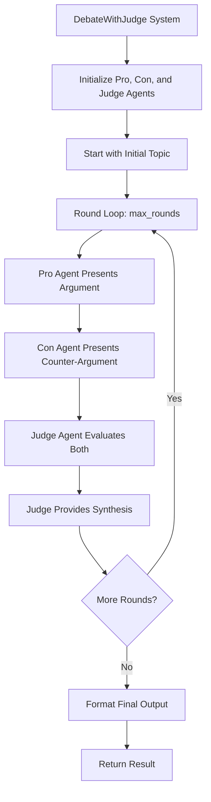

## Overview

The `DebateWithJudge` module provides a sophisticated debate architecture with self-refinement through a judge agent. This system enables two agents (Pro and Con) to debate a topic, with a Judge agent evaluating their arguments and providing refined synthesis. The process repeats for N rounds to progressively refine the answer.

## Installation

```bash
pip install -U swarms
```

## Architecture



### Key Concepts

| Concept | Description |
|---|---|
| Debate Architecture | A structured process where two agents present opposing arguments on a topic |
| Pro Agent | The agent arguing in favor of a position |
| Con Agent | The agent arguing against a position |
| Judge Agent | An impartial evaluator that analyzes both arguments and provides synthesis |
| Iterative Refinement | The process repeats for multiple rounds, each round building upon the judge's previous synthesis |
| Progressive Improvement | Each round refines the answer by incorporating feedback and addressing weaknesses |
| Preset Agents | Built-in optimized agents that can be used without manual configuration |

## Attributes

<ParamField path="pro_agent" type="Optional[Agent]" default="None">
  The agent arguing in favor (Pro position). Not required if using `agents` list or `preset_agents`.
</ParamField>

<ParamField path="con_agent" type="Optional[Agent]" default="None">
  The agent arguing against (Con position). Not required if using `agents` list or `preset_agents`.
</ParamField>

<ParamField path="judge_agent" type="Optional[Agent]" default="None">
  The judge agent that evaluates arguments and provides synthesis. Not required if using `agents` list or `preset_agents`.
</ParamField>

<ParamField path="agents" type="Optional[List[Agent]]" default="None">
  A list of exactly 3 agents in order: `[pro_agent, con_agent, judge_agent]`. Takes precedence over individual agent parameters.
</ParamField>

<ParamField path="preset_agents" type="bool" default="False">
  If `True`, creates default Pro, Con, and Judge agents automatically with optimized system prompts.
</ParamField>

<ParamField path="max_loops" type="int" default="3">
  Maximum number of debate rounds to execute.
</ParamField>

<ParamField path="output_type" type="str" default="str-all-except-first">
  Format for the output conversation history.
</ParamField>

<ParamField path="verbose" type="bool" default="True">
  Whether to enable verbose logging.
</ParamField>

<ParamField path="model_name" type="str" default="gpt-5.4">
  The model name to use for preset agents.
</ParamField>

## Initialization Options

The `DebateWithJudge` class supports three ways to configure agents:

### Option 1: Preset Agents (Simplest)

Use built-in agents with optimized system prompts for debates:

```python
from swarms import DebateWithJudge

# Create debate system with preset agents
debate = DebateWithJudge(
    preset_agents=True,
    max_loops=3,
    model_name="gpt-5.4"
)

result = debate.run("Should AI be regulated?")
```

### Option 2: List of Agents

Provide a list of exactly 3 agents (Pro, Con, Judge):

```python
from swarms import Agent, DebateWithJudge

# Create your custom agents
agents = [pro_agent, con_agent, judge_agent]

# Create debate system with agent list
debate = DebateWithJudge(
    agents=agents,
    max_loops=3
)

result = debate.run("Is remote work better than office work?")
```

### Option 3: Individual Agent Parameters

Provide each agent separately:

```python
from swarms import Agent, DebateWithJudge

# Create debate system with individual agents
debate = DebateWithJudge(
    pro_agent=my_pro_agent,
    con_agent=my_con_agent,
    judge_agent=my_judge_agent,
    max_loops=3
)

result = debate.run("Should we colonize Mars?")
```

## Methods

### run()

Executes the debate with judge refinement process for a single task and returns the refined result.

```python
def run(self, task: str) -> Union[str, List, dict]
```

**Parameters:**
- `task` (str): The initial topic or question to debate

**Returns:** The formatted conversation history or final refined answer, depending on `output_type`

**Process Flow:**

1. **Task Validation**: Validates that the task is a non-empty string
2. **Agent Initialization**: Initializes all three agents with their respective roles and the initial task context
3. **Multi-Round Execution**: For each round (up to `max_loops`):
   - Pro agent presents an argument in favor
   - Con agent presents a counter-argument
   - Judge agent evaluates both arguments and provides synthesis
   - Judge's synthesis becomes the topic for the next round
4. **Result Formatting**: Returns the final result formatted according to `output_type`

**Raises:**
- `ValueError`: If task is None or empty. (Invalid agent configuration or `max_loops < 1` raise `ValueError` at construction time, in `__init__`, not in `run()`.)

### batched_run()

Executes the debate for multiple tasks sequentially.

```python
def batched_run(self, tasks: List[str]) -> List[str]
```

**Parameters:**
- `tasks` (List[str]): List of topics or questions to debate

**Returns:** List of final refined answers, one for each input task

### get_conversation_history()

Get the full conversation history from the debate.

```python
def get_conversation_history(self) -> List[dict]
```

**Returns:** List of message dictionaries containing the conversation history

### get_final_answer()

Get the final refined answer from the judge.

```python
def get_final_answer(self) -> str
```

**Returns:** The content of the final judge synthesis

## Output Types

The `output_type` parameter controls how the conversation history is formatted:

| Value | Description |
|---|---|
| `"str-all-except-first"` | Returns a formatted string with all messages except the first (default) |
| `"str"` | Returns all messages as a formatted string |
| `"dict"` | Returns messages as a dictionary |
| `"list"` | Returns messages as a list |

## Usage Examples

### Quick Start with Preset Agents

```python
from swarms import DebateWithJudge

# Create the DebateWithJudge system with preset agents
debate_system = DebateWithJudge(
    preset_agents=True,
    max_loops=3,
    model_name="gpt-5.4",
    output_type="str-all-except-first",
    verbose=True,
)

# Define the debate topic
topic = (
    "Should artificial intelligence be regulated by governments? "
    "Discuss the balance between innovation and safety."
)

# Run the debate
result = debate_system.run(task=topic)
print(result)

# Get the final refined answer
final_answer = debate_system.get_final_answer()
print(final_answer)
```

### Policy Debate with Custom Agents

```python
from swarms import Agent, DebateWithJudge

# Create the Pro agent (arguing in favor of AI regulation)
pro_agent = Agent(
    agent_name="Pro-Regulation-Agent",
    system_prompt=(
        "You are a policy expert specializing in technology regulation. "
        "You argue in favor of government regulation of artificial intelligence. "
        "You present well-reasoned arguments focusing on safety, ethics, "
        "and public interest. You use evidence, examples, and logical reasoning. "
        "You are persuasive and articulate, emphasizing the need for oversight "
        "to prevent harm and ensure responsible AI development."
    ),
    model_name="gpt-5.4",
    max_loops=1,
)

# Create the Con agent (arguing against AI regulation)
con_agent = Agent(
    agent_name="Anti-Regulation-Agent",
    system_prompt=(
        "You are a technology policy expert specializing in innovation. "
        "You argue against heavy government regulation of artificial intelligence. "
        "You present strong counter-arguments focusing on innovation, economic growth, "
        "and the risks of over-regulation. You identify weaknesses in regulatory "
        "proposals and provide compelling alternatives such as industry self-regulation "
        "and ethical guidelines. You emphasize the importance of maintaining "
        "technological competitiveness."
    ),
    model_name="gpt-5.4",
    max_loops=1,
)

# Create the Judge agent (evaluates and synthesizes)
judge_agent = Agent(
    agent_name="Policy-Judge-Agent",
    system_prompt=(
        "You are an impartial policy analyst and judge who evaluates debates on "
        "technology policy. You carefully analyze arguments from both sides, "
        "identify strengths and weaknesses, and provide balanced synthesis. "
        "You consider multiple perspectives including safety, innovation, economic impact, "
        "and ethical considerations. You may declare a winner or provide a refined "
        "answer that incorporates the best elements from both arguments, such as "
        "balanced regulatory frameworks that protect public interest while fostering innovation."
    ),
    model_name="gpt-5.4",
    max_loops=1,
)

# Create the DebateWithJudge system
debate_system = DebateWithJudge(
    pro_agent=pro_agent,
    con_agent=con_agent,
    judge_agent=judge_agent,
    max_loops=3,
    output_type="str-all-except-first",
    verbose=True,
)

# Define the debate topic
topic = (
    "Should artificial intelligence be regulated by governments? "
    "Discuss the balance between innovation and safety, considering "
    "both the potential benefits of regulation (safety, ethics, public trust) "
    "and the potential drawbacks (stifling innovation, economic impact, "
    "regulatory capture). Provide a nuanced analysis."
)

# Run the debate
result = debate_system.run(task=topic)
print(result)

# Get the final refined answer
final_answer = debate_system.get_final_answer()
print(final_answer)
```

### Using Agent List

```python
from swarms import Agent, DebateWithJudge

# Create your agents
pro = Agent(
    agent_name="Microservices-Pro",
    system_prompt="You advocate for microservices architecture...",
    model_name="gpt-5.4",
    max_loops=1,
)

con = Agent(
    agent_name="Monolith-Pro",
    system_prompt="You advocate for monolithic architecture...",
    model_name="gpt-5.4",
    max_loops=1,
)

judge = Agent(
    agent_name="Architecture-Judge",
    system_prompt="You evaluate architecture debates...",
    model_name="gpt-5.4",
    max_loops=1,
)

# Create debate with agent list
debate = DebateWithJudge(
    agents=[pro, con, judge],
    max_loops=2,
    verbose=True,
)

result = debate.run("Should a startup use microservices or monolithic architecture?")
print(result)
```

### Batch Processing Multiple Topics

```python
from swarms import Agent, DebateWithJudge

# Create specialized technical agents
pro_agent = Agent(
    agent_name="Microservices-Pro",
    system_prompt=(
        "You are a software architecture expert advocating for microservices architecture. "
        "You present arguments focusing on scalability, independent deployment, "
        "technology diversity, and team autonomy. You use real-world examples and "
        "case studies to support your position."
    ),
    model_name="gpt-5.4",
    max_loops=1,
)

con_agent = Agent(
    agent_name="Monolith-Pro",
    system_prompt=(
        "You are a software architecture expert advocating for monolithic architecture. "
        "You present counter-arguments focusing on simplicity, reduced complexity, "
        "easier debugging, and lower operational overhead. You identify weaknesses "
        "in microservices approaches and provide compelling alternatives."
    ),
    model_name="gpt-5.4",
    max_loops=1,
)

judge_agent = Agent(
    agent_name="Architecture-Judge",
    system_prompt=(
        "You are a senior software architect evaluating architecture debates. "
        "You analyze both arguments considering factors like team size, project scale, "
        "complexity, operational capabilities, and long-term maintainability. "
        "You provide balanced synthesis that considers context-specific trade-offs."
    ),
    model_name="gpt-5.4",
    max_loops=1,
)

# Create the debate system
architecture_debate = DebateWithJudge(
    pro_agent=pro_agent,
    con_agent=con_agent,
    judge_agent=judge_agent,
    max_loops=2,
    output_type="str-all-except-first",
    verbose=True,
)

# Define multiple architecture questions
architecture_questions = [
    "Should a startup with 5 developers use microservices or monolithic architecture?",
    "Is serverless architecture better than containerized deployments for event-driven systems?",
    "Should a financial application use SQL or NoSQL databases for transaction processing?",
    "Is event-driven architecture superior to request-response for real-time systems?",
]

# Execute batch processing
results = architecture_debate.batched_run(architecture_questions)

# Display results
for result in results:
    print(result)
```

### Business Strategy Debate with Conversation History

```python
from swarms import Agent, DebateWithJudge

# Create business strategy agents
pro_agent = Agent(
    agent_name="Growth-Strategy-Pro",
    system_prompt=(
        "You are a business strategy consultant specializing in aggressive growth strategies. "
        "You argue in favor of rapid expansion, market penetration, and scaling. "
        "You present arguments focusing on first-mover advantages, market share capture, "
        "network effects, and competitive positioning."
    ),
    model_name="gpt-5.4",
    max_loops=1,
)

con_agent = Agent(
    agent_name="Sustainable-Growth-Pro",
    system_prompt=(
        "You are a business strategy consultant specializing in sustainable, profitable growth. "
        "You argue against aggressive expansion in favor of measured, sustainable growth. "
        "You present counter-arguments focusing on profitability, unit economics, "
        "sustainable competitive advantages, and avoiding overextension."
    ),
    model_name="gpt-5.4",
    max_loops=1,
)

judge_agent = Agent(
    agent_name="Strategy-Judge",
    system_prompt=(
        "You are a seasoned business strategist and former CEO evaluating growth strategy debates. "
        "You carefully analyze arguments from both sides, considering market conditions, "
        "company resources, risk tolerance, and long-term sustainability vs. short-term growth."
    ),
    model_name="gpt-5.4",
    max_loops=1,
)

# Create the debate system with extended rounds
strategy_debate = DebateWithJudge(
    pro_agent=pro_agent,
    con_agent=con_agent,
    judge_agent=judge_agent,
    max_loops=4,
    output_type="dict",
    verbose=True,
)

# Define a complex business strategy question
strategy_question = (
    "A SaaS startup with $2M ARR, 40% gross margins, and $500K in the bank "
    "is considering two paths:\n"
    "1. Aggressive growth: Raise $10M, hire 50 people, expand to 5 new markets\n"
    "2. Sustainable growth: Focus on profitability, improve unit economics, "
    "expand gradually with existing resources\n\n"
    "Which strategy should they pursue?"
)

# Run the debate
result = strategy_debate.run(task=strategy_question)
print(result)

# Get the full conversation history for detailed analysis
history = strategy_debate.get_conversation_history()
print(history)

# Get the final refined answer
final_answer = strategy_debate.get_final_answer()
print(final_answer)
```

## Best Practices

<Tip>
**Agent Configuration**: Use `preset_agents=True` for quick setup with optimized prompts. For specialized domains, create custom agents with domain-specific prompts. Consider using more powerful models for the Judge agent.
</Tip>

<Info>
**Choosing an Initialization Method**: Use `preset_agents=True` for quick prototyping, `agents=[...]` list when you have agents from external sources, and individual parameters for maximum control.
</Info>

<Note>
**Loop Configuration**: Use 2-3 loops for most topics and 4-5 loops for complex, multi-faceted topics. More loops allow for deeper refinement but increase execution time.
</Note>

<Info>
**Output Format**: Use `"str-all-except-first"` for readable summaries (default), `"dict"` for structured analysis, `"list"` for conversation inspection, and `"str"` for complete history.
</Info>

<Warning>
**Performance**: Batch processing is sequential -- consider parallel execution for large batches. Each round requires 3 agent calls (Pro, Con, Judge). Memory usage scales with conversation history length.
</Warning>

## Troubleshooting

| Issue | Solution |
|---|---|
| Agents not following their roles | Ensure system prompts clearly define each agent's role. Consider using `preset_agents=True` for well-tested prompts. |
| Judge synthesis not improving over loops | Increase `max_loops` or improve Judge agent's system prompt to emphasize refinement. |
| Debate results are too generic | Use more specific system prompts and provide detailed context in the task. Custom agents often produce better domain-specific results. |
| Execution time is too long | Reduce `max_loops`, use faster models, or process fewer topics in batch. |
| ValueError when initializing | Ensure you provide one of: (1) all three agents, (2) an agents list with exactly 3 agents, or (3) `preset_agents=True`. |

## Source Code

View the [source code on GitHub](https://github.com/kyegomez/swarms/blob/master/swarms/structs/debate_with_judge.py)
