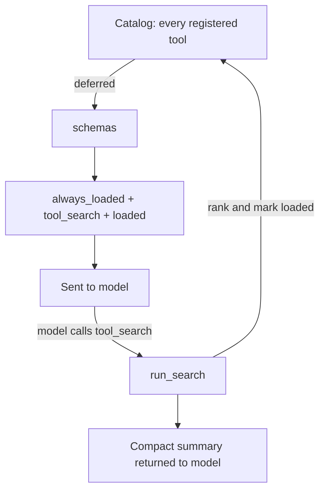

## Overview

`DynamicToolLoader` keeps tools *deferred*: registered and executable, but absent from the schema list sent to the model. One extra tool is always present — `tool_search` — which matches the catalog by name and description and loads what it finds. Loaded tools stay loaded for the rest of the run and become callable on the next request.

Tool definitions live in the prompt's cached prefix, so a large tool set is paid for on every call. Selection accuracy also degrades as the list grows: a model choosing among 80 tools chooses worse than one choosing among 8.



## Import

```python
from swarms.tools.dynamic_tool_loader import (
    DynamicToolLoader,
    DeferredTool,
    SEARCH_TOOL_NAME,
    SEARCH_TOOL_SCHEMA,
    DYNAMIC_TOOLS_NOTICE,
)
```

<Warning>
`DynamicToolLoader` is **not** re-exported from `swarms` or `swarms.tools`. Use the full module path shown above — `from swarms.tools import DynamicToolLoader` raises `ImportError`.
</Warning>

Most users never construct one directly. `Agent(dynamic_tools=True)` builds it and exposes it as `agent.tool_loader`. See [Dynamic Tool Loading](/agents/dynamic-tools) for the agent-level guide.

## Constructor

```python
DynamicToolLoader(
    tools: Iterable[Callable] = (),
    schemas: Iterable[Dict[str, Any]] = (),
    always_loaded: Iterable[Dict[str, Any]] = (),
)
```

<ParamField path="tools" type="Iterable[Callable]" default="()">
  Callables to defer. Each is converted to an OpenAI function schema once, at registration.
</ParamField>

<ParamField path="schemas" type="Iterable[Dict[str, Any]]" default="()">
  Pre-built schemas to defer, for tools that have no local callable — MCP tools, for instance.
</ParamField>

<ParamField path="always_loaded" type="Iterable[Dict[str, Any]]" default="()">
  Schemas that are never deferred. Control-flow tools belong here: an agent that has to search for its own `complete_task` cannot finish.
</ParamField>

## Module Constants

<ParamField path="SEARCH_TOOL_NAME" type="str" default="tool_search">
  The reserved name of the search tool. Registering a tool under this name is refused with a warning.
</ParamField>

<ParamField path="SEARCH_TOOL_SCHEMA" type="Dict[str, Any]">
  The OpenAI function schema for `tool_search`. Takes a required `query` string and an optional `max_results` integer. Its description instructs the model to load everything it expects to need in a single call.
</ParamField>

<ParamField path="DYNAMIC_TOOLS_NOTICE" type="str">
  The system-prompt block appended once when deferral activates, headed `## MOST TOOLS ARE NOT LOADED`. Tells the model that its visible tool list describes what exists, not what it can call right now.
</ParamField>

## Methods

### register

Defer one or more Python callables. Chainable; `None` entries are filtered out.

```python
def register(*tools: Callable) -> "DynamicToolLoader"
```

<ParamField path="tools" type="Callable" required>
  One or more callables. Each is converted to an OpenAI function schema at registration time.
</ParamField>

<ResponseField name="return" type="DynamicToolLoader">
  The same loader, for chaining.
</ResponseField>

### register_schema

Defer a pre-built OpenAI function schema, optionally binding a local callable to it.

```python
def register_schema(
    schema: Dict[str, Any],
    func: Optional[Callable] = None,
) -> "DynamicToolLoader"
```

<ParamField path="schema" type="Dict[str, Any]" required>
  An OpenAI function schema. A schema with no `function.name` is ignored.
</ParamField>

<ParamField path="func" type="Optional[Callable]" default="None">
  The callable that executes this tool. Leave as `None` for remotely-dispatched tools such as MCP.
</ParamField>

<ResponseField name="return" type="DynamicToolLoader">
  The same loader, for chaining.
</ResponseField>

<Warning>
A schema named `tool_search` is **dropped** with a warning — that name is reserved, and both entries would appear in the tool list with the model unable to tell them apart.
</Warning>

### search

Rank catalog entries against a query. Does **not** load anything.

```python
def search(
    query: str,
    limit: int = 5,
    min_score_ratio: float = 0.0,
) -> List[DeferredTool]
```

<ParamField path="query" type="str" required>
  Keywords, or `select:name1,name2` for exact names.
</ParamField>

<ParamField path="limit" type="int" default="5">
  Maximum results returned.
</ParamField>

<ParamField path="min_score_ratio" type="float" default="0.0">
  Drop results scoring below this fraction of the best score. `0.0` keeps every match, which suits an explicit search where the model said what it wanted. Speculative callers should raise it — a long query contains enough common words to give weak matches a nonzero score.
</ParamField>

<ResponseField name="return" type="List[DeferredTool]">
  Matching catalog entries, best first. Empty when nothing matches.
</ResponseField>

### load

Mark tools as loaded by name.

```python
def load(names: Iterable[str]) -> List[DeferredTool]
```

<ParamField path="names" type="Iterable[str]" required>
  Catalog names to load. Unknown names are ignored.
</ParamField>

<ResponseField name="return" type="List[DeferredTool]">
  Only the tools that were **newly** loaded by this call.
</ResponseField>

### run_search

The `tool_search` handler: search, load, and report. This is what the model's tool call invokes.

```python
def run_search(
    query: str,
    max_results: int = 5,
    min_score_ratio: float = 0.0,
    **kwargs,
) -> str
```

<ParamField path="query" type="str" required>
  Keywords, or `select:name1,name2` for exact names.
</ParamField>

<ParamField path="max_results" type="int" default="5">
  Maximum tools to load. A falsy value (`0` or `None`) silently becomes `5`.
</ParamField>

<ParamField path="min_score_ratio" type="float" default="0.0">
  Relative score cutoff, as in `search`.
</ParamField>

<ResponseField name="return" type="str">
  A compact listing — one `name: description` line per match, then a blank line, then either `Loaded N: a, b. They are callable from your next turn.` or `All already loaded - call them directly.` On a miss, the available tool names plus a hint to retry with `select:`.
</ResponseField>

<Note>
The result deliberately returns summaries rather than full schemas. The schemas are already going out in the request's tool array — repeating them here would pay for them twice.
</Note>

### schemas

The tool list to send with the next request.

```python
def schemas() -> List[Dict[str, Any]]
```

<ResponseField name="return" type="List[Dict[str, Any]]">
  `always_loaded` first, then `SEARCH_TOOL_SCHEMA`, then every loaded tool sorted by name.
</ResponseField>

The ordering is load-bearing. Loading changes the tool list, which invalidates the provider's cached prompt prefix; a stable, name-sorted order means two runs that load the same tools produce an identical prefix.

### handlers

Name-to-callable mapping for dispatch.

```python
def handlers() -> Dict[str, Callable]
```

<ResponseField name="return" type="Dict[str, Callable]">
  Every loaded tool **that has a local callable**. Schema-only entries such as MCP tools are excluded by design — they are dispatched through the MCP manager.
</ResponseField>

### catalog_listing

Every deferred tool, one per line. Useful for prompts and debugging.

```python
def catalog_listing() -> str
```

<ResponseField name="return" type="str">
  Name-sorted `name: first line of description` lines for the whole catalog.
</ResponseField>

## Properties

<ParamField path="loaded_names" type="List[str]">
  Sorted names of tools that have been loaded.
</ParamField>

<ParamField path="deferred_names" type="List[str]">
  Sorted names of tools still deferred.
</ParamField>

<ParamField path="always_loaded" type="List[Dict[str, Any]]">
  The never-deferred schemas passed to the constructor. A public mutable list.
</ParamField>

## Dunder Methods

| Expression | Meaning |
| --- | --- |
| `len(loader)` | Catalog size. Does **not** count `tool_search`. |
| `"name" in loader` | Whether a name is in the catalog, loaded or not. |
| `repr(loader)` | `DynamicToolLoader(N tools, M loaded)` |

## The Search Algorithm

Matching is deliberately simple: token overlap, with a name match worth more than a description match. That is enough for the catalog sizes this targets, has no dependencies, and is deterministic — so it can be tested. Swap in embeddings only when this measurably fails.

<Steps>
  <Step title="Handle select:">
    A query starting with `select:` splits the remainder on commas and returns those exact catalog entries immediately — unranked, ignoring both `limit` and `min_score_ratio`. If none of the names match, the loader falls through to a keyword search over the guessed names rather than returning nothing.
  </Step>

  <Step title="Tokenize">
    Non-alphanumeric characters become spaces, so `get_weather` yields `get` and `weather`. Everything is lowercased, then single characters and stopwords are dropped.
  </Step>

  <Step title="Score">
    Each catalog entry scores **3 points for a name-token match** and **1 point for a description or parameter-name match**, summed across the query's terms. Entries scoring zero are dropped.
  </Step>

  <Step title="Sort and cut">
    Sort by descending score, then by name for stability. If `min_score_ratio > 0`, drop anything below `best_score * min_score_ratio`. Return the first `limit` results.
  </Step>
</Steps>

### Searchable Surface

An entry matches on its name, its description, **and its parameter property names**. Searching `"recipient subject"` finds a `send_email(recipient, subject, body)` tool even if neither word appears in its description.

### Stopwords

Common words and single characters are filtered before matching:

```txt
a an the and or of to in on for with from by at as is are be it its
this that these those any some all please can could would should
```

Without this, a query like `"weather in a city"` would match every tool whose description contains `"a"` — loading the whole catalog and defeating the point.

## DeferredTool

One catalog entry: what it is, how to call it, and how to run it.

```python
@dataclass
class DeferredTool:
    name: str
    description: str
    schema: Dict[str, Any]
    func: Optional[Callable] = None
    loaded: bool = False
```

<ParamField path="summary" type="str">
  Property. `"name: first line of description"`, or just the name when the description is empty. This is the line shown in search results.
</ParamField>

<ParamField path="terms" type="List[str]">
  Property. The lowercased tokens this entry can be matched on — drawn from its name, description, and parameter property names.
</ParamField>

## Usage Example

```python
from swarms.tools.dynamic_tool_loader import DynamicToolLoader


def get_weather(city: str) -> str:
    """Get the current weather for a city."""
    return f"{city}: 18C"


def send_email(recipient: str, subject: str, body: str) -> str:
    """Send an email to a recipient."""
    return f"sent to {recipient}"


def read_csv(path: str) -> str:
    """Read a CSV file and return its contents."""
    return open(path).read()


loader = DynamicToolLoader(tools=[get_weather, send_email, read_csv])

len(loader)                                   # 3
len(loader.schemas())                         # 1 - only tool_search is exposed
loader.deferred_names                         # ['get_weather', 'read_csv', 'send_email']

print(loader.run_search("weather"))
# get_weather: Get the current weather for a city.
#
# Loaded 1: get_weather. They are callable from your next turn.

len(loader.schemas())                         # 2 - tool_search + get_weather
loader.loaded_names                           # ['get_weather']
loader.handlers()                             # {'get_weather': <function get_weather>}
```

### Wiring It to a Custom Loop

Two steps: pass `loader.schemas()` as the tool list, and re-read it after each `tool_search` call so newly loaded tools are sent with the next request.

```python
tools = loader.schemas()

while True:
    response = call_model(messages, tools=tools)

    for call in response.tool_calls:
        if call.name == "tool_search":
            result = loader.run_search(**call.arguments)
            tools = loader.schemas()          # re-read: the list just changed
        else:
            result = loader.handlers()[call.name](**call.arguments)
        messages.append(tool_result(call.id, result))
```

<Warning>
Forgetting to re-read `schemas()` is the most common integration bug. The tool loads successfully, the search result says it is callable, and the model still cannot call it — because the request never carried its schema.
</Warning>

## Related Pages

- [Dynamic Tool Loading](/agents/dynamic-tools) — the agent-level guide
- [Dynamic Tool Usage examples](/examples/tools/dynamic-tool-usage) — runnable end-to-end scripts
- [Agent API reference](/api/agent) — `dynamic_tools`, `setup_dynamic_tools`, `defer_tool_schemas`, `defer_mcp_tools`
- [Tools API reference](/api/tools) — schema conversion and execution

## Source

[`swarms/tools/dynamic_tool_loader.py` on GitHub](https://github.com/kyegomez/swarms/blob/master/swarms/tools/dynamic_tool_loader.py)
