## Overview

The `ForestSwarm` organizes agents into trees, where each agent specializes in processing specific tasks. Trees are collections of agents, each assigned based on their relevance to a task through keyword extraction and **litellm-based embedding similarity**.

The architecture allows for efficient task assignment by selecting the most relevant agent from a set of trees. Tasks are processed with agents selected based on task relevance, calculated by the similarity of system prompts and task keywords using **litellm embeddings** and cosine similarity calculations.

```mermaid
graph TD
    A[ForestSwarm] --> B[Financial Services Tree]
    A --> C[Investment & Trading Tree]

    B --> D[Financial Advisor]
    B --> E[Tax Expert]
    B --> F[Retirement Planner]

    C --> G[Stock Analyst]
    C --> H[Investment Strategist]
    C --> I[ROTH IRA Specialist]

    subgraph Embedding Process
        J[litellm Embeddings] --> K[Cosine Similarity]
        K --> L[Agent Selection]
    end

    subgraph Task Processing
        M[Task Input] --> N[Generate Task Embedding]
        N --> O[Find Relevant Tree]
        O --> P[Find Relevant Agent]
        P --> Q[Execute Task]
        Q --> R[Log Results]
    end

    subgraph Batch Processing
        S[Multiple Tasks] --> T[Process Each Task]
        T --> U[Find Relevant Agent per Task]
        U --> V[Execute All Tasks]
        V --> W[Return Results List]
    end
```



## Installation

```bash
pip install -U swarms
```

## Utility Functions

### extract_keywords()

Extracts relevant keywords from a text prompt using basic word splitting and frequency counting.

```python
def extract_keywords(prompt: str, top_n: int = 5) -> List[str]
```

**Parameters:**
- `prompt` (str): The text to extract keywords from
- `top_n` (int): Maximum number of keywords to return

**Returns:** List of extracted keywords sorted by frequency

### cosine_similarity()

Calculates the cosine similarity between two embedding vectors.

```python
def cosine_similarity(vec1: List[float], vec2: List[float]) -> float
```

**Parameters:**
- `vec1` (List[float]): First embedding vector
- `vec2` (List[float]): Second embedding vector

**Returns:** Cosine similarity score between 0 and 1

## TreeAgent

`TreeAgent` represents an individual agent responsible for handling a specific task. Agents are initialized with a **system prompt** and use **litellm embeddings** to dynamically determine their relevance to a given task.

### TreeAgent Attributes

<ParamField path="name" type="str">
  Name of the agent
</ParamField>

<ParamField path="description" type="str">
  Description of the agent
</ParamField>

<ParamField path="system_prompt" type="str">
  A string that defines the agent's area of expertise and task-handling capability
</ParamField>

<ParamField path="model_name" type="str" default="gpt-5.4">
  Name of the language model to use
</ParamField>

<ParamField path="agent_name" type="str">
  The name of the agent
</ParamField>

<ParamField path="system_prompt_embedding" type="List[float]">
  litellm-generated embedding of the system prompt for similarity-based task matching
</ParamField>

<ParamField path="relevant_keywords" type="List[str]">
  Keywords dynamically extracted from the system prompt to assist in task matching
</ParamField>

<ParamField path="distance" type="Optional[float]">
  The computed distance between agents based on embedding similarity
</ParamField>

<ParamField path="embedding_model_name" type="str" default="text-embedding-ada-002">
  Name of the litellm embedding model
</ParamField>

<ParamField path="verbose" type="bool" default="False">
  Whether to enable verbose logging
</ParamField>

### TreeAgent Methods

### calculate_distance()

Calculates the cosine similarity distance between this agent and another agent.

```python
def calculate_distance(self, other_agent: TreeAgent) -> float
```

**Parameters:**
- `other_agent` (TreeAgent): Another agent to compare with

**Returns:** Cosine similarity distance as a float

### run_task()

Executes the task, logs the input/output, and returns the result.

```python
def run_task(self, task: str, img: str = None, *args, **kwargs) -> Any
```

**Parameters:**
- `task` (str): The task to execute
- `img` (str, optional): Optional image input

**Returns:** The result of the task execution

### is_relevant_for_task()

Checks if the agent is relevant for the task using keyword matching and litellm embedding similarity.

```python
def is_relevant_for_task(self, task: str, threshold: float = 0.7) -> bool
```

**Parameters:**
- `task` (str): The task to check relevance for
- `threshold` (float): Similarity threshold (default: 0.7)

**Returns:** Boolean indicating if the agent is relevant for the task

## Tree

`Tree` organizes multiple agents into a hierarchical structure, where agents are sorted based on their relevance to tasks using litellm embeddings.

### Tree Attributes

<ParamField path="tree_name" type="str">
  The name of the tree (represents a domain of agents, e.g., "Financial Tree")
</ParamField>

<ParamField path="agents" type="List[TreeAgent]">
  List of agents belonging to this tree, sorted by embedding-based distance
</ParamField>

<ParamField path="verbose" type="bool" default="False">
  Whether to enable verbose logging
</ParamField>

### Tree Methods

### calculate_agent_distances()

Calculates and assigns distances between agents based on litellm embedding similarity of prompts.

```python
def calculate_agent_distances(self) -> None
```

### find_relevant_agent()

Finds the most relevant agent for a task based on keyword and litellm embedding similarity.

```python
def find_relevant_agent(self, task: str) -> Optional[TreeAgent]
```

**Parameters:**
- `task` (str): The task to find a relevant agent for

**Returns:** The most relevant `TreeAgent`, or `None` if no relevant agent is found

### log_tree_execution()

Logs details of the task execution by the selected agent.

```python
def log_tree_execution(self, task: str, selected_agent: TreeAgent, result: Any) -> None
```

**Parameters:**
- `task` (str): The executed task description
- `selected_agent` (TreeAgent): The agent that executed the task
- `result` (Any): The result of the execution

## ForestSwarm Attributes

<ParamField path="name" type="str" default="default-forest-swarm">
  Name of the forest swarm
</ParamField>

<ParamField path="description" type="str" default="Standard forest swarm">
  Description of the forest swarm
</ParamField>

<ParamField path="trees" type="List[Tree]" default="[]">
  List of trees containing agents organized by domain
</ParamField>

<ParamField path="shared_memory" type="Any" default="None">
  Shared memory object for inter-tree communication
</ParamField>

<ParamField path="rules" type="str" default="None">
  Rules governing the forest swarm behavior
</ParamField>

<ParamField path="verbose" type="bool" default="False">
  Whether to enable verbose logging
</ParamField>

<ParamField path="save_file_path" type="str">
  File path for saving conversation logs
</ParamField>

<ParamField path="conversation" type="Conversation">
  Conversation object for tracking interactions
</ParamField>

## ForestSwarm Methods

### find_relevant_tree()

Searches across all trees to find the most relevant tree based on litellm embedding similarity.

```python
def find_relevant_tree(self, task: str) -> Optional[Tree]
```

**Parameters:**
- `task` (str): The task to find a relevant tree for

**Returns:** The most relevant `Tree`, or `None` if no relevant tree is found

### run()

Executes the task by finding the most relevant agent from the relevant tree using litellm embeddings.

```python
def run(self, task: str, img: str = None, *args, **kwargs) -> Any
```

**Parameters:**
- `task` (str): The task to execute
- `img` (str, optional): Optional image input

**Returns:** The result of the task execution

### batched_run()

Executes multiple tasks by finding the most relevant agent for each task.

```python
def batched_run(self, tasks: List[str], *args, **kwargs) -> List[Any]
```

**Parameters:**
- `tasks` (List[str]): List of tasks to execute

**Returns:** List of results, one per task

## Usage Examples

### Full Working Example

```python
from swarms.structs.tree_swarm import TreeAgent, Tree, ForestSwarm

# Create agents with varying system prompts and dynamically generated distances/keywords
agents_tree1 = [
    TreeAgent(
        name="Financial Advisor",
        system_prompt="I am a financial advisor specializing in investment planning, retirement strategies, and tax optimization for individuals and businesses.",
        agent_name="Financial Advisor",
        verbose=True
    ),
    TreeAgent(
        name="Tax Expert",
        system_prompt="I am a tax expert with deep knowledge of corporate taxation, Delaware incorporation benefits, and free tax filing options for businesses.",
        agent_name="Tax Expert",
        verbose=True
    ),
    TreeAgent(
        name="Retirement Planner",
        system_prompt="I am a retirement planning specialist who helps individuals and businesses create comprehensive retirement strategies and investment plans.",
        agent_name="Retirement Planner",
        verbose=True
    ),
]

agents_tree2 = [
    TreeAgent(
        name="Stock Analyst",
        system_prompt="I am a stock market analyst who provides insights on market trends, stock recommendations, and portfolio optimization strategies.",
        agent_name="Stock Analyst",
        verbose=True
    ),
    TreeAgent(
        name="Investment Strategist",
        system_prompt="I am an investment strategist specializing in portfolio diversification, risk management, and market analysis.",
        agent_name="Investment Strategist",
        verbose=True
    ),
    TreeAgent(
        name="ROTH IRA Specialist",
        system_prompt="I am a ROTH IRA specialist who helps individuals optimize their retirement accounts and tax advantages.",
        agent_name="ROTH IRA Specialist",
        verbose=True
    ),
]

# Create trees
tree1 = Tree(tree_name="Financial Services Tree", agents=agents_tree1, verbose=True)
tree2 = Tree(tree_name="Investment & Trading Tree", agents=agents_tree2, verbose=True)

# Create the ForestSwarm
forest_swarm = ForestSwarm(
    name="Financial Services Forest",
    description="A comprehensive financial services multi-agent system",
    trees=[tree1, tree2],
    verbose=True
)

# Run a task
task = "Our company is incorporated in Delaware, how do we do our taxes for free?"
output = forest_swarm.run(task)
print(output)

# Run multiple tasks
tasks = [
    "What are the best investment strategies for retirement?",
    "How do I file taxes for my Delaware corporation?",
    "What's the current market outlook for tech stocks?"
]
results = forest_swarm.batched_run(tasks)
for i, result in enumerate(results):
    print(f"Task {i+1} result: {result}")
```

## How It Works

1. **Create Agents**: Agents are initialized with varying system prompts, representing different areas of expertise (e.g., financial planning, tax filing).
2. **Generate Embeddings**: Each agent's system prompt is converted to litellm embeddings for semantic similarity calculations.
3. **Create Trees**: Agents are grouped into trees, with each tree representing a domain (e.g., "Financial Services Tree", "Investment & Trading Tree").
4. **Calculate Distances**: litellm embeddings are used to calculate semantic distances between agents within each tree.
5. **Run Task**: When a task is submitted, the system:
   - Generates litellm embeddings for the task
   - Searches through all trees using cosine similarity
   - Finds the most relevant agent based on embedding similarity and keyword matching
6. **Task Execution**: The selected agent processes the task, and the result is returned and logged.
7. **Batched Processing**: Multiple tasks can be processed using the `batched_run` method for efficient batch processing.

## Key Features

### litellm Integration

- **Embedding Generation**: Uses litellm's `embedding()` function for generating high-quality embeddings
- **Model Flexibility**: Supports various embedding models (default: "text-embedding-ada-002")
- **Error Handling**: Robust fallback mechanisms for embedding failures

### Semantic Similarity

- **Cosine Similarity**: Implements efficient cosine similarity calculations for vector comparisons
- **Threshold-based Selection**: Configurable similarity thresholds for agent selection
- **Hybrid Matching**: Combines keyword matching with semantic similarity for optimal results

### Dynamic Agent Organization

- **Automatic Distance Calculation**: Agents are automatically organized by semantic similarity
- **Real-time Relevance**: Task relevance is calculated dynamically using current embeddings
- **Scalable Architecture**: Easy to add/remove agents and trees without manual configuration

### Batch Processing

- **Batched Execution**: Process multiple tasks efficiently using `batched_run` method
- **Parallel Processing**: Each task is processed independently with the most relevant agent
- **Result Aggregation**: All results are returned as a list for easy processing

## Logging Models

### AgentLogInput

Input log model for tracking agent task execution.

| Field | Type | Description |
|-------|------|-------------|
| `log_id` | `str` | Unique identifier for the log entry |
| `agent_name` | `str` | Name of the agent executing the task |
| `task` | `str` | Description of the task being executed |
| `timestamp` | `datetime` | When the task was started |

### AgentLogOutput

Output log model for tracking agent task completion.

| Field | Type | Description |
|-------|------|-------------|
| `log_id` | `str` | Unique identifier for the log entry |
| `agent_name` | `str` | Name of the agent that completed the task |
| `result` | `Any` | Result/output from the task execution |
| `timestamp` | `datetime` | When the task was completed |

### TreeLog

Tree execution log model for tracking tree-level operations.

| Field | Type | Description |
|-------|------|-------------|
| `log_id` | `str` | Unique identifier for the log entry |
| `tree_name` | `str` | Name of the tree that executed the task |
| `task` | `str` | Description of the task that was executed |
| `selected_agent` | `str` | Name of the agent selected for the task |
| `timestamp` | `datetime` | When the task was executed |
| `result` | `Any` | Result/output from the task execution |

## Architecture Analysis

The ForestSwarm Architecture leverages a hierarchical structure (forest) composed of individual trees, each containing agents specialized in specific domains. This design allows for:

- **Modular and Scalable Organization**: By separating agents into trees, it is easy to expand or contract the system by adding or removing trees or agents.
- **Task Specialization**: Each agent is specialized, which ensures that tasks are matched with the most appropriate agent based on litellm embedding similarity and expertise.
- **Dynamic Matching**: The architecture uses both keyword-based and litellm embedding-based matching to assign tasks, ensuring a high level of accuracy in agent selection.
- **Logging and Accountability**: Each task execution is logged in detail, providing transparency and an audit trail of which agent handled which task and the results produced.
- **Batch Processing**: The architecture supports efficient batch processing of multiple tasks simultaneously.

## Source Code

View the [source code on GitHub](https://github.com/kyegomez/swarms/blob/master/swarms/structs/tree_swarm.py)
