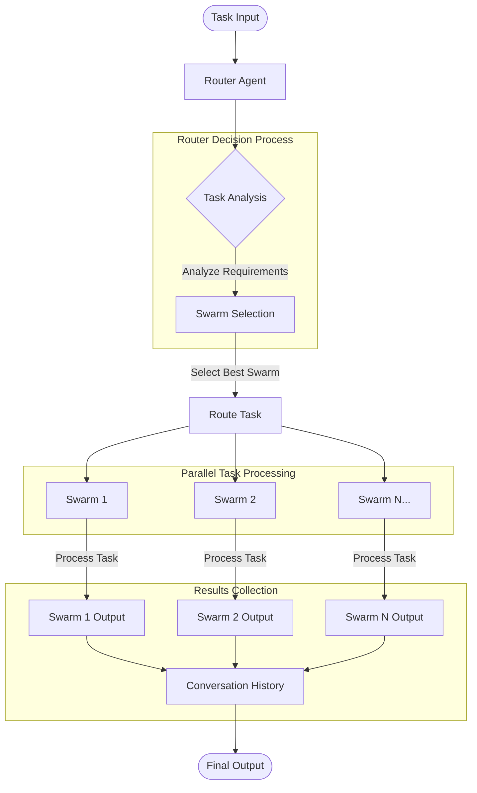

## Overview

The Hybrid Hierarchical-Cluster Swarm (HHCS) is an advanced AI orchestration architecture that combines hierarchical decision-making with parallel processing capabilities. HHCS enables complex task solving by dynamically routing tasks to specialized agent swarms based on their expertise and capabilities.

## Installation

```bash
pip install -U swarms
```

## Purpose

HHCS addresses the challenge of efficiently solving diverse and complex tasks by:

- Intelligently routing tasks to the most appropriate specialized swarms
- Enabling parallel processing of multifaceted problems
- Maintaining a clear hierarchy for effective decision-making
- Combining outputs from multiple specialized agents for comprehensive solutions

## Architecture Diagram

The HHCS architecture follows a hierarchical structure with the router agent at the top level, specialized swarms at the middle level, and individual agents at the bottom level.



## Attributes

<ParamField path="name" type="str" default="Hybrid Hierarchical-Cluster Swarm">
  The name of the swarm instance
</ParamField>

<ParamField path="description" type="str" default="A swarm that uses a hybrid hierarchical-peer model to solve complex tasks.">
  Brief description of the swarm's functionality
</ParamField>

<ParamField path="swarms" type="List[SwarmRouter]" default="[]">
  List of available swarm routers that the HHCS can route tasks to
</ParamField>

<ParamField path="max_loops" type="int" default="1">
  Maximum number of processing loops
</ParamField>

<ParamField path="output_type" type="str" default="list">
  Format for output (e.g., "list", "json")
</ParamField>

<ParamField path="router_agent_model_name" type="str" default="claude-sonnet-4-6">
  LLM model used by the router agent for task analysis and routing decisions
</ParamField>

## Methods

### run()

Processes a single task through the swarm system. The router agent analyzes the task and routes it to the most appropriate specialized swarm.

```python
def run(self, task: str) -> str
```

**Parameters:**
- `task` (str): The task to process

**Returns:** String containing the aggregated results from the selected swarm(s)

### batched_run()

Processes multiple tasks in parallel through the swarm system.

```python
def batched_run(self, tasks: List[str]) -> List[str]
```

**Parameters:**
- `tasks` (List[str]): List of task strings to process

**Returns:** List of results, one for each task

### find_swarm_by_name()

Retrieves a swarm by its name from the available swarms.

```python
def find_swarm_by_name(self, swarm_name: str) -> SwarmRouter
```

**Parameters:**
- `swarm_name` (str): Name of the swarm to find

**Returns:** The matching SwarmRouter instance

### route_task()

Routes a task to a specific swarm by name.

```python
def route_task(self, swarm_name: str, task_description: str) -> None
```

**Parameters:**
- `swarm_name` (str): Name of the target swarm
- `task_description` (str): The task to route

### get_swarms_info()

Returns formatted information about all available swarms.

```python
def get_swarms_info(self) -> str
```

**Returns:** Formatted string with details about all registered swarms

## Usage Examples

### Full Legal Practice Example

```python
from swarms import Agent, SwarmRouter
from swarms.structs.hybrid_hiearchical_peer_swarm import (
    HybridHierarchicalClusterSwarm,
)

# Core Legal Agent Definitions
litigation_agent = Agent(
    agent_name="Litigator",
    system_prompt="You handle lawsuits. Analyze facts, build arguments, and develop case strategy.",
    model_name="claude-sonnet-4-6",
    max_loops=1,
)

corporate_agent = Agent(
    agent_name="Corporate-Attorney",
    system_prompt="You handle business law. Advise on corporate structure, governance, and transactions.",
    model_name="claude-sonnet-4-6",
    max_loops=1,
)

ip_agent = Agent(
    agent_name="IP-Attorney",
    system_prompt="You protect intellectual property. Handle patents, trademarks, copyrights, and trade secrets.",
    model_name="claude-sonnet-4-6",
    max_loops=1,
)

employment_agent = Agent(
    agent_name="Employment-Attorney",
    system_prompt="You handle workplace matters. Address hiring, termination, discrimination, and labor issues.",
    model_name="claude-sonnet-4-6",
    max_loops=1,
)

paralegal_agent = Agent(
    agent_name="Paralegal",
    system_prompt="You assist attorneys. Conduct research, draft documents, and organize case files.",
    model_name="claude-sonnet-4-6",
    max_loops=1,
)

doc_review_agent = Agent(
    agent_name="Document-Reviewer",
    system_prompt="You examine documents. Extract key information and identify relevant content.",
    model_name="claude-sonnet-4-6",
    max_loops=1,
)

# Practice Area Swarm Routers
litigation_swarm = SwarmRouter(
    name="litigation-practice",
    description="Handle all aspects of litigation",
    agents=[litigation_agent, paralegal_agent, doc_review_agent],
    swarm_type="SequentialWorkflow",
)

corporate_swarm = SwarmRouter(
    name="corporate-practice",
    description="Handle business and corporate legal matters",
    agents=[corporate_agent, paralegal_agent],
    swarm_type="SequentialWorkflow",
)

ip_swarm = SwarmRouter(
    name="ip-practice",
    description="Handle intellectual property matters",
    agents=[ip_agent, paralegal_agent],
    swarm_type="SequentialWorkflow",
)

employment_swarm = SwarmRouter(
    name="employment-practice",
    description="Handle employment and labor law matters",
    agents=[employment_agent, paralegal_agent],
    swarm_type="SequentialWorkflow",
)

# Cross-functional Swarm Routers
m_and_a_swarm = SwarmRouter(
    name="mergers-acquisitions",
    description="Handle mergers and acquisitions",
    agents=[
        corporate_agent,
        ip_agent,
        employment_agent,
        doc_review_agent,
    ],
    swarm_type="ConcurrentWorkflow",
)

dispute_swarm = SwarmRouter(
    name="dispute-resolution",
    description="Handle complex disputes requiring multiple specialties",
    agents=[litigation_agent, corporate_agent, doc_review_agent],
    swarm_type="ConcurrentWorkflow",
)

# Create the HHCS
hybrid_hierarchical_swarm = HybridHierarchicalClusterSwarm(
    name="hybrid-hierarchical-swarm",
    description="A hybrid hierarchical swarm that uses a hybrid hierarchical peer model to solve complex tasks.",
    swarms=[
        litigation_swarm,
        corporate_swarm,
        ip_swarm,
        employment_swarm,
        m_and_a_swarm,
        dispute_swarm,
    ],
    max_loops=1,
    router_agent_model_name="claude-sonnet-4-6",
)

# Run a task
result = hybrid_hierarchical_swarm.run(
    "What is the best way to file for a patent for AI technology?"
)
print(result)
```

## Features

- **Router-based task distribution**: Central router agent analyzes incoming tasks and directs them to appropriate specialized swarms
- **Hybrid architecture**: Combines hierarchical control with clustered specialization
- **Parallel processing**: Multiple swarms can work simultaneously on different aspects of complex tasks
- **Flexible swarm types**: Supports both sequential and concurrent workflows within swarms
- **Comprehensive result aggregation**: Collects and combines outputs from all contributing swarms

## How It Works

1. **Task Input**: A task is submitted to the HHCS
2. **Router Analysis**: The router agent analyzes the task requirements
3. **Swarm Selection**: The most appropriate specialized swarm is selected based on the task analysis
4. **Task Routing**: The task is routed to the selected swarm for processing
5. **Parallel Processing**: The selected swarm's agents process the task (sequentially or concurrently depending on swarm type)
6. **Result Collection**: Outputs from all contributing agents are collected into the conversation history
7. **Final Output**: The aggregated results are returned

## Source Code

View the [source code on GitHub](https://github.com/kyegomez/swarms/blob/master/swarms/structs/hybrid_hiearchical_peer_swarm.py)
