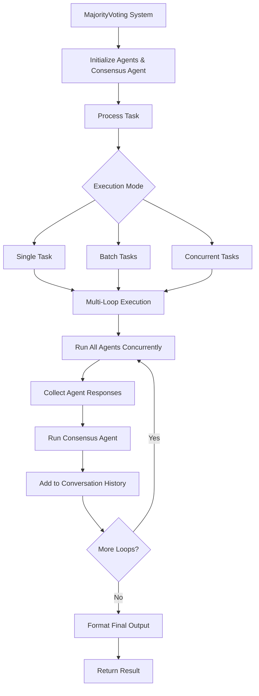

## Overview

The `MajorityVoting` module provides a sophisticated multi-loop consensus building system for agents. Unlike simple majority voting, this system enables iterative consensus building where agents can refine their responses across multiple loops, with each subsequent loop considering the previous consensus. This approach leads to more robust and well-reasoned final decisions by leveraging the collective intelligence of multiple specialized agents.

## Installation

```bash
pip install -U swarms
```

## Architecture



### Key Concepts

- **Multi-Loop Consensus Building**: An iterative process where agents can refine their responses across multiple loops, with each loop building upon the previous consensus.
- **Agents**: Specialized entities (e.g., models, algorithms) that provide expert responses to tasks or queries.
- **Consensus Agent**: An automatically created agent that analyzes and synthesizes responses from all agents to determine the final consensus.
- **Conversation History**: A comprehensive record of all agent interactions, responses, and consensus building across all loops.
- **Concurrent Execution**: Agents run simultaneously for improved performance and efficiency.

## Attributes

<ParamField path="id" type="str" default="swarm_id()">
  Unique identifier for the majority voting system.
</ParamField>

<ParamField path="name" type="str" default="MajorityVoting">
  Name of the majority voting system.
</ParamField>

<ParamField path="description" type="str" default="A multi-loop majority voting system for agents">
  Description of the system.
</ParamField>

<ParamField path="agents" type="List[Agent]" required>
  A list of agents to be used in the majority voting system.
</ParamField>

<ParamField path="autosave" type="bool" default="False">
  Whether to autosave conversations.
</ParamField>

<ParamField path="verbose" type="bool" default="False">
  Whether to enable verbose logging.
</ParamField>

<ParamField path="max_loops" type="int" default="1">
  Maximum number of consensus building loops.
</ParamField>

<ParamField path="output_type" type="OutputType" default="dict">
  Output format: "str", "dict", "list", or other.
</ParamField>

<ParamField path="consensus_agent_prompt" type="str" default="CONSENSUS_AGENT_PROMPT">
  System prompt for the consensus agent.
</ParamField>

<ParamField path="consensus_agent_name" type="str" default="Consensus-Agent">
  Name for the automatically created consensus agent.
</ParamField>

<ParamField path="consensus_agent_description" type="str" default="An agent that uses consensus to generate a final answer.">
  Description for the consensus agent.
</ParamField>

<ParamField path="consensus_agent_model_name" type="str" default="gpt-5.4">
  Model name for the consensus agent.
</ParamField>

<ParamField path="additional_consensus_agent_kwargs" type="dict" default="{}">
  Additional keyword arguments passed to the consensus agent.
</ParamField>

## Methods

### run()

Executes the multi-loop majority voting system for a single task and returns the consensus result.

```python
def run(self, task: str, streaming_callback: Optional[Callable[[str, str, bool], None]] = None, *args, **kwargs) -> Any
```

**Parameters:**
- `task` (str): The task or question to be analyzed by the agent panel
- `streaming_callback` (Optional[Callable[[str, str, bool], None]]): Optional callback invoked as `(agent_name, chunk, is_final)` while the consensus agent streams its response
- `*args` (Any): Variable length argument list passed to individual agents
- `**kwargs` (Any): Arbitrary keyword arguments passed to individual agents

**Returns:** The consensus result formatted according to the specified `output_type`

**Raises:**
- `ValueError`: If the agents list is empty or None

**Process Flow:**
1. Adds the input task to the conversation history
2. For each loop (up to `max_loops`):
   - Runs all agents concurrently on the current conversation state
   - Collects agent responses and adds them to conversation history
   - Runs the consensus agent to analyze and synthesize responses
   - Adds consensus output to conversation history
3. Returns the final result in the specified output format

### batch_run()

Executes the majority voting system for multiple tasks sequentially.

```python
def batch_run(self, tasks: List[str], *args, **kwargs) -> List[Any]
```

**Parameters:**
- `tasks` (List[str]): List of tasks or questions to be processed
- `*args` (Any): Variable length argument list passed to each task execution
- `**kwargs` (Any): Arbitrary keyword arguments passed to each task execution

**Returns:** List of consensus results, one for each input task

### run_concurrently()

Executes the majority voting system for multiple tasks concurrently using thread pooling.

```python
def run_concurrently(self, tasks: List[str], *args, **kwargs) -> List[Any]
```

**Parameters:**
- `tasks` (List[str]): List of tasks or questions to be processed
- `*args` (Any): Variable length argument list passed to each task execution
- `**kwargs` (Any): Arbitrary keyword arguments passed to each task execution

**Returns:** List of consensus results in completion order (not input order)

<Note>
Uses `os.cpu_count()` workers for optimal performance. Results are returned in completion order, not input order.
</Note>

### reliability_check()

Performs validation checks on the majority voting system configuration.

```python
def reliability_check(self) -> None
```

**Raises:**
- `ValueError`: If agents list is empty or None

## Consensus Agent

The MajorityVoting system automatically creates a specialized consensus agent that analyzes and synthesizes responses from all participating agents. This consensus agent:

1. **Comprehensively evaluates** each agent's response across accuracy, depth of analysis, relevance, clarity, and unique perspectives
2. **Performs comparative analysis** by identifying overlapping themes, divergent viewpoints, and strengths/weaknesses
3. **Builds consensus** by identifying the most effective responses and synthesizing best elements
4. **Delivers actionable results** that are fair, balanced, evidence-based, and well-supported

The consensus agent can be customized through the constructor parameters:
- `consensus_agent_prompt`: Custom system prompt
- `consensus_agent_name`: Name for the agent
- `consensus_agent_description`: Description
- `consensus_agent_model_name`: Model to use
- `additional_consensus_agent_kwargs`: Additional configuration

## Usage Examples

### Financial Analysis with Specialized Agents

```python
from swarms import Agent, MajorityVoting

# Technical Analysis Agent
TECHNICAL_ANALYSIS_PROMPT = """
You are a Quantitative Technical Analysis Specialist with deep expertise in
market chart patterns, technical indicators, and algorithmic trading signals.
Focus on price action, volume analysis, and statistical patterns.
Provide specific price levels, timeframes, and probability assessments.
Include risk management parameters (stop losses, take profits, position sizing).
"""

# Fundamental Analysis Agent
FUNDAMENTAL_ANALYSIS_PROMPT = """
You are a Quantitative Fundamental Analysis Specialist with expertise in
financial statement analysis, valuation models, and company performance metrics.
Focus on intrinsic value, financial health, and long-term investment potential.
Calculate and interpret key financial ratios and metrics.
"""

# Risk Management Agent
RISK_MANAGEMENT_PROMPT = """
You are a Quantitative Risk Management Specialist with expertise in portfolio
optimization, risk metrics, and hedging strategies. Focus on risk-adjusted
returns, diversification, and capital preservation.
Calculate comprehensive risk metrics and performance ratios.
"""

# Initialize specialized agents
technical_agent = Agent(
    agent_name="Technical-Analysis-Quant",
    system_prompt=TECHNICAL_ANALYSIS_PROMPT,
    max_loops=1,
    model_name="gpt-4.1",
)

fundamental_agent = Agent(
    agent_name="Fundamental-Analysis-Quant",
    system_prompt=FUNDAMENTAL_ANALYSIS_PROMPT,
    max_loops=1,
    model_name="gpt-4.1",
)

risk_agent = Agent(
    agent_name="Risk-Management-Quant",
    system_prompt=RISK_MANAGEMENT_PROMPT,
    max_loops=1,
    model_name="gpt-4.1",
)

# Create the majority voting swarm
swarm = MajorityVoting(
    name="Quant-Analysis-Swarm",
    description="Analysis of current market conditions with investment recommendations.",
    agents=[technical_agent, fundamental_agent, risk_agent],
)

# Run the analysis
result = swarm.run(
    "Analyze the current market conditions and provide investment recommendations "
    "for a $40k portfolio. Focus on AI and technology sectors with emphasis on "
    "risk management and diversification."
)

print("Quant Analysis Results:")
print(result)
```

### Investment Analysis with Consensus Agent

```python
from swarms import Agent, MajorityVoting

# Initialize multiple specialized agents
agents = [
    Agent(
        agent_name="Market-Analysis-Agent",
        agent_description="Market trend analyst",
        system_prompt="You are a market analyst specializing in identifying growth opportunities and market trends.",
        max_loops=1,
        model_name="gpt-4.1"
    ),
    Agent(
        agent_name="Risk-Assessment-Agent",
        agent_description="Risk analysis expert",
        system_prompt="You are a risk assessment expert focused on evaluating investment risks and volatility.",
        max_loops=1,
        model_name="gpt-4.1"
    ),
    Agent(
        agent_name="Portfolio-Strategy-Agent",
        agent_description="Portfolio optimization specialist",
        system_prompt="You are a portfolio strategist focused on diversification and long-term growth strategies.",
        max_loops=1,
        model_name="gpt-4.1"
    )
]

# Create majority voting system (consensus agent is automatically created)
investment_system = MajorityVoting(
    name="Investment-Analysis-System",
    description="Multi-agent investment analysis with consensus evaluation",
    agents=agents,
    verbose=True,
    output_type="dict"
)

# Execute investment analysis
result = investment_system.run(
    task="""Analyze the following investment scenario and provide recommendations:
    - Budget: $50,000
    - Risk tolerance: Moderate
    - Time horizon: 5-7 years
    - Focus areas: Technology, Healthcare, Renewable Energy
    Provide specific ETF/index fund recommendations with allocation percentages."""
)

print("Investment Analysis Results:")
print(result)
```

### Content Creation with Batch Processing

```python
from swarms import Agent, MajorityVoting

# Initialize content creation agents with different styles
content_agents = [
    Agent(
        agent_name="Creative-Writer",
        system_prompt="You are a creative writer who produces engaging, story-driven content with vivid descriptions.",
        max_loops=1,
        model_name="gpt-4.1"
    ),
    Agent(
        agent_name="Technical-Writer",
        system_prompt="You are a technical writer who focuses on clarity, accuracy, and structured information.",
        max_loops=1,
        model_name="gpt-4.1"
    ),
    Agent(
        agent_name="SEO-Optimized-Writer",
        system_prompt="You are an SEO specialist who creates content optimized for search engines while maintaining quality.",
        max_loops=1,
        model_name="gpt-4.1"
    ),
    Agent(
        agent_name="Conversational-Writer",
        system_prompt="You are a conversational writer who creates relatable, engaging content that connects with readers.",
        max_loops=1,
        model_name="gpt-4.1"
    )
]

# Create majority voting system
content_system = MajorityVoting(
    name="Content-Creation-System",
    description="Multi-style content creation with majority voting",
    agents=content_agents,
    verbose=True,
    output_type="str"
)

# Define multiple content tasks
content_tasks = [
    "Write a blog post about the benefits of renewable energy adoption",
    "Create social media content for a new fitness app launch",
    "Develop a product description for eco-friendly water bottles",
    "Write an email newsletter about artificial intelligence trends"
]

# Execute batch processing
batch_results = content_system.batch_run(content_tasks)

print("Batch Content Creation Results:")
for i, result in enumerate(batch_results, 1):
    print(f"\nTask {i} Result:")
    print(result[:500] + "..." if len(str(result)) > 500 else result)
```

### Research Analysis with Concurrent Processing

```python
from swarms import Agent, MajorityVoting

# Initialize research agents with different methodologies
research_agents = [
    Agent(
        agent_name="Quantitative-Researcher",
        system_prompt="You are a quantitative researcher who analyzes data, statistics, and numerical evidence.",
        max_loops=1,
        model_name="gpt-4.1"
    ),
    Agent(
        agent_name="Qualitative-Researcher",
        system_prompt="You are a qualitative researcher who focuses on patterns, themes, and contextual understanding.",
        max_loops=1,
        model_name="gpt-4.1"
    ),
    Agent(
        agent_name="Literature-Review-Specialist",
        system_prompt="You are a literature review specialist who synthesizes existing research and identifies knowledge gaps.",
        max_loops=1,
        model_name="gpt-4.1"
    ),
    Agent(
        agent_name="Methodology-Expert",
        system_prompt="You are a methodology expert who evaluates research design, validity, and reliability.",
        max_loops=1,
        model_name="gpt-4.1"
    ),
    Agent(
        agent_name="Ethics-Reviewer",
        system_prompt="You are an ethics reviewer who ensures research practices are responsible and unbiased.",
        max_loops=1,
        model_name="gpt-4.1"
    )
]

# Create majority voting system for research
research_system = MajorityVoting(
    name="Research-Analysis-System",
    description="Concurrent multi-perspective research analysis",
    agents=research_agents,
    verbose=True,
    output_type="list"
)

# Define research questions for concurrent analysis
research_questions = [
    "What are the environmental impacts of electric vehicle adoption?",
    "How does remote work affect employee productivity and well-being?",
    "What are the economic implications of universal basic income?",
    "How can AI be used to improve healthcare outcomes?",
    "What are the social effects of social media on mental health?"
]

# Execute concurrent research analysis
concurrent_results = research_system.run_concurrently(research_questions)

print("Concurrent Research Analysis Results:")
print(f"Total questions analyzed: {len(concurrent_results)}")
for i, result in enumerate(concurrent_results, 1):
    print(f"\nResearch Question {i}:")
    print(f"Result: {str(result)[:300]}...")
```

### Majority Voting with Custom Streaming

```python
from swarms import Agent
from swarms.prompts.finance_agent_sys_prompt import (
    FINANCIAL_AGENT_SYS_PROMPT,
)
from swarms.structs.majority_voting import MajorityVoting

def streaming_callback(agent_name: str, chunk: str, is_final: bool):
    if not hasattr(streaming_callback, "_buffer"):
        streaming_callback._buffer = ""
        streaming_callback._buffer_size = 0

    min_chunk_size = 512

    if chunk:
        streaming_callback._buffer += chunk
        streaming_callback._buffer_size += len(chunk)
    if streaming_callback._buffer_size >= min_chunk_size or is_final:
        if streaming_callback._buffer:
            print(streaming_callback._buffer, end="", flush=True)
            streaming_callback._buffer = ""
            streaming_callback._buffer_size = 0
    if is_final:
        print()

# Initialize the agent
agent = Agent(
    agent_name="Financial-Analysis-Agent",
    agent_description="Personal finance advisor agent",
    system_prompt=FINANCIAL_AGENT_SYS_PROMPT,
    max_loops=1,
    model_name="gpt-4.1",
    dynamic_temperature_enabled=True,
    max_tokens=4000,
    streaming_on=True,
)

swarm = MajorityVoting(agents=[agent, agent, agent])

swarm.run(
    "Create a table of super high growth opportunities for AI. "
    "I have $40k to invest in ETFs, index funds, and more. "
    "Please create a table in markdown.",
    streaming_callback=streaming_callback,
)
```

## Usage Patterns

### Single Task Analysis

```python
# Simple single task execution
result = swarm.run("What are the key risks in the current market?")

# With custom parameters
result = swarm.run(
    "Analyze this investment opportunity",
    temperature=0.7,
    max_tokens=1000
)
```

### Batch Processing

```python
# Process multiple sectors
sectors = ["Technology", "Healthcare", "Energy", "Finance"]
tasks = [f"Analyze {sector} sector opportunities" for sector in sectors]
results = swarm.batch_run(tasks)
```

### Concurrent Processing

```python
# Process multiple research questions concurrently
questions = [
    "What are the environmental impacts of AI?",
    "How will quantum computing affect cryptography?",
    "What are the economic implications of space exploration?"
]
results = swarm.run_concurrently(questions)
```

## Performance Considerations

| Consideration | Description |
|---|---|
| Sequential Processing (`batch_run`) | Tasks are processed one after another, not in parallel |
| Concurrent Processing (`run_concurrently`) | Tasks run simultaneously using all available CPU cores |
| Independent Conversation History | Each task maintains its own conversation history |
| Memory Usage | Scales with the number of tasks and the length of each conversation |

## Source Code

View the [source code on GitHub](https://github.com/kyegomez/swarms/blob/master/swarms/structs/majority_voting.py)
