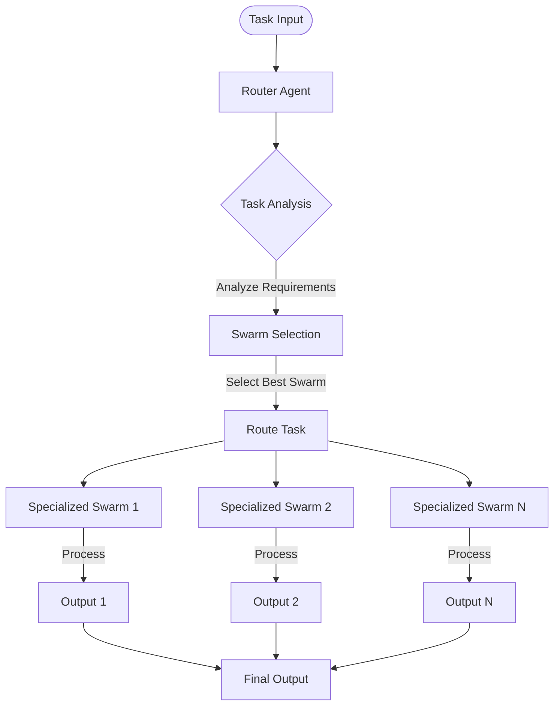
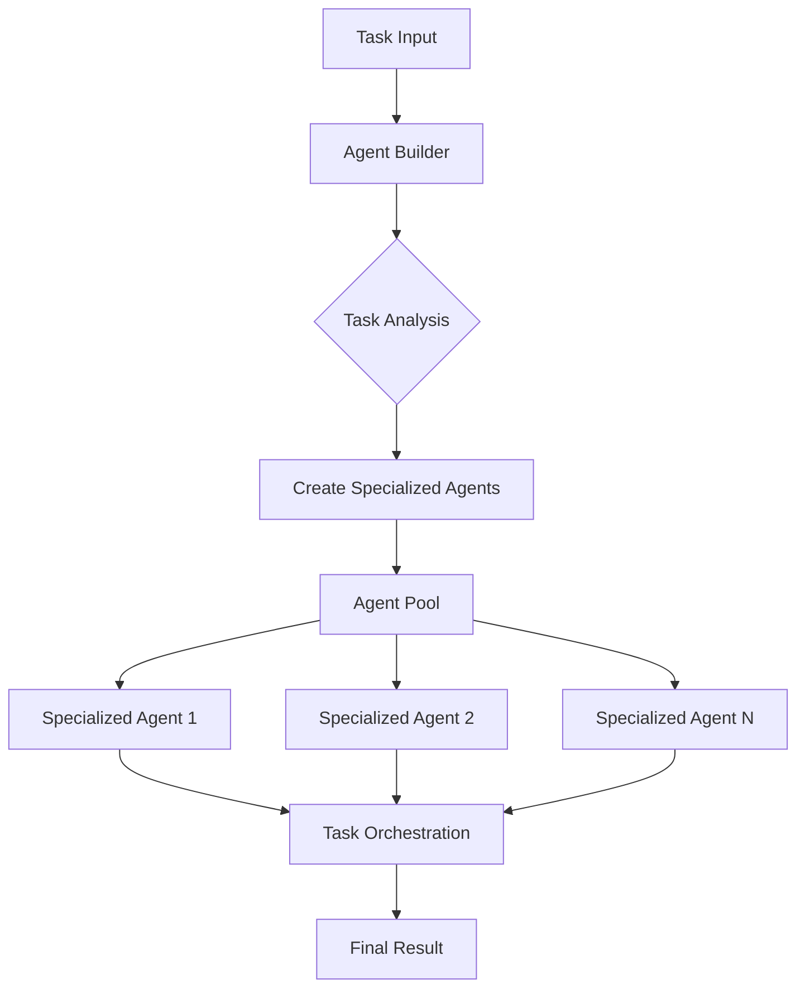
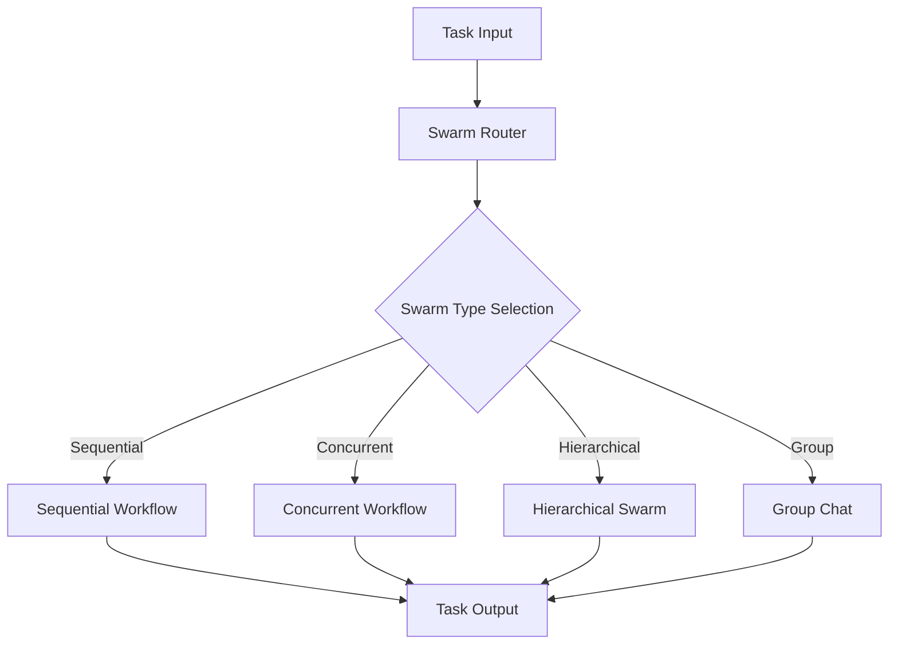

## Overview

Hierarchical agent orchestration involves organizing multiple agents in structured layers to efficiently handle complex tasks. There are several key architectures available, each with distinct characteristics and use cases.

## Installation

```bash
pip install -U swarms
```

## Architecture Comparison

| Architecture | Strengths | Weaknesses |
|--------------|-----------|------------|
| HHCS | Clear task routing, specialized swarm handling, parallel processing capability, good for complex multi-domain tasks | More complex setup, overhead in routing, requires careful swarm design |
| Auto Agent Builder | Dynamic agent creation, flexible scaling, self-organizing, good for evolving tasks | Higher resource usage, potential creation overhead, may create redundant agents |
| SwarmRouter | Multiple workflow types, simple configuration, flexible deployment, good for varied task types | Less specialized than HHCS, limited inter-swarm communication, may require manual type selection |

## Core Architectures

### Hybrid Hierarchical-Cluster Swarm (HHCS)

Hybrid Hierarchical-Cluster Swarm (HHCS) is an architecture that uses a Router Agent to analyze and distribute tasks to other swarms.

- Tasks are routed to specialized swarms based on their requirements
- Enables parallel processing through multiple specialized swarms
- Ideal for complex, multi-domain tasks and enterprise-scale operations
- Provides clear task routing but requires more complex setup



### Auto Agent Builder

Auto Agent Builder is a dynamic agent architecture that creates specialized agents on-demand.

- Analyzes tasks and automatically builds appropriate agents for the job
- Maintains an agent pool that feeds into task orchestration
- Best suited for evolving requirements and dynamic workloads
- Self-organizing but may have higher resource usage



### SwarmRouter

SwarmRouter is a flexible system supporting multiple swarm architectures through a simple interface:

- Sequential workflows
- Concurrent workflows
- Hierarchical swarms
- Group chat interactions
- Simpler to configure and deploy compared to other architectures
- Best for general-purpose tasks and smaller scale operations
- Recommended for 5-20 agents



## Use Case Recommendations

### HHCS

Best for:
- Enterprise-scale operations
- Multi-domain problems
- Complex task routing
- Parallel processing needs

### Auto Agent Builder

Best for:
- Dynamic workloads
- Evolving requirements
- Research and development
- Exploratory tasks

### SwarmRouter

Best for:
- General purpose tasks
- Quick deployment
- Mixed workflow types
- Smaller scale operations

## Best Practices for Selection

### Evaluate Task Complexity

- Simple tasks: SwarmRouter
- Complex, multi-domain tasks: HHCS
- Dynamic, evolving tasks: Auto Agent Builder

### Consider Scale

- Small scale: SwarmRouter
- Large scale: HHCS
- Variable scale: Auto Agent Builder

### Resource Availability

- Limited resources: SwarmRouter
- Abundant resources: HHCS or Auto Agent Builder
- Dynamic resources: Auto Agent Builder

### Development Time

- Quick deployment: SwarmRouter
- Complex system: HHCS
- Experimental system: Auto Agent Builder

## Related Documentation

- [Hybrid Hierarchical-Cluster Swarm (HHCS)](/api/hhcs)
- [SwarmRouter](/api/swarm-router)
- [Auto Swarm Builder](/api/auto-swarm-builder)
