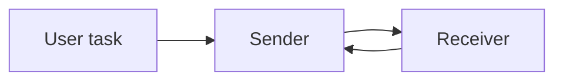

## Overview

`OneToOne` is the smallest reusable multi-agent communication pattern in Swarms. It connects a **sender** and a **receiver** through one shared conversation. The sender speaks first, the receiver reads the updated conversation and replies, and that sender/receiver exchange can repeat for multiple loops.

Use this pattern when a task benefits from a focused handoff between two distinct roles rather than a router, hierarchy, or larger swarm. Common examples include drafting and review, analysis and critique, or proposal and verification.

The implementation creates a fresh `Conversation` for each run, adds the user task, then calls the sender followed by the receiver for every loop. Each agent therefore sees the conversation accumulated so far rather than receiving only the previous raw string.



## Installation

```bash
pip install -U swarms
```

## Quick start

```python
from swarms import Agent, OneToOne

writer = Agent(
    agent_name="Writer",
    model_name="gpt-5.4",
    max_loops=1,
)

reviewer = Agent(
    agent_name="Reviewer",
    model_name="gpt-5.4",
    max_loops=1,
)

pair = OneToOne(
    sender=writer,
    receiver=reviewer,
    output_type="dict",
)

result = pair.run(
    task="Draft a launch checklist, then review it for missing rollback steps.",
    max_loops=2,
)

print(result)
```

With `max_loops=2`, the call order is `Writer -> Reviewer -> Writer -> Reviewer`. The second pass can build on everything already stored in the shared conversation.

## Constructor

```text
OneToOne(
    sender: Agent,
    receiver: Agent,
    name: str = "OneToOne",
    description: str = "A one-to-one communication pattern between two agents",
    output_type: OutputType = "dict",
)
```

<ParamField path="sender" type="Agent" required>
  Agent that responds first in every exchange.
</ParamField>

<ParamField path="receiver" type="Agent" required>
  Agent that responds after the sender and can inspect the shared conversation.
</ParamField>

<ParamField path="name" type="str" default="OneToOne">
  Human-readable name stored on the wrapper.
</ParamField>

<ParamField path="description" type="str" default="A one-to-one communication pattern between two agents">
  Description stored on the wrapper.
</ParamField>

<ParamField path="output_type" type="OutputType" default="dict">
  Format passed to the shared history formatter when a run completes.
</ParamField>

## `run()`

```text
def run(
    self,
    task: str,
    max_loops: int = 1,
) -> dict | list[str] | str
```

`run()` delegates to the functional `one_to_one()` helper using the wrapper's sender, receiver, and output type. The task starts a new conversation for that invocation.

<ParamField path="task" type="str" required>
  Task placed into the shared conversation as the initial user message.
</ParamField>

<ParamField path="max_loops" type="int" default="1">
  Number of sender/receiver exchanges to perform.
</ParamField>

## Functional API

If you do not need a reusable wrapper, call `one_to_one()` directly:

```python
from swarms import Agent, one_to_one

analyst = Agent(
    agent_name="Analyst",
    model_name="gpt-5.4",
    max_loops=1,
)

critic = Agent(
    agent_name="Critic",
    model_name="gpt-5.4",
    max_loops=1,
)

result = one_to_one(
    sender=analyst,
    receiver=critic,
    task="Evaluate the trade-offs of two caching strategies.",
    max_loops=1,
    output_type="dict",
)
```

The functional API validates that `sender`, `receiver`, and `task` are non-empty. If any is missing, it raises `ValueError` before starting the exchange. Exceptions raised while either agent runs are logged and re-raised rather than being converted into a successful result.

## When to use `OneToOne`

Choose `OneToOne` when two roles should repeatedly react to the same accumulated context. It works well for:

- **Draft and review**: one agent produces material and another critiques it.
- **Plan and verify**: one agent proposes a plan while the second checks assumptions.
- **Specialist handoff**: a domain agent produces an answer that a second specialist refines.
- **Iterative refinement**: increase `max_loops` when another alternating pass is useful.

Use a different harness when you need parallel fan-out, dynamic routing, voting, or a hierarchy. `OneToOne` intentionally keeps orchestration minimal: it controls conversation order, not task decomposition or winner selection.

## Execution semantics

A few details matter when designing prompts for the pair:

1. The **sender always speaks first** after the user task.
2. The **receiver sees the sender's contribution** because both run against the same `Conversation`.
3. Additional loops continue the same conversation, so later turns include earlier context.
4. A new call to `run()` or `one_to_one()` starts a new local conversation; history is not reused by this harness across separate invocations.
5. The returned value is formatted by `history_output_formatter`, so select `output_type` based on whether downstream code needs structured history or text.

Because the harness does not assign special system roles automatically, the behavior of “writer,” “reviewer,” or any other role comes from the `Agent` configurations you provide.

## See also

- [OneToThree](/api/one-to-three) for one sender handing a conversation to exactly three receivers.
- [SequentialWorkflow](/api/sequential-workflow) for longer ordered pipelines.
- [ConcurrentWorkflow](/api/concurrent-workflow) when independent agents should run concurrently.
