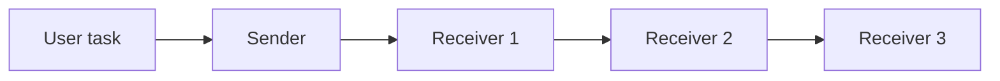

## Overview

`OneToThree` is a compact communication pattern for one sender and exactly three receivers. The sender responds to the user task first. Each receiver then reads the same shared conversation and contributes a response **in sequence**.

That ordering is important: this is not a parallel broadcast. Receiver 2 can see the sender and Receiver 1, and Receiver 3 can see all earlier turns. Use it when you want a small fan-out where later specialists are allowed to build on or challenge earlier responses.



## Installation

```bash
pip install -U swarms
```

## Quick start

```python
from swarms import Agent, OneToThree

coordinator = Agent(
    agent_name="Coordinator",
    model_name="gpt-5.4",
    max_loops=1,
)

receivers = [
    Agent(
        agent_name="SecurityReviewer",
        model_name="gpt-5.4",
        max_loops=1,
    ),
    Agent(
        agent_name="ReliabilityReviewer",
        model_name="gpt-5.4",
        max_loops=1,
    ),
    Agent(
        agent_name="CostReviewer",
        model_name="gpt-5.4",
        max_loops=1,
    ),
]

swarm = OneToThree(
    sender=coordinator,
    receivers=receivers,
    output_type="dict",
)

result = swarm.run(
    "Review a proposed production migration and surface the main risks."
)

print(result)
```

The receiver list must contain exactly three agents. Construction fails early if it contains fewer or more.

## Constructor

```text
OneToThree(
    sender: Agent,
    receivers: AgentListType,
    name: str = "OneToThree",
    description: str = "A one-to-three communication pattern from one agent to exactly three agents",
    output_type: OutputType = "dict",
)
```

<ParamField path="sender" type="Agent" required>
  Agent that responds to the task before any receiver runs.
</ParamField>

<ParamField path="receivers" type="AgentListType" required>
  Sequence containing exactly three receiver agents. Any other length raises `ValueError`.
</ParamField>

<ParamField path="name" type="str" default="OneToThree">
  Human-readable name stored on the wrapper.
</ParamField>

<ParamField path="description" type="str" default="A one-to-three communication pattern from one agent to exactly three agents">
  Description stored on the wrapper.
</ParamField>

<ParamField path="output_type" type="OutputType" default="dict">
  Format passed to the history formatter after all four agents have run.
</ParamField>

## `run()`

```text
def run(self, task: str) -> dict | list[str] | str
```

`run()` starts a new conversation, adds the user task, runs the sender once, then runs each of the three receivers once in list order.

<ParamField path="task" type="str" required>
  Task inserted as the initial user turn in the shared conversation.
</ParamField>

## Functional API

The same pattern is available without constructing a wrapper:

```python
from swarms import Agent, one_to_three

lead = Agent(
    agent_name="Lead",
    model_name="gpt-5.4",
    max_loops=1,
)

specialists = [
    Agent(agent_name="A", model_name="gpt-5.4", max_loops=1),
    Agent(agent_name="B", model_name="gpt-5.4", max_loops=1),
    Agent(agent_name="C", model_name="gpt-5.4", max_loops=1),
]

result = one_to_three(
    sender=lead,
    receivers=specialists,
    task="Produce and review a three-perspective incident response plan.",
    output_type="dict",
)
```

The helper checks the receiver count before starting work. It also rejects an empty sender or task. Runtime exceptions from the sender or any receiver are logged and re-raised, so callers can handle failures explicitly.

## Sequential context, not parallel fan-out

`OneToThree` is useful when the three receivers should influence one another. The implementation loops over `receivers` and calls each agent against the same evolving `Conversation`.

For example, with receivers ordered as Security, Reliability, and Cost:

1. The sender provides the initial response.
2. Security sees the sender and adds a security review.
3. Reliability sees both earlier responses and can account for the security findings.
4. Cost sees the complete conversation so far and can discuss the cost impact of both sets of recommendations.

If the receivers should work independently without seeing each other's output, use a concurrent or broadcast-style harness instead.

## When to use `OneToThree`

This pattern is a good fit for bounded multi-perspective review:

- **Three specialist reviews** after a lead agent frames the problem.
- **Progressive critique**, where later reviewers should incorporate earlier observations.
- **Small decision panels** in which receiver order is intentional.
- **Handoff chains** that always contain one coordinator plus three follow-up roles.

It is deliberately rigid about the number of receivers. If the number of workers needs to vary by task, use a general sequential/concurrent workflow or a router rather than padding or truncating the receiver list.

## Output and state

The returned value is the shared conversation formatted through `history_output_formatter` using `output_type`. The wrapper stores the sender and receiver objects for reuse, but each invocation creates a fresh conversation for the current task.

Agent objects can still have their own configured behavior and memory; `OneToThree` itself is responsible only for the communication order and shared conversation used during this orchestration call.

## See also

- [OneToOne](/api/one-to-one) for an alternating two-agent exchange with optional multiple loops.
- [SequentialWorkflow](/api/sequential-workflow) when you need more than three ordered stages.
- [ConcurrentWorkflow](/api/concurrent-workflow) when receivers should execute independently in parallel.
