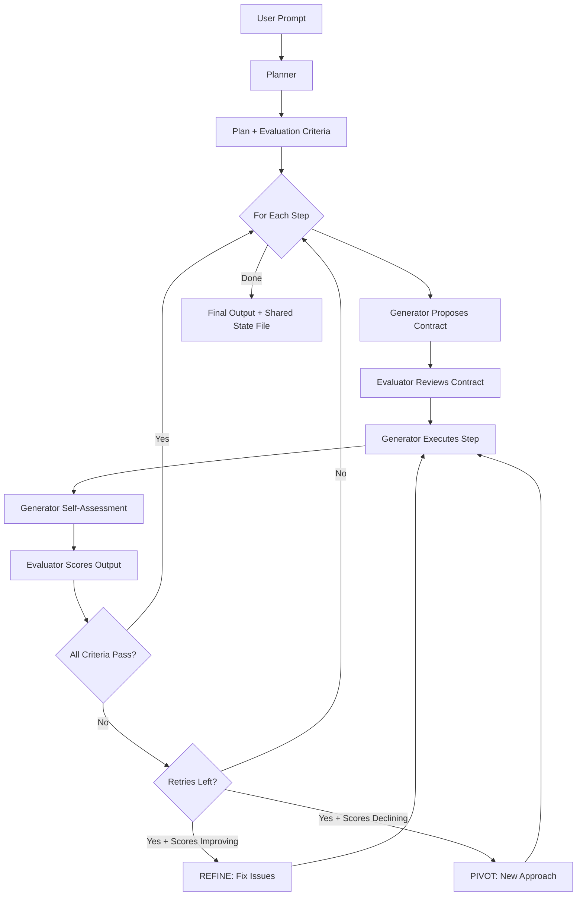

## Overview

The `PlannerGeneratorEvaluator` is a domain-agnostic three-agent orchestration harness inspired by the GAN-style architecture described in [Anthropic's harness design research](https://www.anthropic.com/engineering/harness-design-long-running-apps). It coordinates long-running autonomous tasks from a short natural-language prompt, using an iterative generate-evaluate feedback loop to converge on high-quality output across any domain.

All three agents communicate through a single shared file on disk.



The harness follows this workflow:

1. **Planning**: Planner expands a short prompt into an ambitious plan with steps and evaluation criteria
2. **Contract Negotiation**: Generator proposes what "done" looks like for each step; Evaluator reviews
3. **Execution**: Generator produces concrete output and self-assesses before handoff
4. **Evaluation**: Evaluator scores output per-criterion with hard thresholds -- any criterion below its threshold fails the step
5. **Feedback Loop**: On failure, Generator receives scores + trajectory signal (refine or pivot) and retries
6. **All state on disk**: The shared state file is the single append-only record of the entire run

## Installation

```bash
pip install -U swarms
```

## Key Features

| Feature | Description |
|---------|-------------|
| **GAN-Style Separation** | Distinct Generator and Evaluator agents prevent self-evaluation bias |
| **Step Contracts** | Generator and Evaluator agree on success criteria before execution |
| **Hard Threshold Enforcement** | Any single criterion below its threshold fails the step |
| **Score Trajectory** | Tracks score trends across retries -- signals Generator to refine or pivot |
| **Self-Assessment** | Generator self-evaluates before Evaluator handoff |
| **Shared State File** | Single append-only `.md` file for all inter-agent communication |
| **Domain-Agnostic** | Planner defines evaluation criteria tailored to the task domain |
| **Custom Agents** | Pass pre-configured agents with tools, MCP, or any Agent settings |
| **Configurable Thresholds** | Default thresholds plus Planner-defined per-criterion thresholds |

## Attributes

<ParamField path="model_name" type="str" default="gpt-4.1">
  Model identifier for all three agents
</ParamField>

<ParamField path="planner_model_name" type="str" default="None">
  Override model for the Planner
</ParamField>

<ParamField path="generator_model_name" type="str" default="None">
  Override model for the Generator
</ParamField>

<ParamField path="evaluator_model_name" type="str" default="None">
  Override model for the Evaluator
</ParamField>

<ParamField path="max_steps" type="int" default="10">
  Upper bound on plan steps to execute
</ParamField>

<ParamField path="max_retries_per_step" type="int" default="3">
  Max evaluation failures before advancing
</ParamField>

<ParamField path="working_directory" type="str" default="os.getcwd()">
  Directory where output is produced
</ParamField>

<ParamField path="shared_state_path" type="str" default="None">
  Path for the shared state file (auto-generated if None)
</ParamField>

<ParamField path="default_thresholds" type="Dict[str, float]" default="{}">
  Fallback score thresholds by criterion name
</ParamField>

<ParamField path="output_type" type="OutputType" default="dict">
  Format for output (dict, str, list, final, json, yaml)
</ParamField>

<ParamField path="verbose" type="bool" default="False">
  Enable verbose logging
</ParamField>

<ParamField path="planner_agent" type="Agent" default="None">
  Pre-configured Agent for planning
</ParamField>

<ParamField path="generator_agent" type="Agent" default="None">
  Pre-configured Agent for generation (e.g., with file/code tools)
</ParamField>

<ParamField path="evaluator_agent" type="Agent" default="None">
  Pre-configured Agent for evaluation (e.g., with Playwright MCP)
</ParamField>

**Raises:**

| Exception | Condition |
|-----------|-----------|
| `ValueError` | If `max_steps < 1`, `max_retries_per_step < 0`, or `model_name` is empty |

## Methods

### run()

Execute the full PGE harness pipeline from a short prompt to completed output.

```python
def run(self, task: str) -> Any
```

**Parameters:**
- `task` (str): A short natural-language description of the desired task

**Returns:** Formatted conversation history according to `output_type`

After `run()` completes, access `harness.last_result` for structured metadata:

| Field | Type | Description |
|-------|------|-------------|
| `output_path` | `str` | Path to the shared state file |
| `plan` | `str` | The generated plan text |
| `step_logs` | `List[Dict]` | Per-step metadata (contract, scores, retries) |
| `total_duration` | `float` | Wall-clock time in seconds |
| `total_steps_completed` | `int` | Number of steps that passed evaluation |
| `total_retries` | `int` | Total retry attempts across all steps |

### batched_run()

Run the harness on multiple tasks sequentially.

```python
def batched_run(self, tasks: List[str]) -> List[Any]
```

**Parameters:**
- `tasks` (List[str]): List of task prompts to process

**Returns:** List of results, one per task

## Return Types

The PGE harness produces three structured return types that are also re-exported from `swarms.structs` so you can type-annotate against them.

### StepContract

A negotiated agreement between the Generator and the Evaluator for one step of the plan — the title and acceptance criteria the Generator commits to, plus an `approved` flag and any `amendments` the Evaluator pushed back with.

```python
from swarms import StepContract

contract = StepContract(
    step_number=1,
    title="Draft outline",
    acceptance_criteria="Three sections, each with bullet points",
    approved=True,
    amendments="",
)
```

<ParamField path="step_number" type="int" required>
  1-indexed position in the plan.
</ParamField>

<ParamField path="title" type="str" default='""'>
  Short step title.
</ParamField>

<ParamField path="acceptance_criteria" type="str" default='""'>
  What the Generator's output must satisfy for the Evaluator to approve.
</ParamField>

<ParamField path="approved" type="bool" default="False">
  Whether the Evaluator approved this contract.
</ParamField>

<ParamField path="amendments" type="str" default='""'>
  Evaluator-suggested changes when not approved.
</ParamField>

### EvaluationReport

Per-step evaluation produced by the Evaluator agent — criterion scores, threshold checks, pass/fail, and feedback used to drive retries.

```python
from swarms import EvaluationReport

report = EvaluationReport(
    step_number=1,
    criterion_scores={"completeness": 0.9, "accuracy": 0.85},
    criterion_thresholds={"completeness": 0.8, "accuracy": 0.8},
    passed=True,
    actionable_feedback="Tighten the second paragraph for clarity",
    summary="Meets thresholds; minor stylistic notes",
    raw_evaluation="...",
)
```

<ParamField path="step_number" type="int" required>
  Step this report belongs to.
</ParamField>

<ParamField path="criterion_scores" type="Dict[str, float] | None" default="None">
  Map of criterion name to score, typically in `[0, 1]`.
</ParamField>

<ParamField path="criterion_thresholds" type="Dict[str, float] | None" default="None">
  Minimum scores needed to pass each criterion.
</ParamField>

<ParamField path="passed" type="bool" default="False">
  Whether the step met every threshold.
</ParamField>

<ParamField path="actionable_feedback" type="str" default='""'>
  Specific, retry-targeted feedback for the Generator.
</ParamField>

<ParamField path="summary" type="str" default='""'>
  Short prose summary of the evaluation.
</ParamField>

<ParamField path="raw_evaluation" type="str" default='""'>
  Unparsed Evaluator output, retained for debugging.
</ParamField>

### HarnessResult

Final result container — populated after `run()` and accessible via `harness.last_result`.

```python
from swarms import HarnessResult

result = HarnessResult(
    output_path="runs/2026-05-28/plan.md",
    plan="...",
    step_logs=[{"step": 1, "passed": True}, ...],
    total_duration=42.7,
    total_steps_completed=3,
    total_retries=1,
)
```

<ParamField path="output_path" type="str" default='""'>
  Where the harness wrote artifacts (plan, logs, final output).
</ParamField>

<ParamField path="plan" type="str" default='""'>
  The full plan the harness executed against.
</ParamField>

<ParamField path="step_logs" type="List[Dict[str, Any]] | None" default="None">
  Per-step structured log: which Generator/Evaluator turns ran, scores, retries.
</ParamField>

<ParamField path="total_duration" type="float" default="0.0">
  Wall-clock seconds for the full run.
</ParamField>

<ParamField path="total_steps_completed" type="int" default="0">
  Number of steps that hit `passed=True`.
</ParamField>

<ParamField path="total_retries" type="int" default="0">
  Total retries across all steps.
</ParamField>

## Usage Examples

### Basic Usage

```python
from swarms import PlannerGeneratorEvaluator

harness = PlannerGeneratorEvaluator(
    model_name="gpt-4.1",
    max_steps=3,
    max_retries_per_step=2,
    output_type="final",
    verbose=True,
)

result = harness.run(
    "Write a comprehensive guide on the benefits and risks of intermittent fasting"
)

print(result)
print(f"Steps completed: {harness.last_result.total_steps_completed}")
print(f"Duration: {harness.last_result.total_duration:.1f}s")
```

### Custom Agents with Tools

Pass pre-configured agents with tools so the Generator can write files and the Evaluator can verify them on disk:

```python
from swarms import Agent, PlannerGeneratorEvaluator


def write_file(filename: str, content: str) -> str:
    """Write content to a file."""
    with open(filename, "w") as f:
        f.write(content)
    return f"Written: {filename}"


def read_file(filename: str) -> str:
    """Read content from a file."""
    with open(filename, "r") as f:
        return f.read()


generator = Agent(
    agent_name="PGE-Generator",
    model_name="gpt-4.1",
    max_loops=1,
    tools=[write_file],
)

evaluator = Agent(
    agent_name="PGE-Evaluator",
    model_name="gpt-4.1",
    max_loops=1,
    tools=[read_file],
)

harness = PlannerGeneratorEvaluator(
    model_name="gpt-4.1",
    generator_agent=generator,
    evaluator_agent=evaluator,
    max_steps=3,
)

result = harness.run("Create a Python module for string manipulation utilities")
```

### Evaluator with Playwright MCP (Web App Testing)

For web application development, give the Evaluator browser automation via Playwright MCP so it can test the running app like a real user:

```python
from swarms import Agent, PlannerGeneratorEvaluator

evaluator = Agent(
    agent_name="PGE-Evaluator",
    model_name="gpt-4.1",
    max_loops=1,
    mcp_config={"url": "http://localhost:3000/playwright"},
)

harness = PlannerGeneratorEvaluator(
    model_name="gpt-4.1",
    evaluator_agent=evaluator,
    max_steps=5,
    max_retries_per_step=3,
)

result = harness.run("Build a todo app with React frontend and FastAPI backend")
```

### Custom Thresholds

Provide default score thresholds that apply when the Planner doesn't define them:

```python
from swarms import PlannerGeneratorEvaluator

harness = PlannerGeneratorEvaluator(
    model_name="gpt-4.1",
    default_thresholds={
        "accuracy": 8.0,
        "clarity": 7.0,
        "completeness": 7.0,
    },
    max_retries_per_step=4,
)

result = harness.run("Write a technical specification for a rate-limiting middleware")
```

## Architecture Details

### Shared State File

All inter-agent communication flows through a single append-only markdown file. Each section is timestamped and labeled:

```
# PGE Harness Shared State

## User Prompt
[original prompt]

---
### [PLANNER OUTPUT] (2026-03-25 10:30:00)
[plan with steps and evaluation criteria]

---
### [STEP 1 CONTRACT PROPOSAL] (2026-03-25 10:30:15)
[Generator's proposed contract]

---
### [STEP 1 CONTRACT REVIEW] (2026-03-25 10:30:25)
[Evaluator's review -- APPROVED or AMENDMENTS REQUIRED]

---
### [STEP 1 WORK LOG] (2026-03-25 10:30:45)
[Generator's output + self-assessment]

---
### [STEP 1 EVALUATION] (2026-03-25 10:31:00)
[Evaluator's per-criterion scores, findings, and feedback]
```

### Refine vs. Pivot

When a step fails evaluation, the harness computes a score trajectory across retries:

- **Scores improving** -- REFINE: keep the current direction, fix specific issues
- **Scores declining or stagnant** -- PIVOT: take a fundamentally different approach

This signal is passed to the Generator alongside the Evaluator's feedback.

### Evaluation Criteria

The Planner defines domain-appropriate criteria as part of the plan. Each criterion has:

| Field | Description |
|-------|-------------|
| **Name** | Short label (e.g., "accuracy", "clarity") |
| **Weight** | Relative importance (high, standard, low) |
| **Description** | What it measures and what good/bad looks like |
| **Threshold** | Minimum passing score (1-10). Any criterion below threshold = step fails |

## Source Code

View the [source code on GitHub](https://github.com/kyegomez/swarms/blob/master/swarms/structs/planner_generator_evaluator.py)
