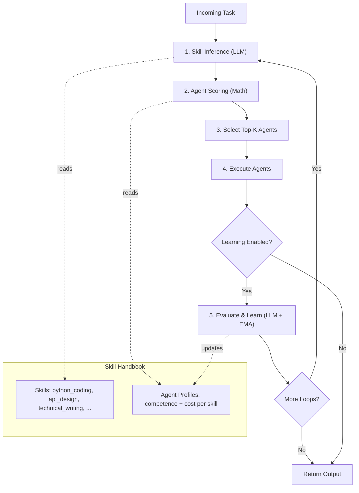
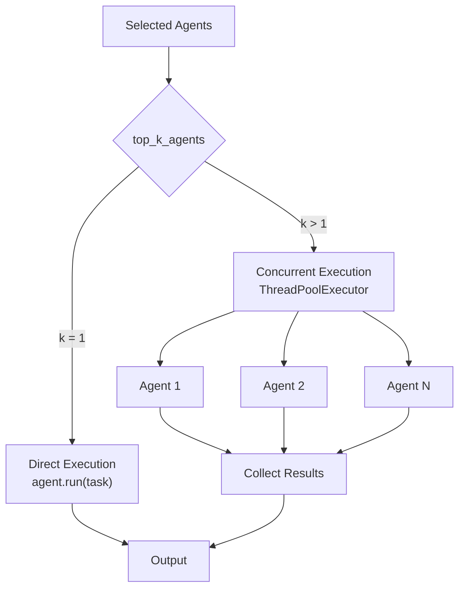

## Overview

`SkillOrchestra` is a skill-aware agent orchestration system based on the paper ["SkillOrchestra: Learning to Route Agents via Skill Transfer"](https://arxiv.org/abs/2602.19672). Instead of end-to-end RL routing, it maintains a **Skill Handbook** that profiles each agent on fine-grained skills, infers which skills a task requires via LLM, and matches agents to tasks via explicit competence-cost scoring.

## Installation

```bash
pip install -U swarms
```

## How It Works

SkillOrchestra routes tasks through a 5-step pipeline:

```
Task -> Skill Inference -> Agent Scoring -> Agent Selection -> Execution -> Learning
```

1. **Skill Inference** -- An LLM analyzes the incoming task and identifies which fine-grained skills are required (e.g., `python_coding`, `data_analysis`, `technical_writing`), each with an importance weight.
2. **Agent Scoring** -- Each agent is scored using a weighted competence-cost formula against the required skills. This step is pure math -- no LLM calls.
3. **Agent Selection** -- The top-k agents with the highest scores are selected.
4. **Execution** -- Selected agents execute the task. Multiple agents run concurrently via `ThreadPoolExecutor`.
5. **Learning** (optional) -- An LLM evaluates the output quality, and agent skill profiles are updated via exponential moving average (EMA).

### Scoring Formula

For each agent, the score is computed as:

```
score = sum(competence_weight * competence_i * importance_i + cost_weight * normalized_cost_i * importance_i) / total_importance
```

Where:
- `competence_i` is the agent's estimated probability of success on skill `i`
- `normalized_cost_i` is `1 - (cost - min_cost) / (max_cost - min_cost)` (lower cost = higher score)
- `importance_i` is how important the skill is for the task

## Key Components

### Data Models

| Model | Description |
|-------|-------------|
| `SkillDefinition` | A fine-grained skill with name, description, and optional category |
| `AgentSkillProfile` | An agent's competence (0-1) and cost on a specific skill, with execution statistics |
| `AgentProfile` | Complete skill profile for a single agent |
| `SkillHandbook` | Central data structure mapping all skills to all agent profiles |
| `TaskSkillInference` | LLM output: skills required by a given task with importance weights |
| `AgentSelectionResult` | Result of agent scoring with name, score, and reasoning |
| `ExecutionFeedback` | Post-execution quality assessment for updating skill profiles |

## Attributes

<ParamField path="name" type="str" default="SkillOrchestra">
  Name identifier for the orchestrator.
</ParamField>

<ParamField path="description" type="str" default="Skill-aware agent orchestration...">
  Description of the orchestrator's purpose.
</ParamField>

<ParamField path="agents" type="List[Union[Agent, Callable]]" required>
  List of agents to orchestrate (at least 1 required).
</ParamField>

<ParamField path="max_loops" type="int" default="1">
  Maximum execution-feedback loops per task.
</ParamField>

<ParamField path="output_type" type="OutputType" default="dict">
  Output format: `"dict"`, `"str"`, `"json"`, `"final"`, etc.
</ParamField>

<ParamField path="model" type="str" default="gpt-5.4">
  LLM model for skill inference and evaluation.
</ParamField>

<ParamField path="temperature" type="float" default="0.1">
  LLM temperature for inference calls.
</ParamField>

<ParamField path="skill_handbook" type="Optional[SkillHandbook]" default="None">
  Pre-built skill handbook. If `None`, auto-generated from agent descriptions.
</ParamField>

<ParamField path="auto_generate_skills" type="bool" default="True">
  Whether to auto-generate handbook when none is provided.
</ParamField>

<ParamField path="cost_weight" type="float" default="0.3">
  Weight for cost component in scoring (0-1).
</ParamField>

<ParamField path="competence_weight" type="float" default="0.7">
  Weight for competence component in scoring (0-1).
</ParamField>

<ParamField path="top_k_agents" type="int" default="1">
  Number of agents to select per task.
</ParamField>

<ParamField path="learning_enabled" type="bool" default="True">
  Whether to update skill profiles after execution via EMA.
</ParamField>

<ParamField path="learning_rate" type="float" default="0.1">
  EMA learning rate for profile updates.
</ParamField>

<ParamField path="autosave" type="bool" default="True">
  Whether to save conversation history and handbook to disk.
</ParamField>

<ParamField path="verbose" type="bool" default="False">
  Whether to log detailed information.
</ParamField>

<ParamField path="print_on" type="bool" default="True">
  Whether to print panels to console.
</ParamField>

## Methods

### run()

Run the full pipeline on a single task.

```python
def run(self, task: str, img: Optional[str] = None, imgs: Optional[List[str]] = None) -> Any
```

**Parameters:**
- `task` (str): The task to execute
- `img` (Optional[str]): Optional image input
- `imgs` (Optional[List[str]]): Optional list of image inputs

**Returns:** Result in the specified `output_type` format

### \_\_call\_\_()

Callable interface that delegates to `run()`.

```python
def __call__(self, task: str, *args, **kwargs) -> Any
```

**Parameters:**
- `task` (str): The task to execute

**Returns:** Result from `run()`

### batch_run()

Run multiple tasks sequentially.

```python
def batch_run(self, tasks: List[str]) -> List[Any]
```

**Parameters:**
- `tasks` (List[str]): List of tasks to execute

**Returns:** `List[Any]` - List of results, one per task

### concurrent_batch_run()

Run multiple tasks concurrently.

```python
def concurrent_batch_run(self, tasks: List[str]) -> List[Any]
```

**Parameters:**
- `tasks` (List[str]): List of tasks to execute

**Returns:** `List[Any]` - List of results from concurrent execution

### get_handbook()

Return the current skill handbook as a dictionary.

```python
def get_handbook(self) -> dict
```

**Returns:** `dict` - The skill handbook data

### update_handbook()

Replace the skill handbook.

```python
def update_handbook(self, handbook: SkillHandbook) -> None
```

**Parameters:**
- `handbook` (SkillHandbook): The new skill handbook

## Architecture

### Pipeline Flow



### Scoring and Selection

```mermaid
flowchart LR
    subgraph Task Skills
        TS1["python_coding (importance: 0.9)"]
        TS2["api_design (importance: 0.5)"]
    end

    subgraph Agent Profiles
        AP1["CodeExpert\npython: 0.95, api: 0.90"]
        AP2["TechWriter\npython: 0.30, api: 0.50"]
        AP3["Researcher\npython: 0.60, api: 0.30"]
    end

    Task Skills --> SCORE["Scoring Formula\nscore = sum(w_c * competence * importance\n+ w_cost * norm_cost * importance)\n/ total_importance"]
    Agent Profiles --> SCORE

    SCORE --> R1["CodeExpert: 0.68"]
    SCORE --> R2["TechWriter: 0.31"]
    SCORE --> R3["Researcher: 0.42"]

    R1 --> SEL["Select Top-K"]
    R2 --> SEL
    R3 --> SEL
    SEL --> WIN["CodeExpert selected"]
```

### Execution Modes



## Best Practices

### Agent Design

- **Write descriptive agent descriptions** -- The auto-generated skill handbook is only as good as your agent descriptions. Be specific about what each agent can do.
- **Use distinct specializations** -- Agents with overlapping skills reduce the effectiveness of skill-based routing. Make each agent clearly specialized.
- **Keep system prompts focused** -- System prompts should reinforce the agent's specialization, not try to make the agent a generalist.

### Tuning Weights

- **Default (0.7 competence / 0.3 cost)** -- Good for most use cases where quality matters more than cost.
- **High competence weight (0.9 / 0.1)** -- Use when quality is critical and cost is not a concern.
- **Balanced (0.5 / 0.5)** -- Use when you want a balance between quality and cost efficiency.
- **High cost weight (0.3 / 0.7)** -- Use for high-volume, cost-sensitive workloads where "good enough" is acceptable.

### Learning Configuration

- **`learning_rate=0.1`** (default) -- Slow adaptation, stable profiles. Good for production.
- **`learning_rate=0.3`** -- Faster adaptation. Good for initial calibration of a new team.
- **`max_loops=1`** -- Single pass, no refinement. Best for simple tasks.
- **`max_loops=2-3`** -- Execute, evaluate, refine. Good for complex tasks that benefit from iterative improvement.

### Error Handling

```python
from swarms import SkillOrchestra

try:
    result = orchestra.run(task)
except ValueError as e:
    # Configuration errors (no agents, invalid weights)
    print(f"Configuration error: {e}")
except Exception as e:
    # Execution errors (LLM failures, agent errors)
    print(f"Execution error: {e}")
```

### Inspecting Routing Decisions

Enable `verbose=True` and `print_on=True` to see detailed routing information:

```python
from swarms import SkillOrchestra

orchestra = SkillOrchestra(
    agents=agents,
    verbose=True,    # Logs skill inference and scoring details
    print_on=True,   # Prints formatted panels to console
)
```

### Saving and Loading Handbooks

```python
import json
from swarms import SkillOrchestra, SkillHandbook

# Save a tuned handbook
handbook_dict = orchestra.get_handbook()
with open("my_handbook.json", "w") as f:
    json.dump(handbook_dict, f, indent=2)

# Load and reuse later
with open("my_handbook.json") as f:
    data = json.load(f)

handbook = SkillHandbook.model_validate(data)
orchestra = SkillOrchestra(
    agents=agents,
    skill_handbook=handbook,
    auto_generate_skills=False,
)
```

## Source Code

View the [source code on GitHub](https://github.com/kyegomez/swarms/blob/master/swarms/structs/skill_orchestra.py)
