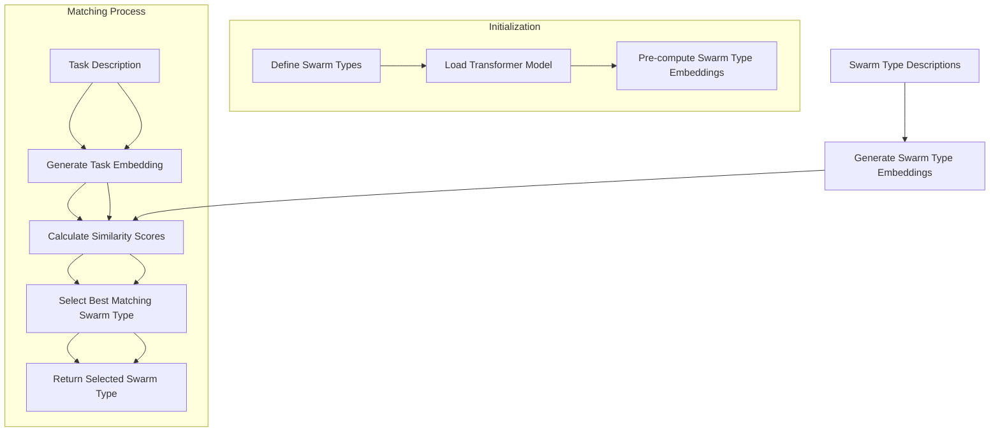
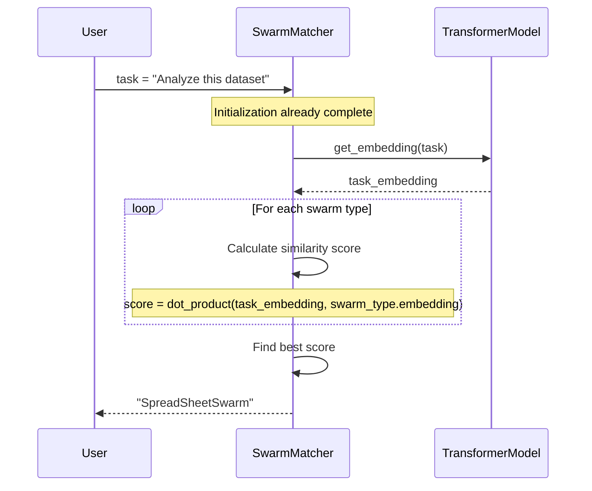

## Overview

The `SwarmMatcher` utilizes transformer-based embeddings to determine the best swarm architecture for a given task. By analyzing the semantic meaning of task descriptions and comparing them to known swarm types, it can intelligently select the optimal swarm configuration for any task.

## Workflow



## Installation

```bash
pip install -U swarms
```

## Attributes

### SwarmMatcherConfig

<ParamField path="model_name" type="str" default="sentence-transformers/all-MiniLM-L6-v2">
  The transformer model to use for generating embeddings.
</ParamField>

<ParamField path="embedding_dim" type="int" default="512">
  The dimension of the embedding vectors.
</ParamField>

### SwarmType

<ParamField path="name" type="str" required>
  The name of the swarm type.
</ParamField>

<ParamField path="description" type="str" required>
  A detailed description of the swarm type's capabilities and ideal use cases.
</ParamField>

<ParamField path="embedding" type="Optional[List[float]]" default="None">
  The generated embedding vector for this swarm type (auto-populated).
</ParamField>

## Methods

### \_\_init\_\_()

Initializes the SwarmMatcher with a configuration.

```python
def __init__(self, config: SwarmMatcherConfig)
```

**Parameters:**
- `config` (SwarmMatcherConfig): Configuration object for the matcher

### get_embedding()

Generates an embedding vector for a given text using the configured model.

```python
def get_embedding(self, text: str) -> np.ndarray
```

**Parameters:**
- `text` (str): The text to embed

**Returns:** `np.ndarray` - The embedding vector

### add_swarm_type()

Adds a swarm type to the matcher, generating an embedding for its description.

```python
def add_swarm_type(self, swarm_type: SwarmType)
```

**Parameters:**
- `swarm_type` (SwarmType): The swarm type to add

### find_best_match()

Finds the best matching swarm type for a given task.

```python
def find_best_match(self, task: str) -> Tuple[str, float]
```

**Parameters:**
- `task` (str): The task description

**Returns:** `Tuple[str, float]` - The name of the best matching swarm type and the similarity score

### auto_select_swarm()

Automatically selects the best swarm type for a given task.

```python
def auto_select_swarm(self, task: str) -> str
```

**Parameters:**
- `task` (str): The task description

**Returns:** `str` - The name of the selected swarm type

### run_multiple()

Matches multiple tasks to swarm types in batch.

```python
def run_multiple(self, tasks: List[str]) -> List[str]
```

**Parameters:**
- `tasks` (List[str]): A list of task descriptions

**Returns:** `List[str]` - A list of selected swarm type names

### save_swarm_types()

Saves the registered swarm types to a JSON file.

```python
def save_swarm_types(self, filename: str)
```

**Parameters:**
- `filename` (str): Path where the swarm types will be saved

### load_swarm_types()

Loads swarm types from a JSON file.

```python
def load_swarm_types(self, filename: str)
```

**Parameters:**
- `filename` (str): Path to the JSON file containing swarm types

## Available Swarm Types

SwarmMatcher comes with several pre-defined swarm types:

| Swarm Type | Description |
| ---------- | ----------- |
| AgentRearrange | Optimize agent order and rearrange flow for multi-step tasks, ensuring efficient task allocation and minimizing bottlenecks. |
| MixtureOfAgents | Combine diverse expert agents for comprehensive analysis, fostering a collaborative approach to problem-solving and leveraging individual strengths. |
| SpreadSheetSwarm | Collaborative data processing and analysis in a spreadsheet-like environment, facilitating real-time data sharing and visualization. |
| SequentialWorkflow | Execute tasks in a step-by-step, sequential process workflow, ensuring a logical and methodical approach to task execution. |
| ConcurrentWorkflow | Process multiple tasks or data sources concurrently in parallel, maximizing productivity and reducing processing time. |

## Usage Examples

### Simple Matching

```python
from swarms import swarm_matcher

# Use the simplified function to match a task to a swarm type
swarm_type = swarm_matcher("Analyze this dataset and create visualizations")
print(f"Selected swarm type: {swarm_type}")
```

### Batch Matching

```python
from swarms import swarm_matcher

# Match tasks to swarm types
tasks = [
    "Analyze this dataset and create visualizations",
    "Coordinate multiple agents to tackle different aspects of a problem",
    "Process these 10 PDF files in sequence",
    "Handle these data processing tasks in parallel"
]

for task in tasks:
    swarm_type = swarm_matcher(task)
    print(f"Task: {task}")
    print(f"Selected swarm: {swarm_type}\n")
```

### Advanced Usage with Custom Configuration

```python
from swarms import SwarmMatcher, SwarmMatcherConfig, SwarmType

# Create a configuration
config = SwarmMatcherConfig(
    model_name="sentence-transformers/all-MiniLM-L6-v2",
    embedding_dim=512
)

# Initialize the matcher
matcher = SwarmMatcher(config)

# Add a custom swarm type
custom_swarm = SwarmType(
    name="CustomSwarm",
    description="A specialized swarm for handling specific domain tasks with expert knowledge."
)
matcher.add_swarm_type(custom_swarm)

# Find the best match for a task
best_match, score = matcher.find_best_match("Process natural language and extract key insights")
print(f"Best match: {best_match}, Score: {score}")

# Auto-select a swarm type
selected_swarm = matcher.auto_select_swarm("Create data visualizations from this CSV file")
print(f"Selected swarm: {selected_swarm}")
```

### Custom Swarm Types

```python
from swarms import SwarmMatcher, SwarmMatcherConfig, SwarmType

# Create configuration and matcher
config = SwarmMatcherConfig()
matcher = SwarmMatcher(config)

# Define custom swarm types
swarm_types = [
    SwarmType(
        name="DataAnalysisSwarm",
        description="Specialized in processing and analyzing large datasets, performing statistical analysis, and extracting insights from complex data."
    ),
    SwarmType(
        name="CreativeWritingSwarm",
        description="Optimized for creative content generation, storytelling, and producing engaging written material with consistent style and tone."
    ),
    SwarmType(
        name="ResearchSwarm",
        description="Focused on deep research tasks, synthesizing information from multiple sources, and producing comprehensive reports on complex topics."
    )
]

# Add swarm types
for swarm_type in swarm_types:
    matcher.add_swarm_type(swarm_type)

# Save the swarm types for future use
matcher.save_swarm_types("custom_swarm_types.json")

# Use the matcher
task = "Research quantum computing advances in the last 5 years"
best_match = matcher.auto_select_swarm(task)
print(f"Selected swarm type: {best_match}")
```

## How It Works

SwarmMatcher uses a transformer-based model to generate embeddings (vector representations) of both the task descriptions and the swarm type descriptions. It then calculates the similarity between these embeddings to determine which swarm type is most semantically similar to the given task.



The matching process follows these steps:

1. The task description is converted to an embedding vector
2. Each swarm type's description is converted to an embedding vector
3. The similarity between the task embedding and each swarm type embedding is calculated
4. The swarm type with the highest similarity score is selected

This approach ensures that the matcher can understand the semantic meaning of tasks, not just keyword matching, resulting in more accurate swarm type selection.

## Source Code

View the [source code on GitHub](https://github.com/kyegomez/swarms/blob/master/swarms/structs/swarm_matcher.py)
