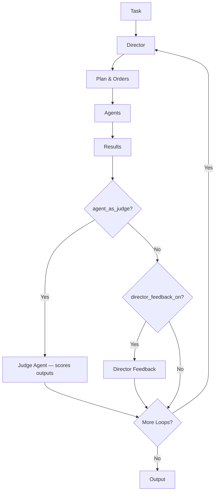

The `HierarchicalSwarm` implements a director-worker pattern. A central director agent analyzes the task, produces a structured plan (a `SwarmSpec`), distributes orders to specialist worker agents, and — optionally — provides feedback or runs a judge over the outputs to iterate further.

## When to Use

- **Complex project management** — multi-stage projects with specialized roles
- **Team coordination** — coordinating diverse specialist agents
- **Quality control** — iterative refinement through feedback loops
- **Hierarchical decisions** — tasks requiring oversight and delegation
- **Strategic planning** — breaking down complex goals into specialized subtasks

## Key Features

- Automatic director agent creation (or pass your own)
- Structured output via `SwarmSpec` (Pydantic schema with `plan` + `orders`)
- Multi-loop feedback and refinement
- Optional agent-as-judge phase for objective scoring
- Optional planning phase before order generation
- Optional team-awareness preamble for workers
- Parallel order execution (default)
- Interactive `rich` dashboard mode
- Conversation history tracking
- Autosave of conversation history to a workspace directory

## Basic Example

```python
from swarms import Agent, HierarchicalSwarm

content_strategist = Agent(
    agent_name="Content-Strategist",
    system_prompt="Develop content strategies and editorial calendars.",
    model_name="gpt-5.4",
)

creative_director = Agent(
    agent_name="Creative-Director",
    system_prompt="Create compelling advertising concepts and visual direction.",
    model_name="gpt-5.4",
)

seo_specialist = Agent(
    agent_name="SEO-Specialist",
    system_prompt="Conduct keyword research and optimize content for search.",
    model_name="gpt-5.4",
)

swarm = HierarchicalSwarm(
    name="Marketing-Team",
    description="Comprehensive marketing team for product launches",
    agents=[content_strategist, creative_director, seo_specialist],
    max_loops=2,            # allow feedback + refinement
)

result = swarm.run(
    "Develop a marketing strategy for a new SaaS project management tool"
)
print(result)
```

## Architecture Flow



```
1. User task → Director Agent
2. (Optional) Director runs a planning pass
3. Director emits SwarmSpec:
   - plan:   overall strategy
   - orders: list of (agent_name, task) pairs
4. Orders execute (parallel by default)
5. Worker outputs go back to the director
6. (Optional) Director feedback OR judge agent scores outputs
7. Loop back to step 2 until max_loops, then synthesize and return
```

## SwarmSpec Structure

The director outputs a Pydantic-validated plan:

```python
from pydantic import BaseModel
from typing import List

class HierarchicalOrder(BaseModel):
    agent_name: str   # worker agent that should execute
    task: str         # specific task for that agent

class SwarmSpec(BaseModel):
    plan: str                              # overall strategy
    orders: List[HierarchicalOrder]        # task assignments
```

Example output:

```json
{
    "plan": "Create comprehensive marketing strategy with content, creative, and SEO components",
    "orders": [
        {"agent_name": "Content-Strategist", "task": "Develop 90-day content calendar"},
        {"agent_name": "Creative-Director", "task": "Create brand visual identity"},
        {"agent_name": "SEO-Specialist", "task": "Research keywords for SaaS project management"}
    ]
}
```

## Key Parameters

<ParamField path="name" type="str" default="HierarchicalAgentSwarm">
  Name for the swarm instance.
</ParamField>

<ParamField path="description" type="str" default="Distributed task swarm">
  Description of the swarm's purpose.
</ParamField>

<ParamField path="agents" type="List[Agent]" required>
  Specialist worker agents.
</ParamField>

<ParamField path="director" type="Agent">
  Custom director agent. If `None`, a default director is created using `director_model_name` + `director_system_prompt`.
</ParamField>

<ParamField path="max_loops" type="int" default="1">
  Maximum number of plan → execute → feedback iterations.
</ParamField>

<ParamField path="output_type" type="OutputType" default="dict-all-except-first">
  Format of the returned conversation history.
</ParamField>

<ParamField path="director_name" type="str" default="Director">
  Display name for the director agent.
</ParamField>

<ParamField path="director_model_name" type="str" default="gpt-5.4">
  Model used by the director.
</ParamField>

<ParamField path="director_system_prompt" type="str" default="HIEARCHICAL_SWARM_SYSTEM_PROMPT">
  System prompt for the director. Override to customize director behavior.
</ParamField>

<ParamField path="director_temperature" type="float" default="0.7">
  Sampling temperature for the director.
</ParamField>

<ParamField path="director_top_p" type="float" default="0.9">
  Top-p for the director.
</ParamField>

<ParamField path="feedback_director_model_name" type="str" default="gpt-5.4">
  Model used when the director generates feedback on worker outputs.
</ParamField>

<ParamField path="director_feedback_on" type="bool" default="True">
  Enable director feedback after each loop.
</ParamField>

<ParamField path="planning_enabled" type="bool" default="True">
  Run an explicit planning pass before generating orders.
</ParamField>

<ParamField path="agent_as_judge" type="bool" default="False">
  Run a judge agent that scores worker outputs against the plan.
</ParamField>

<ParamField path="judge_agent_model_name" type="str" default="gpt-5.4">
  Model used by the judge agent when `agent_as_judge=True`.
</ParamField>

<ParamField path="add_collaboration_prompt" type="bool" default="True">
  Inject the multi-agent collaboration preamble into agents.
</ParamField>

<ParamField path="multi_agent_prompt_improvements" type="bool" default="False">
  Augment every worker's system prompt with team awareness (other agents + roles).
</ParamField>

<ParamField path="parallel_execution" type="bool" default="True">
  Execute multi-agent orders concurrently within a loop.
</ParamField>

<ParamField path="interactive" type="bool" default="False">
  Enable the interactive `rich` dashboard.
</ParamField>

<ParamField path="autosave" type="bool" default="True">
  Persist conversation history to a workspace directory.
</ParamField>

<ParamField path="verbose" type="bool" default="False">
  Enable info-level logging.
</ParamField>

## Methods

### `run(task, img=None)`

Execute the swarm end-to-end.

```python
result = swarm.run(
    task="Develop product launch strategy",
    img=None,
)
```

### `batched_run(tasks, ...)`

Run the swarm sequentially over a batch of tasks.

```python
results = swarm.batched_run([
    "Strategy for product A",
    "Strategy for product B",
    "Strategy for product C",
])
```

### `arun(task, ...)`

Async entry point that wraps `run()` in `asyncio.to_thread()`, so the swarm can be awaited without blocking the event loop. Accepts the same parameters as `run()`.

```python
import asyncio

result = asyncio.run(
    swarm.arun(task="Summarize recent AI research trends")
)
```

<Note>
  `asyncio.run()` raises `RuntimeError` if an event loop is already running (notebooks, some REPLs, async frameworks). In those environments, `await swarm.arun(...)` directly instead.
</Note>

Use `arun()` when integrating the swarm into an existing async application:

```python
from fastapi import FastAPI

app = FastAPI()

@app.post("/analyze")
async def analyze(task: str):
    result = await swarm.arun(task=task)
    return {"result": result}
```

### `run_stream(task, img=None, with_events=False, ...)`

Sync generator that streams tokens as they arrive from the director and workers. Bridges `arun_stream()` onto a background thread, so it can be used outside an async context.

```python
for agent_name, token in swarm.run_stream(task="Develop product launch strategy"):
    print(f"\r{agent_name}: {token}", end="", flush=True)
```

Pass `with_events=True` to receive structured event dicts (`swarm_start`, `director_start`, `token`, `director_end`, `worker_start`, `worker_end`, `aggregator_start`, `aggregator_end`, `swarm_end`) tagged with `role` and `loop` instead of plain `(agent_name, token)` tuples.

### `arun_stream(task, img=None, with_events=False, ...)`

Async generator version of `run_stream()`. Use this directly when you already have a running event loop (e.g. inside a FastAPI handler) — `run_stream()` will raise if called from within an event loop.

```python
async for agent_name, token in swarm.arun_stream(task="Develop product launch strategy"):
    print(f"\r{agent_name}: {token}", end="", flush=True)
```

### `display_hierarchy()`

Visualize the swarm's tree with `rich.Tree`.

```python
swarm.display_hierarchy()
# Hierarchical Swarm: Marketing-Team
# Director: Director (gpt-5.4)
# ├─ Content-Strategist
# ├─ Creative-Director
# └─ SEO-Specialist
```

### `feedback_director(outputs)`

Manually trigger the feedback director on a list of worker outputs.

### `run_judge_agent(outputs)`

Manually score worker outputs with the judge agent (requires `agent_as_judge=True`).

## Advanced Configuration

### Custom Director

```python
custom_director = Agent(
    agent_name="Chief-Strategy-Officer",
    system_prompt="You are a senior executive coordinating teams.",
    model_name="claude-sonnet-4-20250514",
)

swarm = HierarchicalSwarm(
    name="Executive-Team",
    agents=workers,
    director=custom_director,
)
```

### Planning + Multiple Loops

```python
swarm = HierarchicalSwarm(
    name="Research-Team",
    agents=researchers,
    planning_enabled=True,
    max_loops=3,
)
```

With `planning_enabled=True`:

1. Director runs a planning pass first
2. The plan is added to the conversation context
3. Director then emits concrete orders
4. Workers execute with full plan context

### Agent-as-Judge

```python
swarm = HierarchicalSwarm(
    name="Reviewed-Team",
    agents=workers,
    agent_as_judge=True,
    judge_agent_model_name="claude-sonnet-4-20250514",
    max_loops=2,
)
```

When enabled, after worker outputs are gathered a dedicated judge agent scores every worker's output. This takes priority over `director_feedback_on` — if both are `True`, the judge runs instead of the freeform feedback.

**Scoring dimensions (each 0–10, weighted composite):**

| Dimension | Weight | What it measures |
|-----------|--------|------------------|
| Task Adherence | 25% | Did the agent do what it was assigned? |
| Accuracy & Factual Integrity | 25% | Are claims correct and well-supported? |
| Depth & Completeness | 20% | Is the response thorough or surface-level? |
| Clarity & Communication | 15% | Is the output well-structured and actionable? |
| Contribution to Swarm Goal | 15% | Does the output advance the collective mission? |

**Output schema:**

```python
from typing import List
from pydantic import BaseModel

class AgentScore(BaseModel):
    agent_name: str
    score: int          # 0–10 composite
    reasoning: str      # evidence-cited explanation
    suggestions: str    # concrete, actionable improvements

class JudgeReport(BaseModel):
    overall_quality: int        # 0–10 collective score
    scores: List[AgentScore]    # one entry per worker agent
    summary: str                # names best/worst agent, flags gaps
```

The `JudgeReport` is added to the conversation under the role `"JudgeAgent"`. With `max_loops > 1`, the director sees the scores on the next loop and can adjust its plan accordingly.

**Difference from `director_feedback_on`:**

| | `director_feedback_on` | `agent_as_judge` |
|---|---|---|
| Output format | Unstructured string | Structured `JudgeReport` with typed fields |
| Numeric scores | No | Yes — per-agent and overall (0–10) |
| Machine-readable | No | Yes |
| Multi-loop utility | Director reads its own text feedback | Director reads structured scores and suggestions |

### Team-Awareness Preamble

```python
swarm = HierarchicalSwarm(
    agents=workers,
    multi_agent_prompt_improvements=True,
)
```

Each worker's `system_prompt` is extended with a description of every other team member so workers can write coherent hand-offs.

### Interactive Dashboard

```python
swarm = HierarchicalSwarm(
    name="Development-Team",
    agents=developers,
    interactive=True,
    verbose=True,
)

result = swarm.run("Build authentication system")
```

The dashboard shows:

- Swarm metadata (name, description, loops)
- Director status and current plan
- Per-agent status matrix with loop tracking
- Real-time progress updates

### Autosave

```python
swarm = HierarchicalSwarm(
    agents=workers,
    autosave=True,
)
```

When enabled, the swarm writes conversation history under
`$WORKSPACE_DIR/swarms/HierarchicalSwarm/{name}-{timestamp}/`.
If `WORKSPACE_DIR` is unset it defaults to `./agent_workspace`.

## Use Cases

### Software Development Team

```python
architect    = Agent(agent_name="Architect", ...)
frontend_dev = Agent(agent_name="Frontend-Dev", ...)
backend_dev  = Agent(agent_name="Backend-Dev", ...)
tester       = Agent(agent_name="QA-Tester", ...)

dev_swarm = HierarchicalSwarm(
    name="Development-Team",
    agents=[architect, frontend_dev, backend_dev, tester],
    max_loops=2,
)

code = dev_swarm.run("Build user authentication with OAuth")
```

### Research Team

```python
literature_researcher = Agent(agent_name="Literature-Researcher", ...)
data_analyst          = Agent(agent_name="Data-Analyst", ...)
statistician          = Agent(agent_name="Statistician", ...)
writer                = Agent(agent_name="Research-Writer", ...)

research_swarm = HierarchicalSwarm(
    name="Research-Team",
    description="Academic research team",
    agents=[literature_researcher, data_analyst, statistician, writer],
    max_loops=3,
)

paper = research_swarm.run("Research the impact of AI on job markets")
```

### Marketing Campaign

```python
brand_strategist = Agent(agent_name="Brand-Strategist", ...)
copywriter       = Agent(agent_name="Copywriter", ...)
designer         = Agent(agent_name="Designer", ...)
media_buyer      = Agent(agent_name="Media-Buyer", ...)

marketing_swarm = HierarchicalSwarm(
    name="Campaign-Team",
    agents=[brand_strategist, copywriter, designer, media_buyer],
    director_model_name="claude-sonnet-4-20250514",
    max_loops=2,
)

campaign = marketing_swarm.run(
    "Launch campaign for eco-friendly water bottle"
)
```

## Multi-Loop Refinement

With `max_loops > 1`, the director can refine outputs across iterations:

```python
swarm = HierarchicalSwarm(
    agents=workers,
    max_loops=3,
    director_feedback_on=True,
)
```

Each loop:

1. Director creates a new plan informed by previous results
2. Director issues orders (possibly to different agents or with different tasks)
3. Workers execute
4. Results — and any feedback/judge output — are appended to the conversation
5. The next loop sees the complete context

## Order Execution

### Concurrent Execution (default)

Orders for multiple agents run in parallel via `run_agents_concurrently`:

```python
orders = [
    {"agent_name": "Agent1", "task": "Analyze data"},
    {"agent_name": "Agent2", "task": "Research market"},
    {"agent_name": "Agent3", "task": "Review competitors"},
]
# All three execute simultaneously when parallel_execution=True
```

### Sequential Execution

Set `parallel_execution=False` to run orders one after another within a loop. Useful when each order depends on the previous one's output.

## Director System Prompt

The default `HIEARCHICAL_SWARM_SYSTEM_PROMPT` instructs the director to:

- Analyze the task
- Identify required expertise
- Create a comprehensive plan
- Distribute work appropriately
- Evaluate results
- Provide constructive feedback

You can fully override it:

```python
custom_prompt = """
You are a senior project director coordinating a team of specialists.

Responsibilities:
1. Analyze complex tasks and break them down.
2. Assign work to appropriate specialists.
3. Ensure team coordination and communication.
4. Review outputs and provide feedback.
5. Synthesize results into cohesive outcomes.

Always consider dependencies and optimal sequencing.
"""

swarm = HierarchicalSwarm(
    agents=workers,
    director_system_prompt=custom_prompt,
)
```

## Streaming Callbacks

Pass a `streaming_callback` to `run()`, `arun()`, or `batched_run()` to receive token-by-token output from each agent. The callback signature is `(agent_name, chunk, is_final)`.

```python
def streaming_callback(agent_name: str, chunk: str, is_final: bool) -> None:
    if chunk.strip():
        print(f"\r{agent_name}: {chunk}", end="", flush=True)
    if is_final:
        print(f"\n{agent_name} done")

result = swarm.run(task="...", streaming_callback=streaming_callback)
```

## Output Types

| Output type | Description |
|-------------|-------------|
| `"dict-all-except-first"` | All conversation history as a dict, excluding the first message (default) |
| `"dict"` | Full conversation history as a dict |
| `"str"` | Conversation history as a plain string |
| `"list"` | Conversation history as a list |

## Best Practices

<Note>
  **Loop count:** start at 1 loop for simple coordination; 2–3 for quality refinement. Avoid >3 unless you're seeing clear improvement per loop.
</Note>

1. **Specialized workers** — each agent should have an obviously different area of expertise; overlapping workers waste tokens.
2. **Director model** — use a stronger model than the workers (e.g. Claude Sonnet, GPT-5.4). The director's planning quality bounds the whole swarm.
3. **Loop balance** — every extra loop costs an additional director pass + every worker run. Budget accordingly.
4. **Planning phase** — enable for complex tasks that benefit from a strategy step.
5. **Judge phase** — enable when output quality is uneven and you want explicit scoring/feedback.
6. **Dashboard** — useful for demos and debugging.

<Warning>
  Each loop runs the director **and** every selected worker. Costs grow roughly linearly with `max_loops × len(agents)`.
</Warning>

## Error Handling

```python
try:
    result = swarm.run("Task")
except ValueError as e:
    print(f"Configuration error: {e}")
    # e.g. empty agent list, invalid max_loops
except Exception as e:
    print(f"Execution error: {e}")
    # e.g. runtime errors from individual agents
```

`reliability_checks()` runs at construction and validates:

- At least one agent is provided
- `max_loops > 0`
- Director agent can be created or is already valid

## Performance Considerations

### Parallel Order Execution

`run_agents_concurrently` runs all agents in a loop simultaneously when `parallel_execution=True`:

```python
results = run_agents_concurrently(
    agents=agents_to_run,
    task=self.conversation.get_str(),
)
```

### Per-Loop Overhead

| Consideration | Description |
|---|---|
| **Judge overhead** | `agent_as_judge=True` adds one extra LLM call per loop; use a small/fast model via `judge_agent_model_name` |
| **Planning overhead** | `planning_enabled=True` adds one extra director call per loop |
| **Dashboard impact** | `interactive=True` adds minimal overhead but is not recommended for production |

### Conversation Context

The full conversation flows through every loop, giving the director complete state:

```python
output = self.run_director(
    task=f"History: {self.conversation.get_str()} \n\n Task: {task}"
)
```

## Related Architectures

- [Heavy Swarm](/architectures/heavy-swarm) — fixed multi-phase analysis with question generation
- [Mixture of Agents](/architectures/mixture-of-agents) — parallel experts + aggregator
- [Agent Rearrange](/architectures/agent-rearrange) — custom flows without a director
- [Sequential Workflow](/architectures/sequential-workflow) — simple linear flows
- [Structures Catalog](/architectures/structures-catalog) — full enumeration of every multi-agent structure
