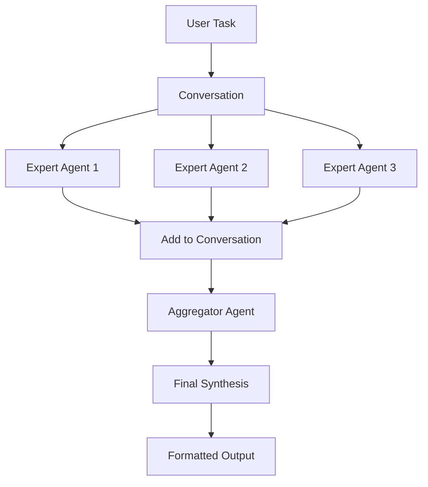

# Mixture of Agents (MoA)

The `MixtureOfAgents` architecture runs multiple expert agents in parallel and synthesizes their diverse outputs through an aggregator agent. This collaborative approach achieves superior results through multi-perspective analysis.

## When to Use

- **Complex problem-solving**: Tasks requiring multiple expert perspectives
- **Quality through collaboration**: Combine diverse viewpoints for better outcomes
- **State-of-the-art performance**: Achieve highest quality through synthesis
- **Expert systems**: Leverage specialized knowledge from multiple domains
- **Comprehensive analysis**: Get well-rounded insights

## Key Features

- Parallel execution of expert agents
- Automatic aggregation and synthesis
- Multi-layer processing (optional)
- Team awareness capabilities
- Flexible output formatting
- Conversation history tracking

## Basic Example

```python
from swarms import Agent, MixtureOfAgents

# Define expert agents
financial_analyst = Agent(
    agent_name="Financial-Analyst",
    system_prompt="Analyze financial data, ratios, and performance metrics.",
    model_name="gpt-4o-mini",
    max_loops=1,
)

market_analyst = Agent(
    agent_name="Market-Analyst",
    system_prompt="Analyze market trends, competition, and positioning.",
    model_name="gpt-4o-mini",
    max_loops=1,
)

risk_analyst = Agent(
    agent_name="Risk-Analyst",
    system_prompt="Analyze risks, threats, and mitigation strategies.",
    model_name="gpt-4o-mini",
    max_loops=1,
)

# Define aggregator agent
aggregator = Agent(
    agent_name="Investment-Advisor",
    system_prompt="Synthesize financial, market, and risk analyses into a comprehensive investment recommendation.",
    model_name="gpt-4o-mini",
    max_loops=1,
)

# Create MoA swarm
moa = MixtureOfAgents(
    name="Investment-Analysis-Team",
    agents=[financial_analyst, market_analyst, risk_analyst],
    aggregator_agent=aggregator,
    layers=1,  # Single layer of analysis
)

# Execute
recommendation = moa.run("Should we invest in NVIDIA stock?")
print(recommendation)
```

## Multi-Layer Processing

Use multiple layers for iterative refinement:

```python
moa = MixtureOfAgents(
    name="Deep-Analysis-Team",
    agents=[expert1, expert2, expert3],
    aggregator_agent=synthesizer,
    layers=3,  # Three rounds of analysis and synthesis
    max_loops=1,
)

result = moa.run("Complex strategic decision")
```

Each layer:
1. Experts analyze the current context
2. Outputs are added to conversation history
3. Next layer sees all previous analysis
4. Aggregator synthesizes final result

## Key Parameters

<ParamField path="name" type="str" default="MixtureOfAgents">
  Name for the MoA instance
</ParamField>

<ParamField path="agents" type="List[Agent]" required>
  List of expert agents to run in parallel
</ParamField>

<ParamField path="aggregator_agent" type="Agent" required>
  Agent that synthesizes expert outputs
</ParamField>

<ParamField path="layers" type="int" default={3}>
  Number of processing layers (iterations)
</ParamField>

<ParamField path="max_loops" type="int" default={1}>
  Maximum loops per layer
</ParamField>

<ParamField path="output_type" type="OutputType" default="final">
  Output format (final, all, list, dict)
</ParamField>

<ParamField path="aggregator_system_prompt" type="str">
  Custom system prompt for aggregator (uses default if not provided)
</ParamField>

<ParamField path="aggregator_model_name" type="str" default="claude-sonnet-4-20250514">
  Model for the aggregator agent
</ParamField>

## Methods

### run()

Execute the mixture of agents with a task.

```python
result = moa.run(
    task="Analyze investment opportunity",
    img=None,  # Optional image input
)
```

### run_batched()

Process multiple tasks sequentially.

```python
tasks = [
    "Analyze tech sector",
    "Analyze healthcare sector",
    "Analyze energy sector"
]

results = moa.run_batched(tasks)
```

### run_concurrently()

Process multiple tasks in parallel.

```python
tasks = ["Task 1", "Task 2", "Task 3"]
results = moa.run_concurrently(tasks)
```

## Use Cases

### Investment Analysis

```python
# Multiple financial experts with synthesis
value_investor = Agent(agent_name="Value-Investor", ...)
growth_investor = Agent(agent_name="Growth-Investor", ...)
momentum_trader = Agent(agent_name="Momentum-Trader", ...)
aggregator = Agent(agent_name="Portfolio-Manager", ...)

investment_moa = MixtureOfAgents(
    agents=[value_investor, growth_investor, momentum_trader],
    aggregator_agent=aggregator,
)

advice = investment_moa.run("Evaluate Tesla for our portfolio")
```

### Medical Diagnosis

```python
# Multiple specialists with diagnostic synthesis
cardiologist = Agent(agent_name="Cardiologist", ...)
neurologist = Agent(agent_name="Neurologist", ...)
internist = Agent(agent_name="Internist", ...)
diagnostician = Agent(agent_name="Chief-Diagnostician", ...)

medical_moa = MixtureOfAgents(
    agents=[cardiologist, neurologist, internist],
    aggregator_agent=diagnostician,
)

diagnosis = medical_moa.run("Patient presents with chest pain and dizziness")
```

### Research Synthesis

```python
# Domain experts with research synthesis
ml_researcher = Agent(agent_name="ML-Researcher", ...)
data_scientist = Agent(agent_name="Data-Scientist", ...)
domain_expert = Agent(agent_name="Domain-Expert", ...)
research_lead = Agent(agent_name="Research-Lead", ...)

research_moa = MixtureOfAgents(
    agents=[ml_researcher, data_scientist, domain_expert],
    aggregator_agent=research_lead,
    layers=2,  # Two rounds of analysis
)

insights = research_moa.run("Novel approaches to computer vision")
```

## Custom Aggregator Prompt

```python
from swarms.prompts.ag_prompt import AGGREGATOR_SYSTEM_PROMPT_MAIN

# Use default prompt
moa = MixtureOfAgents(
    agents=experts,
    aggregator_agent=aggregator,
    aggregator_system_prompt=AGGREGATOR_SYSTEM_PROMPT_MAIN,
)

# Or create custom aggregator prompt
custom_prompt = """
You are a senior investment advisor synthesizing expert analyses.

Your role:
1. Review all expert opinions carefully
2. Identify consensus and conflicts
3. Weight opinions by confidence and evidence
4. Provide clear, actionable recommendations
5. Explain your reasoning and risk factors

Always be conservative and highlight uncertainty.
"""

moa = MixtureOfAgents(
    agents=experts,
    aggregator_agent=aggregator,
    aggregator_system_prompt=custom_prompt,
)
```

## Automatic Aggregator Setup

If no aggregator agent is provided, one is created automatically:

```python
moa = MixtureOfAgents(
    name="Analysis-Team",
    agents=[expert1, expert2, expert3],
    # aggregator_agent not provided - will be created automatically
    aggregator_model_name="claude-sonnet-4-20250514",
)

# Automatic aggregator created with:
# - agent_name="Aggregator Agent"
# - Default AGGREGATOR_SYSTEM_PROMPT_MAIN
# - Specified model_name
# - temperature=0.5
# - max_loops=1
```

## Architecture Flow



## Multi-Layer Flow

With `layers=3`:

```
Layer 1:
  User Task → Experts → Conversation

Layer 2:
  Full Context → Experts → Conversation
  (Experts see Layer 1 outputs)

Layer 3:
  Full Context → Experts → Conversation
  (Experts see Layers 1-2 outputs)

Final:
  Full Context → Aggregator → Output
```

## Output Types

```python
# Only final aggregated output
moa_final = MixtureOfAgents(
    agents=experts,
    aggregator_agent=aggregator,
    output_type="final",
)

# All conversation history
moa_all = MixtureOfAgents(
    agents=experts,
    aggregator_agent=aggregator,
    output_type="all",
)

# Structured dictionary
moa_dict = MixtureOfAgents(
    agents=experts,
    aggregator_agent=aggregator,
    output_type="dict",
)
```

## Best Practices

<Note>
  **Expert Selection**: Choose agents with complementary expertise for maximum benefit
</Note>

1. **Diverse Experts**: Select agents with different perspectives/specializations
2. **Clear Prompts**: Give each expert a specific focus area
3. **Quality Aggregator**: Use strong model for synthesis (Claude Sonnet, GPT-4)
4. **Layer Count**: Start with 1 layer, add more only if needed
5. **Aggregator Instructions**: Provide clear synthesis guidelines

<Warning>
  More experts and layers increase cost and latency - balance quality with efficiency
</Warning>

## Reliability Checks

The system validates configuration on initialization:

```python
try:
    moa = MixtureOfAgents(
        agents=[],  # Empty list
        aggregator_agent=aggregator,
    )
except ValueError as e:
    print(e)  # "No agents provided."
```

Validations:
- At least one expert agent required
- Aggregator system prompt must be provided
- Layers must be specified

## Performance Considerations

### Concurrent Execution

Experts run in true parallel using ThreadPoolExecutor:

```python
# All expert agents execute simultaneously
agent_outputs = run_agents_concurrently(
    agents=self.agents,
    task=task,
    img=img,
    return_agent_output_dict=True,
)
```

### Conversation Context

Full context flows through layers:

```python
# Each layer sees complete history
full_context = self.conversation.get_str()
step_output = self.step(task=full_context, img=img)
```

## Related Architectures

- [Concurrent Workflow](/architectures/concurrent-workflow) - Parallel without synthesis
- [Hierarchical Swarm](/architectures/hierarchical-swarm) - Director-worker pattern
- [Heavy Swarm](/architectures/heavy-swarm) - Multi-phase analysis
- [Agent Rearrange](/architectures/agent-rearrange) - Custom flow patterns