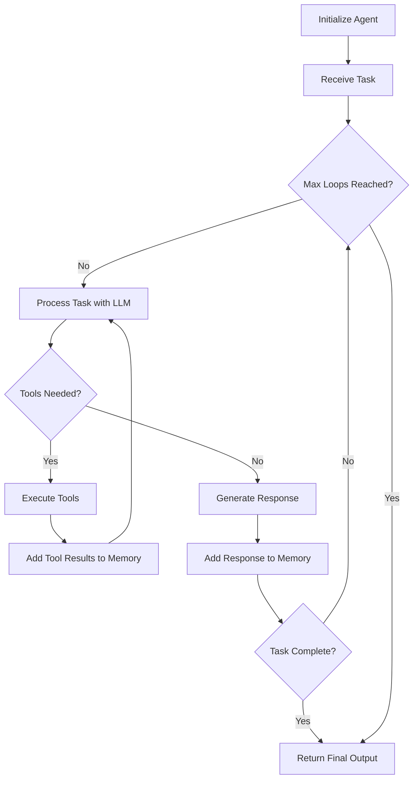

## What is an Agent?

An **Agent** is the fundamental building block of the Swarms framework. It represents an autonomous entity that combines three core components:

<CardGroup cols={3}>
  <Card title="LLM" icon="brain">
    A language model that provides reasoning and decision-making capabilities
  </Card>
  <Card title="Tools" icon="wrench">
    External functions and APIs that extend the agent's capabilities
  </Card>
  <Card title="Memory" icon="database">
    Conversation history and context management for coherent interactions
  </Card>
</CardGroup>

Agents are designed to be production-ready, enterprise-grade components that can execute tasks autonomously, make decisions, use tools, and learn from experience.

## Agent Anatomy

Every agent in Swarms consists of these key components:

### 1. Language Model (LLM)

The LLM serves as the agent's "brain," providing:
- Natural language understanding and generation
- Reasoning and decision-making capabilities
- Tool selection and parameter extraction
- Response synthesis

### 2. Tools

Tools extend the agent's capabilities beyond text generation:
- Function calling for external APIs
- Database queries
- File operations
- Web scraping and search
- Custom business logic

### 3. Memory System

Memory enables agents to maintain context across interactions:
- **Short-term memory**: Conversation history for the current session
- **Long-term memory**: Vector database for retrieval-augmented generation (RAG)
- **Dynamic context window**: Automatic context management for long conversations

### 4. System Prompt

The system prompt defines the agent's:
- Role and responsibilities
- Behavioral guidelines
- Task-specific instructions
- Output format preferences

## Agent Lifecycle

Understanding the agent lifecycle helps you build more effective systems:



### Lifecycle Phases

1. **Initialization**: Agent is created with configuration (LLM, tools, system prompt)
2. **Task Execution**: Agent receives a task and begins processing
3. **Loop Execution**: Agent runs for a specified number of loops (`max_loops`)
4. **Tool Usage**: Agent determines if tools are needed and executes them
5. **Memory Management**: Conversation history is updated with each interaction
6. **Completion**: Agent returns the final output when task is complete or max loops reached

## Creating Your First Agent

Here's a simple example from the source code:

```python
from swarms import Agent

# Initialize a basic agent
agent = Agent(
    model_name="gpt-4o-mini",
    max_loops=1,
    interactive=True,
)

# Run the agent with a task
response = agent.run("What are the key benefits of using a multi-agent system?")
print(response)
```

## Advanced Agent Configuration

Agents support extensive configuration for production use:

```python
from swarms import Agent

# Create a production-ready agent
agent = Agent(
    # Identity
    agent_name="Financial-Analyst",
    agent_description="Expert in financial analysis and market research",
    
    # LLM Configuration
    model_name="gpt-4o-mini",
    max_tokens=4096,
    temperature=0.5,
    
    # Execution Control
    max_loops=5,
    dynamic_loops=True,
    stopping_token="<DONE>",
    
    # System Behavior
    system_prompt="""You are a financial analyst with expertise in market research.
    Your role is to analyze financial data and provide actionable insights.
    Always cite your sources and provide confidence levels for predictions.""",
    
    # Memory & Context
    context_length=16000,
    dynamic_context_window=True,
    return_history=True,
    
    # Tools (if applicable)
    tools=[search_tool, calculator_tool],
    
    # Output Control
    streaming_on=True,
    verbose=True,
)

# Execute a complex task
result = agent.run(
    "Analyze the current state of the renewable energy market and provide investment recommendations"
)
```

## Agent Features

### Autonomous Execution

Agents can run autonomously with `max_loops="auto"`:

```python
agent = Agent(
    model_name="gpt-4o-mini",
    max_loops="auto",  # Agent will determine when to stop
)
```

### Multi-Modal Support

Agents can process images alongside text:

```python
agent = Agent(
    model_name="gpt-4o",
    multi_modal=True,
)

response = agent.run(
    task="Analyze this chart",
    img="/path/to/chart.png"
)
```

### Streaming Responses

Real-time streaming for better user experience:

```python
def streaming_callback(chunk: str):
    print(chunk, end="", flush=True)

agent = Agent(
    model_name="gpt-4o-mini",
    streaming_callback=streaming_callback,
)

response = agent.run("Tell me a story")
```

### Long-Term Memory

Integrate vector databases for RAG:

```python
from swarms.memory import ChromaDB

memory = ChromaDB()

agent = Agent(
    model_name="gpt-4o-mini",
    long_term_memory=memory,
)
```

## Best Practices

<AccordionGroup>
  <Accordion title="Clear System Prompts">
    Define clear, specific system prompts that explain the agent's role, capabilities, and expected behavior. Include examples and constraints.
  </Accordion>
  
  <Accordion title="Appropriate Max Loops">
    Set `max_loops` based on task complexity:
    - Simple tasks: `max_loops=1`
    - Multi-step reasoning: `max_loops=3-5`
    - Autonomous execution: `max_loops="auto"`
  </Accordion>
  
  <Accordion title="Tool Selection">
    Provide only the tools necessary for the task. Too many tools can confuse the agent and increase costs.
  </Accordion>
  
  <Accordion title="Error Handling">
    Implement proper error handling and fallback strategies:
    ```python
    agent = Agent(
        model_name="gpt-4o-mini",
        fallback_models=["gpt-4o", "gpt-3.5-turbo"],
        retry_attempts=3,
    )
    ```
  </Accordion>
  
  <Accordion title="Context Management">
    Use dynamic context windows for long conversations:
    ```python
    agent = Agent(
        dynamic_context_window=True,
        context_length=16000,
    )
    ```
  </Accordion>
</AccordionGroup>

## Agent Capabilities Reference

From the source code (`swarms/structs/agent.py`), agents support:

- **Function Calling**: Native support for tool execution with OpenAI function calling
- **MCP Integration**: Model Context Protocol for standardized tool interfaces
- **Handoffs**: Delegate tasks to specialized agents
- **Artifacts**: Save outputs to structured files (PDF, MD, TXT)
- **State Persistence**: Save and load agent state for long-running tasks
- **Marketplace Integration**: Load prompts from Swarms marketplace
- **Skills Framework**: Modular, reusable capabilities via SKILL.md files

## Common Use Cases

<CardGroup cols={2}>
  <Card title="Research & Analysis" icon="magnifying-glass">
    Use agents to gather information, analyze data, and generate reports
  </Card>
  <Card title="Content Generation" icon="pen-to-square">
    Create blog posts, articles, and marketing materials with specialized agents
  </Card>
  <Card title="Data Processing" icon="table">
    Process and transform data with tool-equipped agents
  </Card>
  <Card title="Customer Support" icon="headset">
    Build intelligent chatbots and support agents
  </Card>
</CardGroup>

## Next Steps

<CardGroup cols={2}>
  <Card title="Tools" icon="wrench" href="/concepts/tools">
    Learn how to equip agents with tools and external capabilities
  </Card>
  <Card title="Swarms" icon="users" href="/concepts/swarms">
    Combine multiple agents into collaborative swarms
  </Card>
  <Card title="Workflows" icon="diagram-project" href="/concepts/workflows">
    Orchestrate agents with different workflow patterns
  </Card>
  <Card title="Agent Reference" icon="book" href="/swarms/structs/agent">
    Complete API reference for the Agent class
  </Card>
</CardGroup>