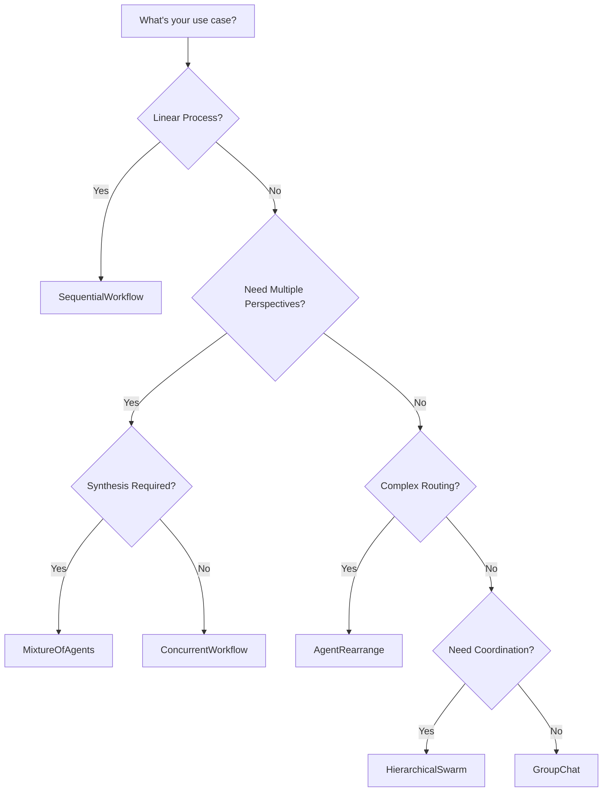

## What are Swarms?

A **Swarm** is a collection of multiple agents working together to accomplish complex tasks. Just as individual agents combine LLM + Tools + Memory, swarms combine multiple agents with different specializations, perspectives, and capabilities to solve problems that would be difficult or impossible for a single agent.

<Info>
**Why Swarms?** Complex tasks often require different types of expertise, perspectives, and approaches. Swarms enable you to decompose problems and leverage specialized agents working in harmony.
</Info>

## The Power of Multi-Agent Systems

Swarms unlock capabilities beyond what single agents can achieve:

<CardGroup cols={2}>
  <Card title="Specialization" icon="graduation-cap">
    Each agent can be optimized for a specific task or domain
  </Card>
  <Card title="Parallel Processing" icon="gauge-high">
    Multiple agents can work simultaneously for faster execution
  </Card>
  <Card title="Diverse Perspectives" icon="eye">
    Different agents provide varied viewpoints and approaches
  </Card>
  <Card title="Scalability" icon="up-right-and-down-left-from-center">
    Add more agents as complexity grows
  </Card>
  <Card title="Fault Tolerance" icon="shield">
    If one agent fails, others can continue
  </Card>
  <Card title="Quality Improvement" icon="star">
    Agents can review and refine each other's work
  </Card>
</CardGroup>

## Swarm Architectures

Swarms provides multiple pre-built architectures for different collaboration patterns:

### Sequential Workflow

**Pattern**: Agents execute tasks in a linear chain, where each agent builds upon the previous agent's output.

**Best For**: Step-by-step processes, data transformation pipelines, content creation workflows

```python
from swarms import Agent, SequentialWorkflow

# Create specialized agents
researcher = Agent(
    agent_name="Researcher",
    system_prompt="Research topics and gather comprehensive information.",
    model_name="gpt-4o-mini",
)

writer = Agent(
    agent_name="Writer",
    system_prompt="Transform research into engaging, well-structured content.",
    model_name="gpt-4o-mini",
)

editor = Agent(
    agent_name="Editor",
    system_prompt="Review and polish content for clarity and correctness.",
    model_name="gpt-4o-mini",
)

# Create sequential workflow: Researcher -> Writer -> Editor
workflow = SequentialWorkflow(agents=[researcher, writer, editor])

# Execute the workflow
final_article = workflow.run("Write an article about quantum computing")
print(final_article)
```

**Flow Visualization**:
```
Researcher → Writer → Editor → Final Output
```

### Concurrent Workflow

**Pattern**: All agents receive the same task and execute simultaneously, providing diverse perspectives.

**Best For**: Analysis tasks, getting multiple viewpoints, parallel data processing

```python
from swarms import Agent, ConcurrentWorkflow

# Create expert analysts
market_analyst = Agent(
    agent_name="Market-Analyst",
    system_prompt="Analyze market trends and competitive landscape.",
    model_name="gpt-4o-mini",
)

financial_analyst = Agent(
    agent_name="Financial-Analyst",
    system_prompt="Analyze financial metrics and profitability.",
    model_name="gpt-4o-mini",
)

risk_analyst = Agent(
    agent_name="Risk-Analyst",
    system_prompt="Identify and assess potential risks.",
    model_name="gpt-4o-mini",
)

# Run all agents concurrently
workflow = ConcurrentWorkflow(
    agents=[market_analyst, financial_analyst, risk_analyst]
)

# All agents analyze the same task simultaneously
analysis_results = workflow.run(
    "Analyze the investment potential of renewable energy sector"
)
```

**Flow Visualization**:
```
                    ┌──→ Market Analyst
Initial Task ───────┼──→ Financial Analyst ───→ Combined Results
                    └──→ Risk Analyst
```

### Agent Rearrange

**Pattern**: Define complex, non-linear relationships between agents using a simple syntax.

**Best For**: Dynamic workflows, flexible routing, complex dependencies

```python
from swarms import Agent, AgentRearrange

# Define agents
researcher = Agent(agent_name="researcher", model_name="gpt-4o-mini")
writer = Agent(agent_name="writer", model_name="gpt-4o-mini")
editor = Agent(agent_name="editor", model_name="gpt-4o-mini")
reviewer = Agent(agent_name="reviewer", model_name="gpt-4o-mini")

# Define flow: researcher sends to both writer and editor,
# then both send to reviewer
flow = "researcher -> writer, editor; writer -> reviewer; editor -> reviewer"

swarm = AgentRearrange(
    agents=[researcher, writer, editor, reviewer],
    flow=flow,
)

result = swarm.run("Create a technical whitepaper on blockchain")
```

**Flow Visualization**:
```
             ┌──→ Writer ───┐
Researcher ──┤              ├──→ Reviewer → Final Output
             └──→ Editor ───┘
```

### Mixture of Agents (MoA)

**Pattern**: Multiple expert agents process tasks in parallel, then an aggregator synthesizes their outputs.

**Best For**: Complex decision-making, leveraging diverse expertise, state-of-the-art performance

```python
from swarms import Agent, MixtureOfAgents

# Create expert agents
financial_expert = Agent(
    agent_name="Financial-Expert",
    system_prompt="Expert in financial analysis and investment strategies.",
    model_name="gpt-4o-mini"
)

market_expert = Agent(
    agent_name="Market-Expert",
    system_prompt="Expert in market trends and competitive analysis.",
    model_name="gpt-4o-mini"
)

risk_expert = Agent(
    agent_name="Risk-Expert",
    system_prompt="Expert in risk assessment and mitigation.",
    model_name="gpt-4o-mini"
)

# Create aggregator to synthesize expert opinions
aggregator = Agent(
    agent_name="Investment-Advisor",
    system_prompt="Synthesize expert analyses into actionable recommendations.",
    model_name="gpt-4o-mini"
)

# Create MoA swarm
moa_swarm = MixtureOfAgents(
    agents=[financial_expert, market_expert, risk_expert],
    aggregator_agent=aggregator,
)

recommendation = moa_swarm.run("Should we invest in NVIDIA stock?")
```

### Hierarchical Swarm

**Pattern**: A director agent creates plans and distributes tasks to specialized worker agents.

**Best For**: Complex project management, team coordination, hierarchical decision-making

```python
from swarms import Agent, HierarchicalSwarm

# Create specialized workers
content_strategist = Agent(
    agent_name="Content-Strategist",
    system_prompt="Develop content strategies and editorial calendars.",
    model_name="gpt-4o-mini"
)

creative_director = Agent(
    agent_name="Creative-Director",
    system_prompt="Create compelling advertising concepts and campaigns.",
    model_name="gpt-4o-mini"
)

seo_specialist = Agent(
    agent_name="SEO-Specialist",
    system_prompt="Optimize content for search engines and organic growth.",
    model_name="gpt-4o-mini"
)

# Director coordinates the team
marketing_swarm = HierarchicalSwarm(
    name="Marketing-Team",
    description="Comprehensive marketing team for product launches",
    agents=[content_strategist, creative_director, seo_specialist],
    max_loops=2,  # Allow for feedback and refinement
)

strategy = marketing_swarm.run(
    "Develop a marketing strategy for our new SaaS product launch"
)
```

### GroupChat

**Pattern**: Agents engage in conversational collaboration, discussing and debating solutions.

**Best For**: Brainstorming, decision-making, collaborative problem-solving

```python
from swarms import Agent, GroupChat

# Create agents with different perspectives
optimist = Agent(
    agent_name="Optimist",
    system_prompt="Present the benefits and opportunities of ideas.",
    model_name="gpt-4o-mini"
)

critic = Agent(
    agent_name="Critic",
    system_prompt="Identify potential problems and challenges.",
    model_name="gpt-4o-mini"
)

realist = Agent(
    agent_name="Realist",
    system_prompt="Provide balanced, practical perspectives.",
    model_name="gpt-4o-mini"
)

# Create group chat
chat = GroupChat(
    agents=[optimist, critic, realist],
    max_loops=4,  # Number of conversation rounds
)

conversation = chat.run(
    "Should we adopt AI agents for customer support?"
)
```

## Choosing the Right Architecture

Use this decision guide to select the appropriate swarm architecture:



<AccordionGroup>
  <Accordion title="SequentialWorkflow - Linear Pipelines">
    **Use when**: Tasks have clear sequential dependencies
    
    **Examples**:
    - Content creation (research → write → edit → publish)
    - Data processing (extract → transform → load)
    - Report generation (gather data → analyze → format → summarize)
  </Accordion>
  
  <Accordion title="ConcurrentWorkflow - Parallel Analysis">
    **Use when**: You need multiple independent analyses of the same input
    
    **Examples**:
    - Multi-perspective analysis (market, financial, risk)
    - Quality assurance (multiple reviewers)
    - A/B testing different approaches
  </Accordion>
  
  <Accordion title="MixtureOfAgents - Expert Synthesis">
    **Use when**: You need to combine diverse expertise into unified output
    
    **Examples**:
    - Investment decisions (combine multiple expert analyses)
    - Medical diagnosis (multiple specialist opinions)
    - Strategic planning (synthesize different viewpoints)
  </Accordion>
  
  <Accordion title="HierarchicalSwarm - Project Management">
    **Use when**: You need centralized planning with specialized execution
    
    **Examples**:
    - Marketing campaigns (director coordinates specialists)
    - Software development (architect guides developers)
    - Event planning (coordinator manages vendors)
  </Accordion>
  
  <Accordion title="AgentRearrange - Complex Flows">
    **Use when**: You need flexible, non-linear agent interactions
    
    **Examples**:
    - Adaptive workflows that change based on results
    - Multi-stage review processes
    - Complex approval chains
  </Accordion>
  
  <Accordion title="GroupChat - Collaborative Discussion">
    **Use when**: Agents need to discuss and debate solutions
    
    **Examples**:
    - Brainstorming sessions
    - Consensus building
    - Debate and deliberation
  </Accordion>
</AccordionGroup>

## Real-World Examples

### Content Production Pipeline

```python
from swarms import Agent, SequentialWorkflow

# Stage 1: Research
researcher = Agent(
    agent_name="Researcher",
    system_prompt="Research topics thoroughly using multiple sources.",
    model_name="gpt-4o-mini",
    tools=[web_search_tool, database_tool],
)

# Stage 2: Writing
writer = Agent(
    agent_name="Writer",
    system_prompt="Create engaging, well-structured content.",
    model_name="gpt-4o-mini",
)

# Stage 3: SEO Optimization
seo_optimizer = Agent(
    agent_name="SEO-Optimizer",
    system_prompt="Optimize content for search engines.",
    model_name="gpt-4o-mini",
)

# Stage 4: Fact Checking
fact_checker = Agent(
    agent_name="Fact-Checker",
    system_prompt="Verify all claims and citations.",
    model_name="gpt-4o-mini",
)

pipeline = SequentialWorkflow(
    agents=[researcher, writer, seo_optimizer, fact_checker]
)

final_article = pipeline.run("Create an article about renewable energy trends")
```

### Investment Analysis Team

```python
from swarms import Agent, MixtureOfAgents

# Create specialized analysts
quant_analyst = Agent(
    agent_name="Quantitative-Analyst",
    system_prompt="Analyze numerical data and statistical patterns.",
)

fundamental_analyst = Agent(
    agent_name="Fundamental-Analyst",
    system_prompt="Evaluate company fundamentals and business models.",
)

technical_analyst = Agent(
    agent_name="Technical-Analyst",
    system_prompt="Analyze price charts and trading patterns.",
)

sentiment_analyst = Agent(
    agent_name="Sentiment-Analyst",
    system_prompt="Analyze market sentiment and news.",
)

# Portfolio manager synthesizes all analyses
portfolio_manager = Agent(
    agent_name="Portfolio-Manager",
    system_prompt="Create balanced investment recommendations.",
)

investment_team = MixtureOfAgents(
    agents=[quant_analyst, fundamental_analyst, technical_analyst, sentiment_analyst],
    aggregator_agent=portfolio_manager,
)

recommendation = investment_team.run("Analyze Tesla stock for Q1 2024")
```

## Best Practices

<CardGroup cols={2}>
  <Card title="Agent Specialization" icon="bullseye">
    Design each agent with a clear, focused role. Specialized agents perform better than generalists.
  </Card>
  <Card title="Clear Communication" icon="comments">
    Use explicit system prompts that explain how agents should collaborate and what outputs are expected.
  </Card>
  <Card title="Error Handling" icon="triangle-exclamation">
    Implement fallback strategies for when individual agents fail or produce low-quality output.
  </Card>
  <Card title="Monitoring" icon="chart-line">
    Track agent performance and swarm metrics to identify bottlenecks and optimization opportunities.
  </Card>
</CardGroup>

## Advanced Features

### Swarm Router

Dynamically switch between swarm architectures:

```python
from swarms.structs.swarm_router import SwarmRouter, SwarmType

# Use the same agents with different strategies
router = SwarmRouter(
    swarm_type=SwarmType.SequentialWorkflow,  # or ConcurrentWorkflow, MixtureOfAgents, etc.
    agents=[agent1, agent2, agent3]
)

result = router.run(task)
```

### Conversation History

All swarm architectures maintain conversation history for debugging and analysis:

```python
workflow = SequentialWorkflow(
    agents=[researcher, writer],
    autosave=True,  # Save conversation history
)

result = workflow.run("Create a report")

# Access conversation history
print(workflow.agent_rearrange.conversation.get_str())
```

## Next Steps

<CardGroup cols={2}>
  <Card title="Workflows" icon="diagram-project" href="/concepts/workflows">
    Deep dive into workflow orchestration patterns
  </Card>
  <Card title="Tools" icon="wrench" href="/concepts/tools">
    Learn how to equip agents with external capabilities
  </Card>
  <Card title="Examples" icon="code" href="/examples">
    Explore real-world swarm implementations
  </Card>
  <Card title="Architecture Guide" icon="sitemap" href="/swarms/structs/overview">
    Complete reference for all swarm architectures
  </Card>
</CardGroup>