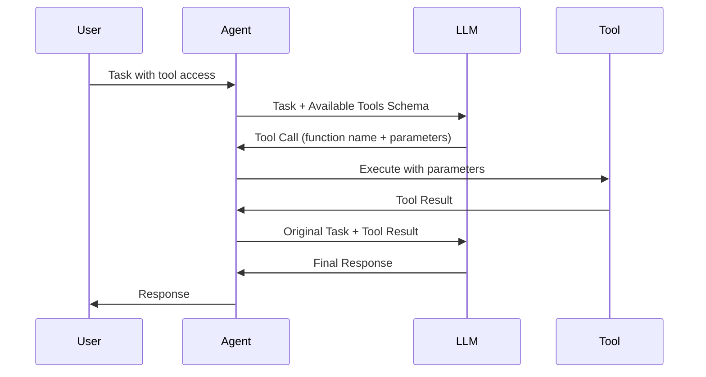

## What are Tools?

**Tools** are external functions and capabilities that extend what agents can do beyond text generation. While language models excel at reasoning and language tasks, tools enable agents to:

- **Access external data** (APIs, databases, web search)
- **Perform computations** (calculations, data analysis)
- **Take actions** (send emails, create files, run code)
- **Interact with systems** (databases, cloud services, IoT devices)

<Info>
Think of tools as the "hands" of your agent - they transform language understanding into real-world actions.
</Info>

## Why Tools Matter

Language models alone are limited to generating text based on their training data. Tools unlock:

<CardGroup cols={2}>
  <Card title="Current Information" icon="newspaper">
    Access real-time data via web search, APIs, and databases
  </Card>
  <Card title="Reliable Computation" icon="calculator">
    Perform accurate calculations and data processing
  </Card>
  <Card title="External Actions" icon="bolt">
    Interact with external systems and services
  </Card>
  <Card title="Domain Expertise" icon="graduation-cap">
    Integrate specialized knowledge and capabilities
  </Card>
</CardGroup>

## How Tools Work

The tool execution lifecycle in Swarms:



### Step-by-Step Process

1. **Schema Generation**: Tools are converted to OpenAI function calling schema
2. **Tool Discovery**: LLM sees available tools and their descriptions
3. **Tool Selection**: LLM decides which tool(s) to use based on the task
4. **Parameter Extraction**: LLM generates parameters for the tool
5. **Execution**: Agent executes the tool with provided parameters
6. **Result Integration**: Tool output is added to conversation context
7. **Response Generation**: LLM uses tool results to generate final response

## Creating Tools

### Basic Python Functions

The simplest way to create a tool is with a Python function:

```python
from swarms import Agent

def search_web(query: str) -> str:
    """
    Search the web for information.
    
    Args:
        query (str): The search query to execute
        
    Returns:
        str: Search results
    """
    # Your search implementation
    return f"Search results for: {query}"

def calculate(expression: str) -> float:
    """
    Evaluate a mathematical expression.
    
    Args:
        expression (str): Mathematical expression to evaluate (e.g., "2 + 2")
        
    Returns:
        float: The calculated result
    """
    return eval(expression)  # Be careful with eval in production!

# Create agent with tools
agent = Agent(
    model_name="gpt-4o-mini",
    tools=[search_web, calculate],
)

response = agent.run("Search for the current price of Bitcoin and calculate 5 * 100")
```

<Warning>
**Requirements for Tool Functions**:
1. **Type hints**: All parameters and return values must have type annotations
2. **Docstrings**: Clear documentation explaining what the tool does
3. **Parameter descriptions**: Document each parameter in the docstring

Without these, the LLM cannot reliably use your tools!
</Warning>

### Tool Best Practices

```python
# ✅ Good: Clear, well-documented tool
def fetch_stock_price(symbol: str, date: str = None) -> dict:
    """
    Fetch the stock price for a given symbol.
    
    Args:
        symbol (str): Stock ticker symbol (e.g., "AAPL", "GOOGL")
        date (str, optional): Date in YYYY-MM-DD format. Defaults to today.
        
    Returns:
        dict: Dictionary containing price, volume, and market cap
    """
    # Implementation
    return {"price": 150.0, "volume": 1000000, "market_cap": "2.5T"}

# ❌ Bad: No type hints or documentation
def get_price(symbol):
    return 150.0
```

## Tool Integration Patterns

### Pattern 1: Direct Function Tools

Simple Python functions passed directly to the agent:

```python
def get_weather(location: str, units: str = "celsius") -> str:
    """
    Get current weather for a location.
    
    Args:
        location (str): City name or coordinates
        units (str): Temperature units ("celsius" or "fahrenheit")
        
    Returns:
        str: Weather description
    """
    return f"Weather in {location}: 22°{units[0].upper()}, Sunny"

agent = Agent(
    model_name="gpt-4o-mini",
    tools=[get_weather],
)

response = agent.run("What's the weather in San Francisco?")
```

### Pattern 2: BaseTool Class

For advanced tool management and validation, use the `BaseTool` class from `swarms/tools/base_tool.py`:

```python
from swarms.tools import BaseTool

def search(query: str) -> str:
    """Search the web."""
    return f"Results for: {query}"

def calculate(expr: str) -> float:
    """Calculate mathematical expressions."""
    return eval(expr)

# Create tool manager
tool_manager = BaseTool(
    tools=[search, calculate],
    verbose=True,
)

# Convert tools to OpenAI schema
schema = tool_manager.convert_tool_into_openai_schema()

# Execute tools from LLM response
result = tool_manager.execute_tool(llm_response)
```

The `BaseTool` class provides:
- **Automatic schema conversion**: Convert Python functions to OpenAI format
- **Validation**: Check for documentation and type hints
- **Execution management**: Parse LLM responses and execute appropriate tools
- **Error handling**: Graceful error handling and logging
- **Caching**: Performance optimization for repeated operations

### Pattern 3: Pydantic Models as Tools

Use Pydantic models for structured data:

```python
from pydantic import BaseModel, Field
from swarms import Agent

class SearchQuery(BaseModel):
    """A web search query."""
    query: str = Field(..., description="The search query string")
    num_results: int = Field(10, description="Number of results to return")
    
class CalculationRequest(BaseModel):
    """A calculation request."""
    expression: str = Field(..., description="Mathematical expression to evaluate")
    precision: int = Field(2, description="Decimal places for the result")

agent = Agent(
    model_name="gpt-4o-mini",
    list_base_models=[SearchQuery, CalculationRequest],
)
```

### Pattern 4: MCP (Model Context Protocol)

MCP provides standardized tool integration via external servers:

```python
from swarms import Agent
from swarms.schemas.mcp_schemas import MCPConnection

# Connect to MCP server
mcp_connection = MCPConnection(
    name="file-server",
    transport_type="stdio",
    command="npx",
    args=["-y", "@modelcontextprotocol/server-filesystem", "/Users/workspace"],
)

# Agent automatically discovers and uses MCP tools
agent = Agent(
    model_name="gpt-4o-mini",
    mcp_config=mcp_connection,
)

response = agent.run("List files in the workspace directory")
```

**MCP Benefits**:
- Standardized protocol for tool integration
- Dynamic tool discovery
- Multiple MCP server support
- Built-in error handling

### Pattern 5: Tools from External Libraries

Integrate tools from other libraries like LangChain:

```python
from swarms import Agent
from langchain.tools import DuckDuckGoSearchRun

# Wrap external tools
def search_web(query: str) -> str:
    """Search the web using DuckDuckGo."""
    search = DuckDuckGoSearchRun()
    return search.run(query)

agent = Agent(
    model_name="gpt-4o-mini",
    tools=[search_web],
)
```

## Common Tool Examples

### Web Search Tool

```python
import requests

def search_web(query: str, num_results: int = 5) -> str:
    """
    Search the web and return results.
    
    Args:
        query (str): Search query string
        num_results (int): Number of results to return
        
    Returns:
        str: Formatted search results
    """
    # Integration with search API (e.g., Google, DuckDuckGo, Exa)
    # This is a simplified example
    return f"Top {num_results} results for '{query}'"
```

### Database Query Tool

```python
import sqlite3

def query_database(sql: str) -> list:
    """
    Execute a SQL query on the database.
    
    Args:
        sql (str): SQL query to execute (SELECT statements only)
        
    Returns:
        list: Query results as list of dictionaries
    """
    # Add safety checks for production!
    conn = sqlite3.connect('database.db')
    cursor = conn.cursor()
    cursor.execute(sql)
    results = cursor.fetchall()
    conn.close()
    return results
```

### File Operations Tool

```python
import os

def read_file(filepath: str) -> str:
    """
    Read contents of a file.
    
    Args:
        filepath (str): Path to the file to read
        
    Returns:
        str: File contents
    """
    with open(filepath, 'r') as f:
        return f.read()

def write_file(filepath: str, content: str) -> str:
    """
    Write content to a file.
    
    Args:
        filepath (str): Path where file should be written
        content (str): Content to write to file
        
    Returns:
        str: Success message
    """
    with open(filepath, 'w') as f:
        f.write(content)
    return f"Successfully wrote to {filepath}"

def list_files(directory: str) -> list:
    """
    List files in a directory.
    
    Args:
        directory (str): Path to directory
        
    Returns:
        list: List of filenames
    """
    return os.listdir(directory)
```

### API Integration Tool

```python
import requests
from typing import Dict, Any

def call_api(
    endpoint: str,
    method: str = "GET",
    params: Dict[str, Any] = None,
    data: Dict[str, Any] = None
) -> Dict[str, Any]:
    """
    Make an API call to an external service.
    
    Args:
        endpoint (str): API endpoint URL
        method (str): HTTP method (GET, POST, etc.)
        params (dict): Query parameters
        data (dict): Request body data
        
    Returns:
        dict: API response as dictionary
    """
    response = requests.request(
        method=method,
        url=endpoint,
        params=params,
        json=data
    )
    return response.json()
```

### Code Execution Tool

```python
import subprocess

def run_python_code(code: str) -> str:
    """
    Execute Python code in a safe environment.
    
    Args:
        code (str): Python code to execute
        
    Returns:
        str: Output from code execution
    """
    # WARNING: This is unsafe in production! Use sandboxing.
    try:
        result = subprocess.run(
            ['python', '-c', code],
            capture_output=True,
            text=True,
            timeout=5
        )
        return result.stdout or result.stderr
    except subprocess.TimeoutExpired:
        return "Code execution timed out"
```

## Multi-Tool Agents

Agents can use multiple tools in combination:

```python
from swarms import Agent

def search_web(query: str) -> str:
    """Search the web for information."""
    return f"Search results for: {query}"

def calculate(expression: str) -> float:
    """Perform mathematical calculations."""
    return eval(expression)

def save_to_file(filename: str, content: str) -> str:
    """Save content to a file."""
    with open(filename, 'w') as f:
        f.write(content)
    return f"Saved to {filename}"

# Agent with multiple tools
agent = Agent(
    model_name="gpt-4o-mini",
    tools=[search_web, calculate, save_to_file],
    max_loops=5,  # Allow multiple tool uses
)

# Agent can chain tools together
response = agent.run(
    "Search for the current Bitcoin price, calculate what 10 Bitcoins would cost, "
    "and save the result to bitcoin_value.txt"
)
```

## Tool Execution Control

Control how tools are executed:

```python
agent = Agent(
    model_name="gpt-4o-mini",
    tools=[tool1, tool2, tool3],
    
    # Tool execution settings
    tool_choice="auto",  # "auto", "required", or specific tool name
    tool_retry_attempts=3,  # Retry failed tool executions
    show_tool_execution_output=True,  # Display tool outputs
    tool_call_summary=True,  # Summarize tool calls
)
```

## BaseTool API Reference

Key methods from `swarms/tools/base_tool.py`:

### Schema Conversion

```python
from swarms.tools import BaseTool

tool_manager = BaseTool(tools=[my_function])

# Convert function to OpenAI schema
schema = tool_manager.func_to_dict(my_function)

# Convert multiple functions
schemas = tool_manager.multiple_functions_to_dict([func1, func2])

# Convert Pydantic model
model_schema = tool_manager.base_model_to_dict(MyModel)
```

### Tool Execution

```python
# Execute tool from LLM response
result = tool_manager.execute_tool(llm_response)

# Execute specific tool by name
result = tool_manager.execute_tool_by_name(
    tool_name="search_web",
    response='{"query": "Python"}'
)

# Execute from JSON text
result = tool_manager.execute_tool_from_text(
    '{"name": "search_web", "parameters": {"query": "Python"}}'
)
```

### Validation

```python
# Check if function has documentation
has_docs = tool_manager.check_func_if_have_docs(my_function)

# Check if function has type hints
has_hints = tool_manager.check_func_if_have_type_hints(my_function)

# Validate function call string
is_valid = tool_manager.check_str_for_functions_valid(function_call_str)
```

## Best Practices

<AccordionGroup>
  <Accordion title="Clear Function Signatures">
    Use descriptive parameter names and comprehensive type hints:
    ```python
    # Good
    def search_products(category: str, min_price: float, max_price: float) -> list:
        ...
    
    # Bad
    def search(cat, min, max):
        ...
    ```
  </Accordion>
  
  <Accordion title="Detailed Docstrings">
    Provide clear descriptions that help the LLM understand when and how to use the tool:
    ```python
    def search_web(query: str, num_results: int = 10) -> str:
        """
        Search the web using DuckDuckGo and return formatted results.
        
        Use this tool when you need current information from the internet,
        real-time data, or information not in your training data.
        
        Args:
            query (str): The search query. Be specific for better results.
            num_results (int): Number of results to return (default: 10, max: 50)
            
        Returns:
            str: Formatted search results with titles, URLs, and snippets
        """
    ```
  </Accordion>
  
  <Accordion title="Error Handling">
    Tools should handle errors gracefully and return informative messages:
    ```python
    def fetch_data(url: str) -> str:
        try:
            response = requests.get(url, timeout=10)
            response.raise_for_status()
            return response.text
        except requests.Timeout:
            return "Error: Request timed out"
        except requests.RequestException as e:
            return f"Error fetching data: {str(e)}"
    ```
  </Accordion>
  
  <Accordion title="Security Considerations">
    - Validate and sanitize all inputs
    - Limit file system access
    - Use sandboxing for code execution
    - Implement rate limiting for API calls
    - Never expose sensitive credentials in tool descriptions
  </Accordion>
  
  <Accordion title="Performance Optimization">
    - Cache frequently used results
    - Use async operations when possible
    - Set appropriate timeouts
    - Limit output size for large responses
    ```python
    def search_web(query: str) -> str:
        # Cache results for repeated queries
        cache_key = f"search_{query}"
        if cache_key in cache:
            return cache[cache_key]
        
        result = perform_search(query)
        cache[cache_key] = result
        return result
    ```
  </Accordion>
</AccordionGroup>

## Advanced: Custom Tool Protocols

Implement custom tool loading and execution:

```python
from swarms.tools import BaseTool

class CustomToolManager(BaseTool):
    def __init__(self, *args, **kwargs):
        super().__init__(*args, **kwargs)
        
    def load_tools_from_directory(self, directory: str):
        """Load all Python functions from a directory as tools."""
        import importlib.util
        import inspect
        
        tools = []
        for file in os.listdir(directory):
            if file.endswith('.py'):
                # Load module and extract functions
                spec = importlib.util.spec_from_file_location(
                    file[:-3], os.path.join(directory, file)
                )
                module = importlib.util.module_from_spec(spec)
                spec.loader.exec_module(module)
                
                # Get all functions from module
                for name, obj in inspect.getmembers(module):
                    if inspect.isfunction(obj):
                        tools.append(obj)
        
        self.tools = tools
        return tools
```

## Next Steps

<CardGroup cols={2}>
  <Card title="Agents" icon="robot" href="/concepts/agents">
    Learn how agents use tools for task execution
  </Card>
  <Card title="MCP Integration" icon="plug" href="/swarms/examples/multi_mcp_agent">
    Integrate standardized MCP tool servers
  </Card>
  <Card title="Tool Examples" icon="code" href="/examples">
    Explore real-world tool implementations
  </Card>
  <Card title="BaseTool Reference" icon="book" href="/swarms/tools/base_tool">
    Complete API reference for BaseTool class
  </Card>
</CardGroup>