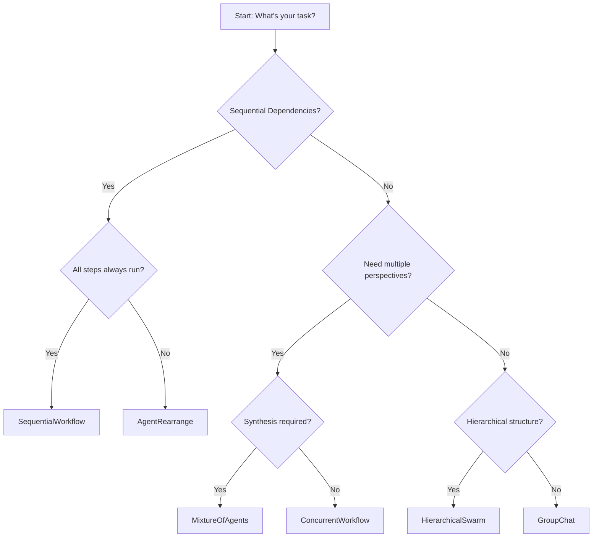

## What are Workflows?

**Workflows** define how multiple agents coordinate and execute tasks. While individual agents handle discrete tasks, workflows orchestrate multiple agents to solve complex, multi-step problems. Think of workflows as the "choreography" that determines how agents interact, communicate, and build upon each other's work.

<Info>
Workflows transform independent agents into coordinated systems, enabling sophisticated multi-agent collaboration patterns.
</Info>

## Core Workflow Patterns

Swarms provides several fundamental workflow patterns, each optimized for different use cases:

### Sequential Workflows

**Pattern**: Agents execute in a linear chain, where each agent's output becomes the next agent's input.

**When to Use**:
- Tasks with clear sequential dependencies
- Data transformation pipelines
- Multi-stage content creation
- Step-by-step analysis processes

**Characteristics**:
- **Ordered execution**: Agents run one after another
- **Data flow**: Output of Agent N becomes input for Agent N+1
- **Deterministic**: Same input always produces same agent sequence
- **Synchronous**: Each agent waits for the previous to complete

#### Implementation

From `swarms/structs/sequential_workflow.py`:

```python
from swarms import Agent, SequentialWorkflow

# Create specialized agents
researcher = Agent(
    agent_name="Researcher",
    system_prompt="Your job is to research the provided topic and provide a detailed summary.",
    model_name="gpt-4o-mini",
)

writer = Agent(
    agent_name="Writer",
    system_prompt="Your job is to take the research summary and write a beautiful, engaging blog post.",
    model_name="gpt-4o-mini",
)

editor = Agent(
    agent_name="Editor",
    system_prompt="Review and polish the content for clarity, grammar, and engagement.",
    model_name="gpt-4o-mini",
)

# Create sequential workflow
workflow = SequentialWorkflow(
    agents=[researcher, writer, editor],
    max_loops=1,  # How many times to run the entire sequence
)

# Execute the workflow
final_post = workflow.run("The future of artificial intelligence")
print(final_post)
```

**Flow Diagram**:
```
Task → Researcher → [Research Output] → Writer → [Draft] → Editor → [Final Output]
```

#### Advanced Configuration

```python
workflow = SequentialWorkflow(
    name="Content-Production-Pipeline",
    description="End-to-end content creation workflow",
    agents=[researcher, writer, seo_optimizer, fact_checker],
    max_loops=2,  # Run the sequence twice for refinement
    output_type="dict",  # Return structured output
    autosave=True,  # Save conversation history
    verbose=True,  # Enable detailed logging
)
```

#### Use Cases

<CardGroup cols={2}>
  <Card title="Content Creation" icon="pen">
    Research → Write → Edit → SEO Optimize → Publish
  </Card>
  <Card title="Data Processing" icon="database">
    Extract → Transform → Validate → Load → Report
  </Card>
  <Card title="Document Analysis" icon="file">
    Parse → Summarize → Classify → Extract Entities → Generate Insights
  </Card>
  <Card title="Code Generation" icon="code">
    Spec → Design → Implement → Test → Document
  </Card>
</CardGroup>

---

### Concurrent Workflows

**Pattern**: All agents receive the same task and execute simultaneously, producing independent outputs.

**When to Use**:
- Need multiple perspectives on the same problem
- Parallel data processing
- A/B testing different approaches
- High-throughput batch processing

**Characteristics**:
- **Parallel execution**: All agents run at the same time
- **Independent processing**: Each agent works on the same input independently
- **Asynchronous**: Agents don't wait for each other
- **Resource-intensive**: Uses multiple threads/processes

#### Implementation

From `swarms/structs/concurrent_workflow.py`:

```python
from swarms import Agent, ConcurrentWorkflow

# Create expert analysts
market_analyst = Agent(
    agent_name="Market-Analyst",
    system_prompt="Analyze market trends and provide insights on the given topic.",
    model_name="gpt-4o-mini",
    max_loops=1,
)

financial_analyst = Agent(
    agent_name="Financial-Analyst", 
    system_prompt="Provide financial analysis and recommendations on the given topic.",
    model_name="gpt-4o-mini",
    max_loops=1,
)

risk_analyst = Agent(
    agent_name="Risk-Analyst",
    system_prompt="Assess risks and provide risk management strategies for the given topic.",
    model_name="gpt-4o-mini", 
    max_loops=1,
)

# Create concurrent workflow
concurrent_workflow = ConcurrentWorkflow(
    agents=[market_analyst, financial_analyst, risk_analyst],
    max_loops=1,
)

# All agents analyze the same task concurrently
results = concurrent_workflow.run(
    "Analyze the potential impact of AI technology on the healthcare industry"
)

print(results)
```

**Flow Diagram**:
```
                    ┌──→ Market Analyst → [Market Analysis]
                    │
Initial Task ───────┼──→ Financial Analyst → [Financial Analysis]
                    │
                    └──→ Risk Analyst → [Risk Assessment]
                             ↓
                    Combined Results Dict
```

#### Advanced Features

**Real-time Dashboard**:
```python
concurrent_workflow = ConcurrentWorkflow(
    agents=[analyst1, analyst2, analyst3],
    show_dashboard=True,  # Display real-time progress
)
```

**Streaming Callbacks**:
```python
def streaming_callback(agent_name: str, chunk: str, is_final: bool):
    print(f"[{agent_name}]: {chunk}", end="")
    if is_final:
        print(f"\n{agent_name} completed!")

workflow = ConcurrentWorkflow(agents=[agent1, agent2])
results = workflow.run(
    task="Analyze this data",
    streaming_callback=streaming_callback
)
```

**Batch Processing**:
```python
tasks = [
    "Analyze company A",
    "Analyze company B",
    "Analyze company C",
]

results = concurrent_workflow.batch_run(tasks)
```

#### Use Cases

<CardGroup cols={2}>
  <Card title="Multi-Perspective Analysis" icon="eye">
    Get market, financial, and risk perspectives simultaneously
  </Card>
  <Card title="Quality Assurance" icon="check">
    Multiple reviewers check the same content concurrently
  </Card>
  <Card title="Batch Processing" icon="layer-group">
    Process multiple documents/records in parallel
  </Card>
  <Card title="A/B Testing" icon="flask">
    Test different prompt strategies simultaneously
  </Card>
</CardGroup>

---

### Comparison: Sequential vs Concurrent

| Aspect | Sequential | Concurrent |
|--------|-----------|------------|
| **Execution** | One at a time | All at once |
| **Data Flow** | Output → Input chain | Independent outputs |
| **Speed** | Slower (serial) | Faster (parallel) |
| **Resource Usage** | Lower (one agent active) | Higher (all agents active) |
| **Use Case** | Dependent steps | Independent analyses |
| **Output** | Single refined result | Multiple perspectives |
| **Complexity** | Simple, predictable | Requires result aggregation |

---

## Advanced Workflow Patterns

### AgentRearrange (Custom Flows)

**Pattern**: Define complex, non-linear agent relationships using a simple syntax.

**When to Use**:
- Complex routing logic
- One-to-many or many-to-one relationships
- Dynamic agent selection based on results
- Custom orchestration patterns

```python
from swarms import Agent, AgentRearrange

researcher = Agent(agent_name="researcher", model_name="gpt-4o-mini")
writer = Agent(agent_name="writer", model_name="gpt-4o-mini")
editor = Agent(agent_name="editor", model_name="gpt-4o-mini")
reviewer = Agent(agent_name="reviewer", model_name="gpt-4o-mini")

# Define custom flow:
# researcher sends to both writer AND editor
# then both send to reviewer
flow = "researcher -> writer, editor; writer -> reviewer; editor -> reviewer"

rearrange_system = AgentRearrange(
    agents=[researcher, writer, editor, reviewer],
    flow=flow,
)

result = rearrange_system.run("Create a technical whitepaper")
```

**Flow Diagram**:
```
              ┌──→ Writer ───┐
Researcher ───┤              ├──→ Reviewer → Final Output
              └──→ Editor ───┘
```

### Mixture of Agents (MoA)

**Pattern**: Multiple expert agents process tasks in parallel, then an aggregator synthesizes outputs.

**When to Use**:
- Leverage diverse expertise
- Complex decision-making
- Achieving state-of-the-art performance
- Combining different approaches

```python
from swarms import Agent, MixtureOfAgents

# Expert agents
expert1 = Agent(agent_name="Financial-Expert", ...)
expert2 = Agent(agent_name="Market-Expert", ...)
expert3 = Agent(agent_name="Risk-Expert", ...)

# Aggregator synthesizes expert opinions
aggregator = Agent(
    agent_name="Investment-Advisor",
    system_prompt="Synthesize expert analyses into actionable recommendations.",
)

moa = MixtureOfAgents(
    agents=[expert1, expert2, expert3],
    aggregator_agent=aggregator,
)

recommendation = moa.run("Should we invest in NVIDIA stock?")
```

### Hierarchical Workflows

**Pattern**: A director agent creates plans and delegates to specialized workers.

**When to Use**:
- Complex project management
- Team coordination scenarios
- Hierarchical decision-making
- Dynamic task allocation

```python
from swarms import Agent, HierarchicalSwarm

worker1 = Agent(agent_name="Content-Strategist", ...)
worker2 = Agent(agent_name="Creative-Director", ...)
worker3 = Agent(agent_name="SEO-Specialist", ...)

# Director coordinates workers
swarm = HierarchicalSwarm(
    name="Marketing-Team",
    agents=[worker1, worker2, worker3],
    max_loops=2,  # Allow feedback loops
)

strategy = swarm.run("Develop Q1 marketing strategy")
```

---

## Workflow Selection Guide

Use this decision tree to choose the right workflow pattern:



<AccordionGroup>
  <Accordion title="SequentialWorkflow">
    **Choose when**:
    - Clear step-by-step process
    - Each step depends on previous output
    - Linear data transformation
    
    **Examples**: Content pipeline, ETL, document processing
  </Accordion>
  
  <Accordion title="ConcurrentWorkflow">
    **Choose when**:
    - Need multiple independent analyses
    - High-throughput batch processing
    - Parallel execution possible
    
    **Examples**: Multi-analyst review, A/B testing, batch processing
  </Accordion>
  
  <Accordion title="AgentRearrange">
    **Choose when**:
    - Complex routing logic needed
    - One-to-many or many-to-one relationships
    - Custom orchestration required
    
    **Examples**: Approval chains, multi-stage reviews, adaptive workflows
  </Accordion>
  
  <Accordion title="MixtureOfAgents">
    **Choose when**:
    - Multiple expert perspectives needed
    - Outputs must be synthesized
    - State-of-the-art performance required
    
    **Examples**: Investment analysis, medical diagnosis, strategic planning
  </Accordion>
  
  <Accordion title="HierarchicalSwarm">
    **Choose when**:
    - Central coordination needed
    - Dynamic task allocation required
    - Project management scenario
    
    **Examples**: Marketing campaigns, software development, event planning
  </Accordion>
</AccordionGroup>

---

## Best Practices

### 1. Agent Specialization

Design agents with focused, well-defined roles:

```python
# ✅ Good: Specialized agents
researcher = Agent(
    agent_name="Researcher",
    system_prompt="Expert researcher who gathers comprehensive, well-cited information."
)

# ❌ Bad: Generic agent
generic = Agent(
    agent_name="Agent",
    system_prompt="Do whatever is needed."
)
```

### 2. Clear Data Flow

Ensure agents produce outputs that the next agent can consume:

```python
researcher = Agent(
    system_prompt="Research the topic and provide a structured summary with sources."
)

writer = Agent(
    system_prompt="Take the research summary and sources, and write an article."
)
```

### 3. Error Handling

Implement fallback strategies:

```python
workflow = SequentialWorkflow(
    agents=[agent1, agent2],
    max_loops=1,
)

try:
    result = workflow.run(task)
except Exception as e:
    # Implement fallback
    result = fallback_agent.run(task)
```

### 4. Performance Monitoring

```python
workflow = ConcurrentWorkflow(
    agents=[agent1, agent2, agent3],
    verbose=True,  # Enable logging
    autosave=True,  # Save conversation history
)

result = workflow.run(task)

# Access conversation history for analysis
history = workflow.conversation.get_str()
```

### 5. Resource Management

For concurrent workflows, be mindful of resource usage:

```python
# CPU cores are automatically managed
# But you can control max_loops to limit iterations
workflow = ConcurrentWorkflow(
    agents=[agent1, agent2, agent3],
    max_loops=1,  # Limit iterations to control costs
)
```

---

## Real-World Examples

### Content Production Pipeline

```python
# Sequential workflow for blog post creation
pipeline = SequentialWorkflow(
    agents=[
        Agent(agent_name="Researcher", system_prompt="Research topics..."),
        Agent(agent_name="Outliner", system_prompt="Create detailed outline..."),
        Agent(agent_name="Writer", system_prompt="Write engaging content..."),
        Agent(agent_name="SEO-Optimizer", system_prompt="Optimize for search..."),
        Agent(agent_name="Editor", system_prompt="Final polish and fact-check..."),
    ]
)

article = pipeline.run("The future of renewable energy")
```

### Financial Analysis System

```python
# Concurrent workflow for multi-perspective analysis
analysis_team = ConcurrentWorkflow(
    agents=[
        Agent(agent_name="Fundamental-Analyst", ...),
        Agent(agent_name="Technical-Analyst", ...),
        Agent(agent_name="Sentiment-Analyst", ...),
        Agent(agent_name="Macro-Analyst", ...),
    ],
    show_dashboard=True,
)

analysis = analysis_team.run("Analyze Tesla stock for Q1 2024")
```

### Document Processing System

```python
# Custom flow with AgentRearrange
flow = """
parser -> summarizer, entity_extractor;
summarizer -> report_generator;
entity_extractor -> report_generator
"""

doc_processor = AgentRearrange(
    agents=[parser, summarizer, entity_extractor, report_generator],
    flow=flow,
)

report = doc_processor.run(document_content)
```

---

## Next Steps

<CardGroup cols={2}>
  <Card title="Agents" icon="robot" href="/concepts/agents">
    Learn about individual agent capabilities
  </Card>
  <Card title="Swarms" icon="users" href="/concepts/swarms">
    Explore multi-agent collaboration patterns
  </Card>
  <Card title="Tools" icon="wrench" href="/concepts/tools">
    Equip agents with external capabilities
  </Card>
  <Card title="API Reference" icon="book" href="/swarms/structs/sequential_workflow">
    Complete workflow API documentation
  </Card>
</CardGroup>