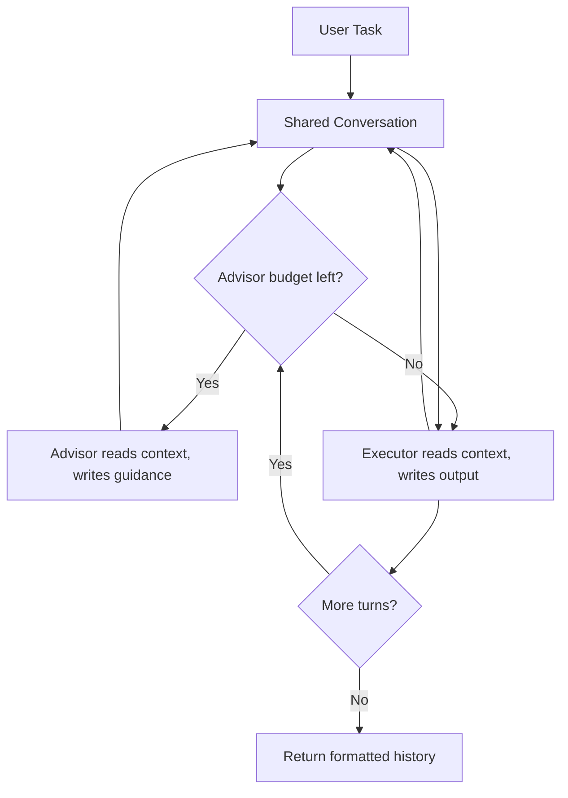

`AdvisorSwarm` implements the [advisor strategy](https://claude.com/blog/the-advisor-strategy) — a cheaper **executor** model drives the task end-to-end while a more capable **advisor** model is consulted on-demand between executor turns for strategic guidance. Both agents read from and write to a shared conversation, so the executor sees the advisor's notes on the next turn.

This is well-suited to tasks where most of the per-turn work is cheap but a few pivotal decisions benefit from a stronger model — code review, multi-step debugging, research planning, document refinement.

## How Advisor Swarm Works



1. The user task is added to a shared `Conversation`.
2. Before each executor turn, if `advisor_uses < max_advisor_uses`, the advisor reads the full conversation and writes strategic guidance back to it.
3. The executor reads the same conversation — task, any prior output, and any advisor guidance — and produces its turn output.
4. Steps 2–3 repeat for `max_loops` executor turns.
5. The formatted conversation history is returned per `output_type`.

The advisor never calls tools and never produces user-facing output — it only writes guidance for the executor to consume.

### Key Characteristics

- **Executor-driven loop**: the executor runs every turn; the advisor is optional.
- **Budgeted advisor calls**: `max_advisor_uses` caps how often the expensive model is invoked.
- **Shared context**: both agents see the same conversation, so guidance compounds across turns.
- **Provider-agnostic**: any LiteLLM-supported model works for either role.
- **Tools on executor only**: the executor can be a pre-configured `Agent` with tools or MCP; the advisor stays tool-free.

## Basic Example: Code Review

A natural fit for the executor/advisor split — the executor does the line-by-line review work, the advisor sets priorities and catches what the executor misses.

```python
from swarms import AdvisorSwarm

swarm = AdvisorSwarm(
    executor_model_name="claude-sonnet-4-6",  # cheap, does the work
    advisor_model_name="claude-opus-4-6",     # expensive, sets direction
    max_advisor_uses=2,
    max_loops=3,
    verbose=True,
)

result = swarm.run(
    """
    Review this Python function for correctness, security, and style:

    def get_user(user_id):
        query = f"SELECT * FROM users WHERE id = {user_id}"
        return db.execute(query).fetchone()

    Identify all issues, rank them by severity, and propose fixes.
    """
)

print(result)
```

### What happens each turn

With `max_loops=3` and `max_advisor_uses=2`, the run looks like this:

| Turn | Advisor consulted? | What the executor sees | What it produces |
|------|--------------------|------------------------|------------------|
| 1 | Yes (1/2) | Task + advisor guidance #1 ("focus on SQL injection first; that's the critical issue") | First-pass review citing the injection vulnerability |
| 2 | Yes (2/2) | Task + guidance #1 + turn 1 output + advisor guidance #2 ("you missed the missing type hints and no error handling") | Second-pass review covering style and robustness |
| 3 | No (budget exhausted) | Full conversation so far | Final consolidated review, ranked by severity |

The advisor's "look here next" notes carry forward in the shared conversation, so the executor's later turns are guided by both its own prior output and the strategic direction the advisor set earlier.

## Custom Executor with Tools

Pass a pre-configured `Agent` as `executor_agent` to give it tools, MCP connections, or any other agent setting. The advisor stays tool-free so its role remains strategic.

```python
from swarms import Agent, AdvisorSwarm


def search_codebase(query: str) -> str:
    """Search the codebase for a pattern. Returns matching lines."""
    # Implementation here — call ripgrep, your code search, etc.
    return f"Results for: {query}"


def read_file(path: str) -> str:
    """Read a file from disk."""
    with open(path) as f:
        return f.read()


executor = Agent(
    agent_name="CodebaseReviewer",
    model_name="claude-sonnet-4-6",
    max_loops=1,
    tools=[search_codebase, read_file],
)

swarm = AdvisorSwarm(
    executor_agent=executor,
    advisor_model_name="claude-opus-4-6",
    max_advisor_uses=3,
    max_loops=4,
)

result = swarm.run(
    "Audit src/auth/ for missing input validation. Search the directory, "
    "read each handler, and report any endpoints that accept user input "
    "without validating it."
)
```

The advisor sets the audit strategy ("start with the login flow — that's where the highest-impact bugs live"); the executor uses its tools to actually fetch and read the code.

## Tuning the Advisor Budget

`max_advisor_uses` and `max_loops` together control cost vs. quality:

| `max_advisor_uses` | `max_loops` | When to use |
|---|---|---|
| `0` | `1` | Smoke test — executor alone, no expensive calls |
| `1` | `1` | One strategic check before a single execution |
| `1` | `3` | One direction-setting consultation, then executor iterates on its own |
| `3` | `3` | Every executor turn gets fresh guidance — highest cost, highest quality |
| `2` | `4` | Most-bang-for-buck for longer tasks: guidance up front and at a midpoint |

If a task is well-scoped and the executor model handles it confidently, `max_advisor_uses=0` is fine — you just get a cheap-model run with the `AdvisorSwarm` plumbing in place for when you do want guidance.

## Mixing Providers

Provider-agnostic — the executor and advisor don't need to come from the same vendor.

```python
from swarms import AdvisorSwarm

# Cheap OpenAI executor, expensive Anthropic advisor
swarm = AdvisorSwarm(
    executor_model_name="gpt-4.1-mini",
    advisor_model_name="claude-opus-4-6",
    max_advisor_uses=2,
    max_loops=3,
)

result = swarm.run("Draft a launch announcement for our new product")
```

## When to Use AdvisorSwarm

- **Cost-sensitive workloads** where most turns are routine but a few decisions matter
- **Long-running tasks** where periodic strategic re-checks add value
- **Tasks with tools or MCP** where you want a smaller tool-using executor plus a tool-free strategic overseer
- **Domains where direction matters more than throughput** — code review, research planning, document polish

## When NOT to Use AdvisorSwarm

- **Single-shot prompts** where one model call is enough — use a bare `Agent`
- **Pure parallel workloads** with no inter-turn strategy — use `ConcurrentWorkflow` or `MixtureOfAgents`
- **Strict sequential pipelines** with fixed roles per stage — use `SequentialWorkflow`
- **All turns equally critical** — just use the strong model directly

## Related Architectures

- **[MixtureOfAgents](/examples/mixture-of-agents-example)**: Parallel experts with aggregation — peers, not executor/advisor
- **[HierarchicalSwarm](/examples/hierarchical-swarm-example)**: Director-worker with task distribution — many workers, not one paired advisor
- **[SequentialWorkflow](/examples/sequential-workflow-example)**: Fixed pipeline of agents — no on-demand consultation

## Learn More

- [AdvisorSwarm API Reference](/api/advisor-swarm)
- ["The advisor strategy: Give agents an intelligence boost" (Anthropic, April 2026)](https://claude.com/blog/the-advisor-strategy)
- [Multi-Agent Architectures Overview](/architectures/overview)
